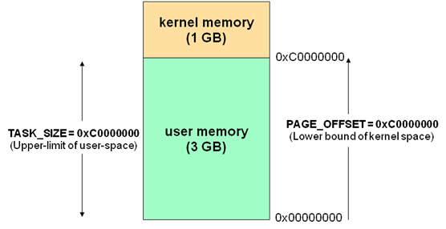

Android高效数据存储-mmap
====================
### 相关知识点
###### 虚拟内存、物理内存（DRAM）
相对于磁盘空间，内存一直是紧缺的。对于一个Linux设备，其上可能跑在几十个进程。这些进程间都需要有足够的内存且需要互相隔离，内存本身最好是连续的。为了解决这个问题，Linux不会让应用直接面对物理内存，引入了一个虚拟内存的技术来解决这个问题。

系统为每个进程提供独立的虚拟内存空间（virtual memory space），这个空间的大小和cpu有关，在32位系统上是4G。个人理解上，这个4GB虚拟内存并不以实际落地的内存形式存在，可以理解为在代码上定义了从0x00000000d到0xFFFFFFFF的ID，可以认为一个标记、句柄之类的概念，并不是有这么一个区域，只是说有这么多个可用的固定的内存地址，所以虚拟内存空间也会被称为寻址控件。

进程内的相关操作（进程fork、excuate、malloc、mmap）都会引起内存分配，这个时候分配获得的只是虚拟内存地址，当进程真正访问这块内存时，会有“请页机制”产生“缺页”异常，进而内核去为进程分配物理页，这里会用到由由操作系统维护的页表（page table）。

页表（page table）是一个保存了虚拟内存地址和特定资源（物理内存或者外部存储空间）的映射关系（memory mapping）的链表。每个进程都拥有自己独立的链表，但指向的物理内存可能是同一个。同时并不是进程中每个虚拟内存页在页表中都有映射关系，只有在虚拟地址被分配给进程后（进程fork、excuate、malloc、mmap等）系统内核才在page table会创建记录。

在虚拟内存和物理内存映射转化火车中，操作系统内核会将虚拟内存和物理内存拆分为固定大小（x86的系统一般内存页大小是4K）的页，每个页都会分配一个唯一的编号，这就是页编号（PFN）

要点：
* 4GB的虚拟内存一直存在，只是一个虚拟地址ID。
* malloc等时为该操作分配一个虚拟内存地址，同时内核在当前进程的Page Table中添加映射记录（memory mapping）。
* 进程真正操作内存时，如果没有物理内存，通过“请页机制”分配物理内存，并保存到Page Table的对应记录中。
* 不同的进程的虚拟地址可以指向同一块物理内存，这个就是共享内存。
* 每个进程都有4G（32位系统）的虚拟地址空间，但只有向系统申请了的那些地址空间才能用，访问未分配的地址空间将会出segmentfault错误。
* 操作系统内核可以访问受保护的内存空间和底层硬件设备。虚拟内存中的高位1GB内核空间的地址是用来操作内核的，每个进程可以通过系统调用进入内核态，就是通过内核空间地址实现，这样保证了用户进程无法直接操作内核，保证内核的安全。
* Linux内核代码访问内存时用的都是实际的物理地址，所以不存在虚拟地址到物理地址的转换，只有应用层程序才需要。


###### 内核空间（kernel space）、用户空间（user space）

每个进程的虚拟内存大小为4GB（32位系统上），这4GB的虚拟内存可以分为两部分，内核空间和用户空间。在linux下分配比例为1：3（widow为2：2）。

两种的虚拟地址情况如下：图片来自网络

3GB的底地址（0x00000000~0xC0000000）代表用户空间，1GB的高地址代表内核空间。那这里也可以引申为，一个进程用户空间最多能够映射3GB的物理内存。

在Android中，我们调用一些系统函数，都会引发从用户空间到内核空间的切换，也就是我们常说的从用户态切换到内核态，这也是Linux系统的两个权限等级，内核态有最高的权限等级。除了调用系统函数会导致用户态到内核态切换外，还有异常和外设中断的场景会导致切换。对于异常导致的切换，我们在Native层的异常捕获时有用到，可以查看 breakpad等。

###### PageCache
>Page Cache层实际上是内核中的物理内存，在磁盘和用户空间之间多了一层缓存层，由内核负责管理控制。由于物理内存的速度远远快于磁盘的速度，有了这一层的存在，数据放入Page Cache中可以更快的进行访问。而且数据一旦被访问后，短时间内有极大会再一次被访问，短时间内集中访问同一数据的原理就叫做局部性原理。因此经常需要被访问的数据，如果将其放入缓存中，那就有可能再次被页高速缓存命中，这也是Page Cache所带来的性能提升！

PageCache是用来解决设备和内存交互时高速访问的问题。他的读取性能提升主要体现在将高访问频次的资源缓存在Page Cache中，减少重复资源的磁盘访问这一次内存拷贝上。

PageCache其实缓存，因为涉及到内存拷贝，在用户操作后和磁盘中的数据会有不一致。操作系统会在合适的时机（“自动回写机制”，例如脏数据达到一定的量，内存不足导致Cache被回收等情况）将PageCache中的脏数据回写到磁盘中。

这里想到了Java中对文件的操作函数 flush、close等。flush函数只是刷新缓冲区，针对BufferedXXXStream，提供了默认8KB的缓冲区，对于写操作先会写入缓存区，当满时才会内容送入内核缓冲区（Page Cache）。

相关知识点：块缓存 buffer cache。

###### 一般读写流程
* 程序在用户态调用open、write等函数。
* 调用系统函数后，程序从用户态切换到内核态。
* 内核态有访问硬件的权限，从磁盘中读取相应数据。
* 将磁盘中的数据拷贝到PageCache中。PageCache由内核负责管理控制，属于内核态，在用户态无法直接操作。
* 将数据从PageCache中拷贝到用户态。
* 程序退出内核态进入用户态，进行数据操作。

这里有两次内存拷贝，磁盘到PageCache和PageCache到用户空间。


###mmap
mmap内存映射解决了一般读写流程需要两次内存拷贝的问题。不会将PageCache中的数据拷贝到用户空间。既加速了读写，又减少了程序本身的内存占用。

###### 相关API

```c++
void* mmap(void addr, size_t length, int prot, int flags, int fd, off_t offset);
int munmap(void *addr, size_t length);
int msync(void * addr, size_t len, int flags);
```


mmap: 将fd指向的文件映射的内存。
munmap: 释放共享内存。类似close。
msync: 将PageCache中数据变化写入导磁盘中。 类似flush。

示例：

```c++
//创建映射关键代码
int fd = open(file_path, O_RDWR | O_CREAT | O_CLOEXEC, S_IRWXU);

char *addr = static_cast<char *>(mmap(nullptr, model->buffer_size,
                                          PROT_READ | PROT_WRITE,
                                          MAP_SHARED,
                                          fd, model->file_len));
//写入关键代码
memcpy(model->blank_addr, text, len);

//flush调用示例
msync(model->buffer_addr, model->mapped_size, MS_SYNC);

//close调用示例
munmap(model->buffer_addr, model->mapped_size);

```

在实际时候用中需要注意：

* mmap的使用无法动态扩容文件大小。如果过我们映射了MMAP_SIZE大小的区域，需要保证文件中已经有该大小的区域。特别的，MMAP_SIZE为页内存倍数时，需要保证文件大小至少为MMAP_SIZE+1，并且结尾赋值为0。否则当刚好写入满MMAP_SIZE大小时，会偶现奔溃。不以0结尾无法正确识别内存结尾，会报如下错误，其中0x地址刚好是我们文件内存映射结尾。
* 对于写入场景，当我们将映射的区域写入MMAP_SIZE大小后，不应继续写入，需要扩容重新映射。当MMAP_SIZE小于页内存大小时，我们会发现不做扩容可以继续使用，这是应为内存映射是以页为单位的，虽然我们在mmap的时候指定的MMAP_SIZE小于页内存，但实际分配的是以页内存为单位所以可以用。但不建议这样操作。
* 使用mmap做应该是试试，函数的最后一个参数“off_t offset”是想要返回映射内存在文件中的偏移量，这里需要注意，这个offset也需要是页内存的倍数。


### 性能比较
1万条数据，使用过java、jni调用mmap、native直接调用mmap情况对比，每条数据36字节。使用mmap时，分为一次映射4KB内存超出时扩容和一次性映射360KB两种情况。


|-|项目|耗时|内存|
|---|---|---|---|
|1|java|50ms|13M|
|2|JNI+4KB|200ms|1.2M|
|3|JNI+360KB|120ms|1.2M|
|4|Native+4KB|70ms|0|
|5|Native+360KB|6ms|0|


* 可以看到使用MMAP确实可以减少内存。
* 纯Native调用的话，MMAP的调用效率是高于java读写的，具体高多少和一次映射多少内存有关，既是否需要做内存扩容有关。
* 使用JNI调用的话，由于JNI调用耗时，效率并不由于Java读写，具体情况可调用JNI次数有关。


###### 参考
<a href="https://blog.csdn.net/qq_34556414/article/details/107929249">Linux 搞懂物理内存和虚拟内存</a>

<a href="https://www.cnblogs.com/linyx/p/3998847.html">linux进程用户内存空间和内核空间</a>

<a href="https://blog.csdn.net/mcryeasy/article/details/86741781">Android-内存映射mmap</a>