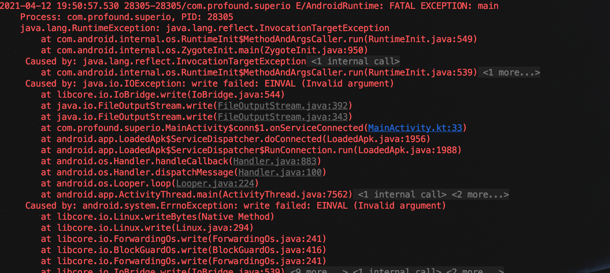

Android共享内存实践
==================
###共享内存
共享内存是linux下进程间IPC通信的一种方式，适用于数据量叫大的通信。在Android上对linux这种模型做个针对性的改进，形成了Android的匿名共享内存Ashmem（Anonymous Shared Memory-Ashmem）。

>Ashmem的核心原理主要是两部分：驱动和fd传递。
>
>Ashmem是Linux内核中的一个misc设备，对应的设备文件是/dev/ashmem，此设备是一个虚拟设备，不存在实际文件，只在内核驱动中对应一个inode节点。Ashmem在驱动层是基于linux系统的共享内存功能实现的，Ashmem可以理解为只是对原生的共享内存进行了一层包装，使其更方便在Android系统上使用。
>Binder机制不仅支持binder对象的传递，还支持文件描述符的传递。fd经过binder驱动时，binder驱动会将源进程的fd转换成目标进程的fd，转换过程为：取出发送方binder数据里的fd，通过fd找到文件对象，然后为目标进程创建fd，将目标进程fd和文件对象进行关联，将发送方binder数据里的fd改为目标进程的fd，然后将数据发送给目标进程。这个过程相当于文件在目标进程又打开了一次，目标进程使用的是自己的fd，但和源进程都指向的是同一个文件。这样源进程和目标进程就都可以map到同一片内存了。
>Ashmem通过pin/unpin操作来管理内存，默认是pined的状态。这个时候共享内存会一直存在直到进程死亡。可以调用unpin操作来讲内存解除锁定，这时当系统内存不足时会自动释放。对于unpin状态的共享内存如需再次使用，需要先调用pin操作，如果pin操作返回ASHMEM_WAS_PURGED，也就是说内存已经被回收，已经回收的内存再次访问会触发缺页中断重新进行物理内存的分配，因此这段内存里的数据已经不是起初的那个数据了，如果仍旧当做原始数据进行访问必然引发错误。
###### 应用场景
* 1.进程间通信，多个进程共同操作一块内存、或者作为缓存区。
* 2.对于数据量较大的只读配置文件，可以在主进程中加载，并将内存共享，其他进程直接访问共享内存。这样可以减少整体内存占用。

###关键函数
###### Linux下使用
```
int shmget(key_t key, size_t size, int shmflg); 
```
用来创建共享内存，其中key可以认为是共享内存名，多个进程共享的内存块就是通过这个key来统一的。返回值是共享内存标识，在映射到当前内存空间等操作是都会用到。

```
void *shmat(int shm_id, const void *shm_addr, int shmflg); 
```
将共享内存映射到当前进程的地址空间，返回值就是内存地址。取得内存地址后就可以进行操作了，可以将void*指针强转为数据结构对象指针进行操作。

其他还有进程分离shmdt、删除函数shmctl。

###### Ashmen-C++使用
ashmen相关的C++操作函数如下：
```
#include <cutils/ashmem.h>

int ashmem_valid(int fd);
int ashmem_create_region(const char *name, size_t size);
int ashmem_set_prot_region(int fd, int prot);
int ashmem_pin_region(int fd, size_t offset, size_t len);
int ashmem_unpin_region(int fd, size_t offset, size_t len);
int ashmem_get_size_region(int fd);
```

ashmen相关功能不在标准NDK内，JNI开发无法直接使用ashmen相关功能。

但并不是说就没法在Native层使用ashmen。ashmen相关操作在libcutils.so中，源码路径：/system/core/libcutils。相关头文件路径：/system/core/libcutils/include

我们可以将libcutils.so作为预编译库，集成到我们的程序中。但这样只保证我们使用对于源码的Android版本可用，其他会存在兼容性问题。

我们知道MMKV是使用是MMAP来做高效的kv存储的，mmap的学习会单独的笔记记录。同时MMKV是支持跨进程调用的。查看MMKV的源码后发现其就是通过Ashmem实现的。

MMKV对Ashmem的使用也是做多版本的兼容的，Android本身是有Ashmem实现的，相关功能打包后在libandroid.so中。MMKV中就是动态调用libandroid.so中相关函数来实现Ashmem的操作。

核心代码源码目录：/MMKV/Core/MemoryFile_Android.cpp中。

```C++
//动态链接libandroid.so，获取句柄。
void *loadLibrary() {
    auto name = "libandroid.so";
    static auto handle = dlopen(name, RTLD_LAZY | RTLD_LOCAL);
    if (handle == RTLD_DEFAULT) {
        MMKVError("unable to load library %s", name);
    }
    return handle;
}
//对于Android O以上设备，尝试动态调用AShareMemory_create函数创建fd。
//前文提到，Ashmem是Linux内核中的一个misc设备，对应的设备文件是/dev/ashmem。如果上一步未取得fd，直接打开/dev/ashmem文件。
//ASHMEM_NAME_DEF即为/dev/ashmem。
int ASharedMemory_create(const char *name, size_t size) {
    int fd = -1;
    if (g_android_api >= __ANDROID_API_O__) {
        static auto handle = loadLibrary();
        static AShmem_create_t funcPtr =
            (handle != nullptr) ? reinterpret_cast<AShmem_create_t>(dlsym(handle, "ASharedMemory_create")) : nullptr;
        if (funcPtr) {
            fd = funcPtr(name, size);
            if (fd < 0) {
                MMKVError("fail to ASharedMemory_create %s with size %zu, errno:%s", name, size, strerror(errno));
            }
        } else {
            MMKVWarning("fail to locate ASharedMemory_create() from loading libandroid.so");
        }
    }
    if (fd < 0) {
        fd = open(ASHMEM_NAME_DEF, O_RDWR | O_CLOEXEC);
        if (fd < 0) {
            MMKVError("fail to open ashmem:%s, %s", name, strerror(errno));
        } else {
            if (ioctl(fd, ASHMEM_SET_NAME, name) != 0) {
                MMKVError("fail to set ashmem name:%s, %s", name, strerror(errno));
            } else if (ioctl(fd, ASHMEM_SET_SIZE, size) != 0) {
                MMKVError("fail to set ashmem:%s, size %zu, %s", name, size, strerror(errno));
            }
        }
    }
    return fd;
}
```


包括获取文件大小，获取文件名都有对于的函数。但都存在一定适配逻辑。

###### Ashmem-Java使用 MemoryFile/SharedMemory(API27)
Java层通过MemoryFile/SharedMemory类进行进程间内存共享。由于SharedMemory要求API27以上，这里使用MemoryFile。

MemoryFile对不同版本也有不同，在API27以上，就是对SharedMemory的封装。在API27以下则通过直接调用Native函数实现：
```java

    private static native FileDescriptor native_open(String name, int length) throws IOException;
    // returns memory address for ashmem region
    private static native long native_mmap(FileDescriptor fd, int length, int mode)
            throws IOException;
    private static native void native_munmap(long addr, int length) throws IOException;
    private static native void native_close(FileDescriptor fd);
    private static native int native_read(FileDescriptor fd, long address, byte[] buffer,
            int srcOffset, int destOffset, int count, boolean isUnpinned) throws IOException;
    private static native void native_write(FileDescriptor fd, long address, byte[] buffer,
            int srcOffset, int destOffset, int count, boolean isUnpinned) throws IOException;
    private static native void native_pin(FileDescriptor fd, boolean pin) throws IOException;
    private static native int native_get_size(FileDescriptor fd) throws IOException;
```

直接查看MemoryFile源码存在getFileDescriptor()的hide函数。
```java
    /**
     * Gets a FileDescriptor for the memory file.
     *
     * The returned file descriptor is not duplicated.
     *
     * @throws IOException If the memory file has been closed.
     *
     * @hide
     */
    public FileDescriptor getFileDescriptor() throws IOException {
        return mFD;
    }
```

我们通过反射调用该函数获取fd，通过AIDL进行进程间传递实现跨进程共享。

service进程提供内存
```kotlin
val mf = MemoryFile("ProcessMemoryService",1024 * 1024)

private val mStub = object : IMemoryShared.Stub() {
    override fun getParcelFileDescriptor(): ParcelFileDescriptor {
        val method: Method = MemoryFile::class.java.getDeclaredMethod("getFileDescriptor")
        val fd: FileDescriptor = method.invoke(mf) as FileDescriptor
        val arr = "Hello world!".toByteArray()
        mf.writeBytes(arr,0,0,arr.size)
        return ParcelFileDescriptor.dup(fd);
    }

}
```

client进程读取内存
```
private val conn = object : ServiceConnection {
    override fun onServiceDisconnected(name: ComponentName?) {
    }

    override fun onServiceConnected(name: ComponentName?, service: IBinder?) {
        val pfd = IMemoryShared.Stub.asInterface(service).parcelFileDescriptor
        val fd = pfd.fileDescriptor
        val fo = FileInputStream(fd)
        val reader = fo.reader()
        reader.readLines().forEach {
            println("memory file content:$it")
        }
        reader.close()

    }

}
```

对于内存的写入，不能建fd包装成FileOutputStream后进行写入，会报错，见踩坑二。

### 踩坑
###### 踩坑一
在Java侧使用MemoryFile进行共享内存，构造函数第一个参数要求传入name。参照Linux下使用通过相同key的方式来确定同一共享内存方式，尝试了在不同进程中通过相同那么创建共享内存，无法共享。

###### 踩坑二
获取FD后，构建FileOutputStream后进行写入，crash，日志如下：

看报错堆栈是在libcore.io.Linux中抛出的，调用的是native函数：
```java
private native int writeBytes(FileDescriptor fd, Object buffer, int offset, int byteCount) throws ErrnoException, InterruptedIOException;
```
其native源码路劲：/Volumes/android/dad_android/libcore/luni/src/main/native/libcore_io_Linux.cpp
```
static jint Linux_writeBytes(JNIEnv* env, jobject, jobject javaFd, jbyteArray javaBytes, jint byteOffset, jint byteCount) {
    ScopedBytesRO bytes(env, javaBytes);
    if (bytes.get() == NULL) {
        return -1;
    }
    return IO_FAILURE_RETRY(env, ssize_t, write, javaFd, bytes.get() + byteOffset, byteCount);
}
```

是调用文件写入的操作，但共享内存并不是一个真的文件，只是在tempfs文件系统下的一个文件抽象，因此无法直接写入。

### Ashmem与Linux下匿名共享内存的区别
* 1.Linux下匿名共享没有锁机制。Ashmem在驱动中添加了互斥锁。
* 2.Ashmem在Java层提供了简便的API调用，通过fd的传递来实现共享内存的传递，会在tmpfs临时文件系统中创建一个临时文件，可以在proc/pid下查看。