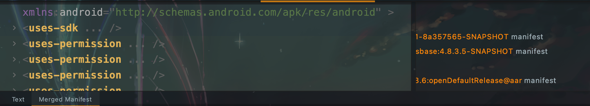

Android APP安全合规问题及解决
============================

### AndroidManifest清单文件问题

AndroidManifest清单文件，主要会涉及到权限声明，和四大组件导出的问题。特别是权限声明，很多都是在SDK里直接声明的，不好确认也不好修改。

##### Merged Manifest

在Android Studio中打开AndroidManifest.xml文件，底下有Text、Merged Manifest两个TAB，其中Text是当前项目配置的清单文件。



Merged Manifest分为两部分，左边是所有merged的信息，可以通过双击定位到具体的来源AndroidManifest文件。右边是所有依赖库的情况。

通过Merged Manifest我们可以快速排查清单文件中不符合安全规范的项并定位来源。

##### 复写SDK中的配置

当我们的安全问题项在三方SDK内部时，标准的做法应该是找提供方兼容解决。但这就涉及到沟通渠道、时间成本的问题。特别是有写大型SDK我们用到的部分完全不涉及到安全合规问题时,可以在打包时强制复写掉SDK内相关声明。

例如去除NFC权限申明，我们在Application 工程的build.gradle中添加如下代码实现：
```
afterEvaluate{
    android.applicationVariants.all{variant ->
        variant.outputs.each { output ->
            output.processResources.doFirst { pm->
                String manifestPath = output.processResources.manifestFile;
                def manifestContent;
                file(manifestPath).readLines().each {
                    if (it.contains("android.permission.NFC")){
                        println(it)

                    }else {
                        if(manifestContent == null){
                            manifestContent = it
                        }else{
                            manifestContent = manifestContent +"\n"+ it
                        }
                    }
                }
                file(manifestPath).write(manifestContent)
            }
        }
    }
}
```

##### 四大组件export属性

对于非外部调用的四大组件export设置为false，对于必须要设置为true的情况下，可以考虑配合自定义权限来使用。

同时对于需要设置为true的四大组件，内部使用Intent内数据时都需要做异常保护。


### 资源相关
##### assets下文件
assets下文件不要有html、特别说HTML中JS有用到innerHTML属性。innerHTML存在XSS攻击漏洞，通过innerHTML属性注入攻击者的页面、执行攻击者的JS等。因此不要在assets下直接明文保存。

assets下不要明文存储的H5地址。


### 权限及个人信息相关

个人信息需要在告知之后才能收集，包括网络请求、mac地址，设备信息等都是个人信息。这就涉及到了我们的启动流程，之前我们将所有的初始化项放到进程初始化中，根据合规要求，对于收集信息的启动项需要在告知弹框并在用户同意之后。在SDK内部需要处理用户拒绝的兜底。

对于权限，基本都申请前弹窗明示权限使用的功能->动态申请->使用（允许）/告知可以在设置中调整（拒绝）的动态权限流程。但现在一个新的要求是拒绝之后48小时内不能频繁申请。这里和业务做个折中，如果是强业务需求的可以重复，非强需求做48小时控制。

### Fuzz测试
Android中通过模糊测试可以做很多事情，例如本身提供的monkey测试，通过adb monkey命令进行点击、滑动等操作的模糊测试，也有很多在线平台例如腾讯的WeTest可以进行模糊测试。对于Android的模糊测试，

网上可以找到的模糊测试脚本：


### 运行时函数函数调用监控


### 一些标准

<a href="https://www.tc260.org.cn/front/main.html">全国信息安全标准化技术委员会</a>

<a href="http://www.cac.gov.cn/2021-03/22/c_1617990997054277.htm">网信办：关于印发《常见类型移动互联网应用程序必要个人信息范围规定》的通知</a>
