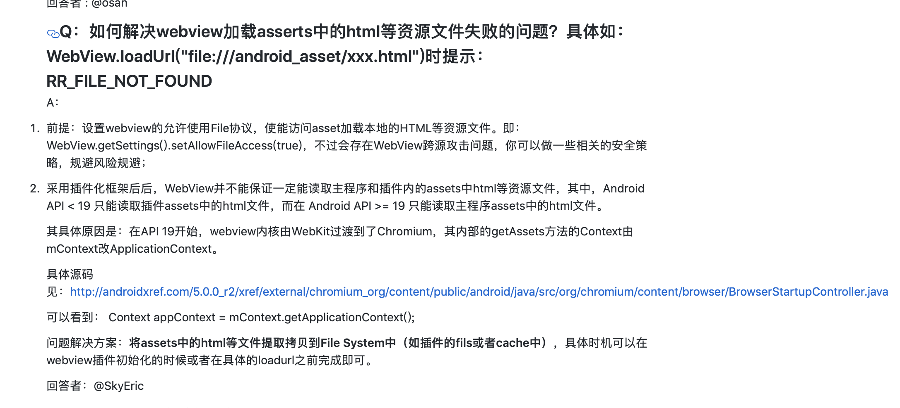
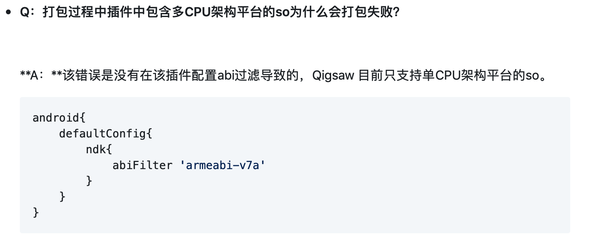

## 插件化框架横向对比

### 框架介绍

#### Atlas

Atlas是伴随着手淘的不断发展而衍生出来的一个运行于Android系统上的一个容器化框架，我们也叫动态组件化(Dynamic Bundle)框架。

Atlas需要将app拆分为host、bundle：

* host。基础支持。包含独立的中间件，以及一个Base的工程，里面可能包含应用的Application，应用icon等基础性内容
*  bundle。业务层基本单位。**运行期按需动态加载**。bundle可以调用host的代码和资源，同时bundle之间允许存在依赖关系。

##### 开发期

提供gradle插件，简化开发者接入的负担。

需要说明的是，gradle插件不会侵入正常的开发流程，host和bundle都可以独立的进行开发和调试。

| plugin                   | 说明                                                         |
| ------------------------ | ------------------------------------------------------------ |
| com.taobao.atlas         | 用于host工程，用于设置对bundle的依赖和其它atlas的功能        |
| com.taobao.atlas.library | 对应bundle工程，用于将module转化成atlas所需要的bundle依赖，不会侵入正常的开发环境 |

##### 运行期

* 四大组件支持。支持运行bundle中的四大组件。
* 共享代码资源。bundle可以直接使用host中的代码和资源。
* bundle按需加载。业务需要时，才会去加载对应bundle中的代码和资源。
* 远程bundle。减少包体积。不常用的bundle放在云端，需要时按需下载。当用户设备空间紧张时,可以清理掉一些长期不用的组件。
* 解释执行。为了降低用户等待时间，Atlas框架在dalivk系统上首次使用bundle时关闭了verify，在ART系统上首次使用时关闭了dex2oat走解释执行。同时后台通过异步任务走原生的dexopt过程，为下次使用做好准备。

##### 运维期

**动态部署** 是容器一个最重要的功能。基于此，业务可以灵活发布自己的需求，有故障的业务可以及时修复或者回滚，同时动态部署的快速覆盖能力在灰度等场景下可以更快地收到所需的效果。

* 动态部署。构建时会与之前版本的dex进行字节码级别的diff，生成tpatch包。最终下发到用户手机的patch仅包含变化class组成的dex和更改或者新增的资源文件。
* dexpatch。以动态部署技术方案为基础，可以看作是动态部署的子集，专注于单个bundle的故障修复。由于做的事小而精，所以编译构建速度、线上生效速度都是远远快于动态部署。

##### 接入指南

用一个比较干净的壳子工程来作为容器架构下的打包工程,称之为__main_builder__，__main_builder__建议只存在AndroidManifest.xml、构建文件及部分资源内容。

- manifest：文件用于单独管理apk的icon，版本号，versioncode等；
- gradle：用于配置主apk的依赖及控制构建参数

1. 引用Atlas插件及依赖仓库，修改工程gradle文件

   ```
   buildscript {
   	repositories { jcenter()}
   	dependencies {
   		classpath "com.taobao.android:atlasplugin:2.3.3.beta2"
   	}
   }
   ```

2. bundle接入，修改bundle的gradle

   ```
   apply plugin: 'com.taobao.atlas.library'
   
   atlas {
   	//声明为awb 即bundle工程
   	bundleConfig { awbBundle true }
   }
   ```

3. 容器接入，修改app模块的gradle文件

   ```
   apply plugin: 'com.taobao.atlas.application'
   dependencies {
   	//核心sdk
   	compile('com.taobao.android:atlas_core:5.0.0@aar') {
    		transitive = true
   	}
   	//如果不需要用到atlas的动态部署功能，不需要依赖atlasupdate
   	compile 'com.taobao.android:atlasupdate:1.0.8@aar'
   	
   	//设置bundle依赖
   	bundleCompile project(':firstbundle')
   }
   atlas {
     atlasEnabled true
     //...
   }
   ```

##### Atlas总结

Atlas其实是一个**组件框架**，并不是一个插件化框架。他主要完成的就是在运行环境中按需地去完成各个bundle的安装，加载类和资源。


#### RePlugin

RePlugin是一套完整的、稳定的、适合全面使用的，占坑类插件化方案，由360手机卫士的RePlugin Team研发，也是业内首个提出”全面插件化“（全面特性、全面兼容、全面使用）的方案。

其主要优势有：

- **极其灵活**：主程序无需升级（无需在Manifest中预埋组件），即可支持新增的四大组件，甚至全新的插件
- **非常稳定**：Hook点**仅有一处（ClassLoader），无任何Binder Hook**！如此可做到其**崩溃率仅为“万分之一”，并完美兼容市面上近乎所有的Android ROM**
- **特性丰富**：支持近乎所有在“单品”开发时的特性。**包括静态Receiver、Task-Affinity坑位、自定义Theme、进程坑位、AppCompat、DataBinding等**
- **易于集成**：无论插件还是主程序，**只需“数行”就能完成接入**
- **管理成熟**：拥有成熟稳定的“插件管理方案”，支持插件安装、升级、卸载、版本管理，甚至包括进程通讯、协议版本、安全校验等
- **数亿支撑**：有360手机卫士庞大的**数亿**用户做支撑，**三年多的残酷验证**，确保App用到的方案是最稳定、最适合使用的

AndroidX版本：<https://github.com/froyohuang/replugin-androidx>

##### 接入指南

###### 主程序接入

1. 添加 RePlugin Host Gradle 依赖

在**项目根目录**的 build.gradle（注意：不是 app/build.gradle） 中添加 **replugin-host-gradle** 依赖：

```
buildscript {
    dependencies {
        classpath 'com.qihoo360.replugin:replugin-host-gradle:2.2.4'
        ...
    }
}
```

2. 添加 RePlugin 

在 **app/build.gradle** 中应用 **replugin-host-gradle** 插件，并添加 **replugin-host-lib** 依赖:

```
android {
    // ATTENTION!!! Must CONFIG this to accord with Gradle's standard, and avoid some error
    defaultConfig {
        applicationId "com.qihoo360.replugin.sample.host"
        ...
    }
    ...
}

// ATTENTION!!! Must be PLACED AFTER "android{}" to read the applicationId
apply plugin: 'replugin-host-gradle'

/**
 * 配置项均为可选配置，默认无需添加
 * 更多可选配置项参见replugin-host-gradle的RepluginConfig类
 * 可更改配置项参见 自动生成RePluginHostConfig.java
 */
repluginHostConfig {
    /**
     * 是否使用 AppCompat 库
     * 不需要个性化配置时，无需添加
     */
    useAppCompat = true
    /**
     * 背景不透明的坑的数量
     * 不需要个性化配置时，无需添加
     */
    countNotTranslucentStandard = 6
    countNotTranslucentSingleTop = 2
    countNotTranslucentSingleTask = 3
    countNotTranslucentSingleInstance = 2
}

dependencies {
    compile 'com.qihoo360.replugin:replugin-host-lib:2.2.4'
    ...
}
```

务必注意

以下请务必注意：

- 请一定要确保符合Gradle开发规范，也**即“必须将包名写在applicatonId”，而非AndroidManifest.xml中**（通常从Eclipse迁移过来的项目可能出现此问题）。如果不这么写，则有可能导致运行时出现“Failed to find provider info for com.ss.android.auto.loader.p.main”的问题。具体可[参见 #87 Issue的问答](https://github.com/Qihoo360/RePlugin/issues/87)。
- 请将apply plugin: 'replugin-host-gradle'放在 android{} 块之后，防止出现无法读取applicationId，导致生成的坑位出现异常
- 如果您的应用**需要支持AppComat**，则除了在主程序中引入AppComat-v7包以外，还需要在宿主的build.gradle中添加下面的代码**若不支持AppComat则请不要设置此项**：

```
repluginHostConfig {
    useAppCompat = true
}
```

> 开启useAppCompat后，我们会在编译期生成AppCompat专用坑位，这样插件若使用AppCompat的Theme时就能生效了。若不设置，则可能会出现“IllegalStateException: You need to use a Theme.AppCompat theme (or descendant) with this activity.”的异常。

- 如果您的应用**需要个性化配置坑位数量**，则需要在宿主的build.gradle中添加下面的代码：

```
repluginHostConfig {
     /**
     * 背景不透明的坑的数量
     */
    countNotTranslucentStandard = 6
    countNotTranslucentSingleTop = 2
    countNotTranslucentSingleTask = 3
    countNotTranslucentSingleInstance = 2
}
```

更多可选配置项参见replugin-host-gradle的RepluginConfig类

3. 配置 Application 类

让工程的 Application 直接继承自 RePluginApplication。

> 如果您的工程已有Application类，则可以将基类切换到RePluginApplication即可。或者您也可以用“非继承式”接入。

```
public class MainApplication extends RePluginApplication {
}
```

既然声明了Application，自然**还需要在AndroidManifest中配置这个Application**。

```
    <application
        android:name=".MainApplication"
        ... />
```

###### 插件接入

1. 添加 RePlugin Plugin Gradle 依赖

在**项目根目录**的 build.gradle（注意：不是 app/build.gradle） 中添加 **replugin-plugin-gradle** 依赖：

```
buildscript {
    dependencies {
        classpath 'com.qihoo360.replugin:replugin-plugin-gradle:2.2.4'
        ...
    }
}
```

2. 添加 RePlugin Plugin Library 依赖

在 **app/build.gradle** 中应用 **replugin-plugin-gradle** 插件，并添加 **replugin-plugin-lib** 依赖:

```
apply plugin: 'replugin-plugin-gradle'

dependencies {
    compile 'com.qihoo360.replugin:replugin-plugin-lib:2.2.4'
    ...
}
```

插件开发教程：<https://github.com/Qihoo360/RePlugin/wiki/%E8%AF%A6%E7%BB%86%E6%95%99%E7%A8%8B>

##### 使用情况

除了**360集团旗下的亿级别应用**以外，还有一些对**稳定要求极其严苛的“金融类”产品**，及第三方合作应用也接入了RePlugin。

##### Replugin一些限制

1. 透明样式不支持与Appcompat使用
2. webview访问assets中文件可能失败
3. 插件的代码尽量小，保证在一个dex中
4. 插件与宿主通过provider jar的方式共享代码
5. 插件内页面无法横屏、转场动画


#### Qigsaw

Qigsaw 是爱奇艺提供的一套**基于 Android App Bundle 的动态化方案**，无需谷歌 Play Service 即可在国内体验 Android App Bundle开发工具。它支持动态下发插件 APK，让应用能够在不重新安装的情况下实现动态安装插件。

##### 接入指南

Qigsaw提供了与AAB相似的接入方式，开发人员只需在gradle中进行配置引入。

在你的项目中新建名为`qigsaw_feature`的dynamic feature模块，`File`->`New`->`New Module`->`Dynamic Feature Module`，默认填入相关配置信息完成插件创建。

在`app/build.gradle`中会自动生成`dynamicFeatures`数组，记录所有插件名称。

```
android {
    compileSdkVersion 28
    buildToolsVersion "29.0.0"
    defaultConfig {
        applicationId "com.example.qigsaw_sample"
        minSdkVersion 14
        targetSdkVersion 28
        versionCode 1
        versionName "1.0"
        testInstrumentationRunner "android.support.test.runner.AndroidJUnitRunner"
    }
    buildTypes {
        release {
            minifyEnabled false
            proguardFiles getDefaultProguardFile('proguard-android-optimize.txt'), 'proguard-rules.pro'
        }
    }
    //所有插件会被记录在数组dynamicFeatures中
    dynamicFeatures = [":qigsaw_feature"]
}
```

在项目根目录下的build.gradle文件中增加`qigsaw-gradle-plugin`作为依赖。

```
buildscript {
    repositories {
        google()
        jcenter()
    }
    dependencies {
        classpath 'com.android.tools.build:gradle:3.3.2'
        classpath 'com.iqiyi.android.qigsaw:gradle-plugin:1.1.4'
    }
}
```

在`app/build.gradle`应用`com.iqiyi.qigsaw.application`插件，并引入`qigsaw-core-library`依赖。

```
apply plugin: 'com.android.application'
apply plugin: 'com.iqiyi.qigsaw.application'

...

dependencies {
    implementation fileTree(dir: 'libs', include: ['*.jar'])
    ......
    implementation 'com.iqiyi.android.qigsaw:splitcore:1.1.4'
    ......
}
```

在`app/build.gradle`中配置`qigsawSplit`拓展选项。

```
qigsawSplit {

    /**
     * 可选项，默认为null
     * 如果插件需要热更新，必须指定old apk文件路径。
     */
    oldApk = projectDir.getPath() + "/qigsaw/app.apk"
    
    /**
     * 可选项, 默认为'null'
     * 限制插件运行的进程，如果配置插件名，插件仅运行在其AndroidManifest文件声明的所有进程（android:process标签）。否则，所有进程均可运行该插件。
     */
    restrictWorkProcessesForSplits = ['qigsaw_feature']

    /**
     * 可选项，默认为1.0.0 
     * 插件信息 JSON 文件版本号，当插件更新时，必须修改其值。
     */
    splitInfoVersion '1.0.0'

    /**
     * 可选项，默认为null
     * 如果插件需要热更新，需要指定old apk生成的mapping文件。
     */
    applyMapping projectDir.getPath() + '/qigsaw/mapping.txt'
    
    /**
     * 可选项，默认为false
     * 控制app编译期间是否上传插件至CDN。推荐Debug阶段为false，Release阶段为true。
     */
    releaseSplitApk false
}
```

> 插件是否上传至您的CDN服务器，由两个因素解决。
>
> 一是 `releaseSplitApk` 必须设置为 true。
>
> 二是插件 AndroidManifest 文件`onDemand` 标签值设置为 true。

在`dynamicFeature/build.gradle`中应用`com.iqiyi.qigsaw.dynamicfeature`插件。

```
apply plugin: 'com.android.dynamic-feature'
apply plugin: 'com.iqiyi.qigsaw.dynamicfeature'
android {
    compileSdkVersion 28

    defaultConfig {
        minSdkVersion 14
        targetSdkVersion 28
        versionCode 1
        versionName "1.0"
    }
}
...
```

详细接入参考：<https://github.com/iqiyi/Qigsaw/wiki>


#### 三大框架对比

##### 使用情况对比

* Atlas，未找到相关数据
* RePlugin，360旗下应用、部分金融App
* Qigsaw，未找到相关数据

#####Android版本支持情况

* Atlas，4.0-7.0
* RePlugin，>=2.3
* Qigsaw，>= 4.0

##### 框架维护状况

- Atlas，github记录最新更新为两年前
- RePlugin，github记录最新更新为9个月前
- Qigsaw，github记录最新更新为1个月内

##### 开发体验

* Atlas，文档简陋，由于是一个组件化框架，与我们现有项目结合不太合适，虽然支持动态部署，但是跟我们目标的以插件形式提供功能存在一定的差距，适配工作较为麻烦。
* RePlugin，文档丰富，同时提供配套的插件管理服务，开发需要按照RePlugin的规范来，存在一些限制，可能导致接入外部SDK出现问题。
* Qigsaw，文档略简陋，提供相应接口自行实现插件管理，开发与原生AAB一致，由于使用AAB的开发套件因此开发体验与原生AAB一直。采取和一般插件化框架类似的动态加载技术并不依赖google play市场。

### 总结

综合考虑了RePlugin和Qigsaw方案：RePlugin是插件化方案，设计上插件是一个完整的功能块，插件和宿主之间不推荐存在也很难实现共享代码和共享资源。Qigsaw是动态组件化方案，各个插件可以直接依赖宿主的代码，但不能动态新增四大组件，需要提前占坑。

考虑到使用场景下插件对宿主的依赖较大，例如依赖宿主的地图、阿里支付模块，依赖宿主插件管理层定义的标准协议，且RePlugin存在一个无法绕过的坑（见附录 坑1），因此将采用Qigsaw方案。RePlugin可作为备选方案，若需使用备用RePlugin方案，将需要将业务插件包装成一个闭环。

### 附录 坑1


使用hybird的SDK理论上存在该问题，使用内置assets下静态HTML有问题，这里介绍的兼容方案需要改SDK内加载HTML的逻辑，如果是将三方SDK作为插件时无法这样适配。

### 附录 坑2



使用Qigsaw方案插件只允许支持一种cpu类型。考虑到我们当前目标支持设备基本都是armeabi-v7a，该问题影响不大。后续如果有相关的强需求，也可以在插件下发时根据目标设备做取舍。


