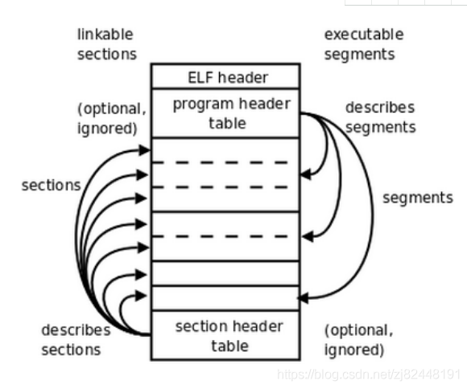
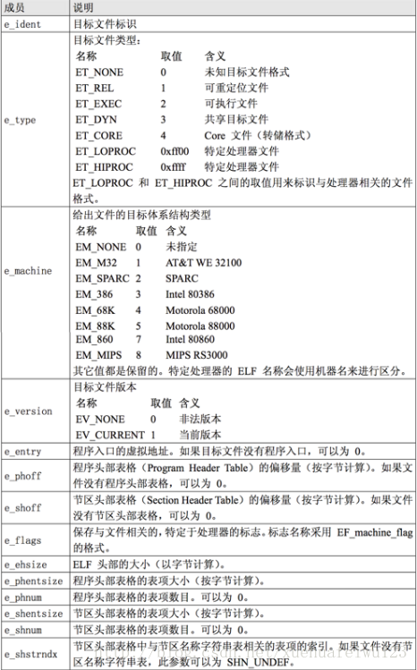
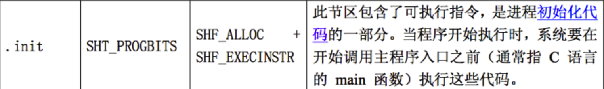
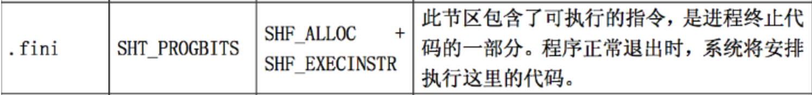

SO文件分析及逆向、加固
===================

### so文件ELF格式分析
ELF格式有ELF头（ELF header）、程序头表（Program header table）、节（Section）/段（Segment）和节区头表（Section header table）。

整体结构入下图，图片来自网络：


对于SO，有链接、执行等阶段。链接是按图左边，通过ELF头中节区头表的偏移量定位到节区头表，然后映射的中间节区区域。执行是按图的右边，过ELF头中程序头表的偏移量定位到程序头表，然后映射的中间段区域。节和段指的是同一部分区域，只是在不同的阶段不同的格式读取。

###### ELF头（ELF Header）

```java
public byte[] e_ident = new byte[16];  //16位字节魔数，包含".ELF"，Class:64位（0x02）还是32位（0x01）或者非法（0x01x01）、Data：采用大端字节结构(0x02)还是小端字节结构（0x01）或者非法（0x01x01）、Version(ELF头部版本，固定)、之后都是未使用字段赋值0。
public short e_type; //文件类型 2位字节
public short e_machine; //运行设备类型 ARM/X86等
public int e_version; //文件版本
public int e_entry; //入口
public int e_phoff; //程序头表偏移
public int e_shoff; //节区头表偏移
public int e_flags; 
public short e_ehsize; //ELF头部长度正常应该是52
public short e_phentsize; //程序头块的大小
public short e_phnum; //程序头块的数量
public short e_shentsize; //节区头表块大小
public short e_shnum; //节区头表块数量
public short e_shstrndx;
```


详细取值情况可见下表，表格来自网络：



在elf.h中的定义如下：

```cpp
typedef struct elf32_hdr{
    unsigned char   e_ident[EI_NIDENT];
    Elf32_Half  e_type;
    Elf32_Half  e_machine;
    Elf32_Word  e_version;
    Elf32_Addr  e_entry;  /* Entry point */
    Elf32_Off   e_phoff;
    Elf32_Off   e_shoff;
    Elf32_Word  e_flags;
    Elf32_Half  e_ehsize;
    Elf32_Half  e_phentsize;
    Elf32_Half  e_phnum;
    Elf32_Half  e_shentsize;
    Elf32_Half  e_shnum;
    Elf32_Half  e_shstrndx;
} Elf32_Ehdr;
typedef struct elf64_hdr {
    unsigned char   e_ident[16];    /* ELF "magic number" */
    Elf64_Half e_type;
    Elf64_Half e_machine;
    Elf64_Word e_version;
    Elf64_Addr e_entry; /* Entry point virtual address */
    Elf64_Off e_phoff;  /* Program header table file offset */
    Elf64_Off e_shoff;  /* Section header table file offset */
    Elf64_Word e_flags;
    Elf64_Half e_ehsize;
    Elf64_Half e_phentsize;
    Elf64_Half e_phnum;
    Elf64_Half e_shentsize;
    Elf64_Half e_shnum;
    Elf64_Half e_shstrndx;
}
```


###### 程序头表（Program Header）

程序头表在ELF中可能存在多个，描述的是一个段的信息。

对于程序头表，在elf.h中的定义如下：
```cpp
typedef struct elf32_phdr{
    Elf32_Word  p_type;
    Elf32_Off   p_offset;
    Elf32_Addr  p_vaddr;
    Elf32_Addr  p_paddr;
    Elf32_Word  p_filesz;
    Elf32_Word  p_memsz;
    Elf32_Word  p_flags;
    Elf32_Word  p_align;
} Elf32_Phdr;
typedef struct elf64_phdr {
    Elf64_Word p_type;
    Elf64_Word p_flags;
    Elf64_Off p_offset; /* Segment file offset */
    Elf64_Addr p_vaddr; /* Segment virtual address */
    Elf64_Addr p_paddr; /* Segment physical address */
    Elf64_Xword p_filesz;   /* Segment size in file */
    Elf64_Xword p_memsz;    /* Segment size in memory */
    Elf64_Xword p_align;    /* Segment alignment, file & memory */
} Elf64_Phdr;
```

p_type：段的类型
p_offset：相对于文件的偏移。
p_vaddr：该段的所指向内存中的虚拟地址。
p_paddr：该段的所指向内存中的物理地址。
p_filesz：该段在文件映像中所占的字节数。
p_memsz：该段在内存映像中占用的字节数。可能大于p_filesz，多余的部分补0，这是因为ELF文件映射到内存中时是以系统的页长度为单位的，操作系统往往以页为基本单位来管理内存分配，一般是4KB。但不可能小于p_filesz。
p_flags：相关标志。
p_align：对齐参数。


对于p_type的取值，在elf.h中都有有定义：
```cpp
#define PT_NULL    0  //未定义
#define PT_LOAD    1  //可加载段
#define PT_DYNAMIC 2  //动态链接信息
#define PT_INTERP  3  //描述了一个字符串的长度位置信息，被当做解释器使用，最多存在一个段且必须在可加载段之前。
#define PT_NOTE    4  //附加信息
#define PT_SHLIB   5
#define PT_PHDR    6
#define PT_LOPROC  0x70000000
#define PT_HIPROC  0x7fffffff
#define PT_MIPS_REGINFO 0x70000000
#define PT_MIPS_OPTIONS 0x70000001
```

其他的都一些取值也都有预定义。

###### 节区
节区保存了具体的文件信息。特别的，节和段的区别，一个段有多个节组成。他们是链接器和执行期不同维度的结构。

我们的在SO开发的时候会要求release去除符号表。这个符号表就是一个特殊的节，就保存在节区中。

特别的有一些特殊的系统使用的节区，这写节区名都是以”.“开头的。这里可以看下.init和.fini节区：





##### 节区头部 

在elf.h中的定义如下：
```cpp
typedef struct elf32_shdr {
    Elf32_Word  sh_name;
    Elf32_Word  sh_type;
    Elf32_Word  sh_flags;
    Elf32_Addr  sh_addr;
    Elf32_Off   sh_offset;
    Elf32_Word  sh_size;
    Elf32_Word  sh_link;
    Elf32_Word  sh_info;
    Elf32_Word  sh_addralign;
    Elf32_Word  sh_entsize;
} Elf32_Shdr;
typedef struct elf64_shdr {
    Elf64_Word sh_name; /* Section name, index in string tbl */
    Elf64_Word sh_type; /* Type of section */
    Elf64_Xword sh_flags;   /* Miscellaneous section attributes */
    Elf64_Addr sh_addr; /* Section virtual addr at execution */
    Elf64_Off sh_offset;    /* Section file offset */
    Elf64_Xword sh_size;    /* Size of section in bytes */
    Elf64_Word sh_link; /* Index of another section */
    Elf64_Word sh_info; /* Additional section information */
    Elf64_Xword sh_addralign;   /* Section alignment */
    Elf64_Xword sh_entsize; /* Entry size if section holds table */
} Elf64_Shdr;
```

这里主要看一下sh_type的取值，其他部分都可以在elf.h中查到

```cpp
/* sh_type */
#define SHT_NULL    0 //空节区，这个类型的节区头部表数据结构中其他变量都无意义。
#define SHT_PROGBITS    1 //程序信息。
#define SHT_SYMTAB  2 //符号表。
#define SHT_STRTAB  3 //字符串表
#define SHT_RELA    4 //重定位表项
#define SHT_HASH    5  // 符号哈希表
#define SHT_DYNAMIC 6  //动态链接信息
#define SHT_NOTE    7   //标记文件信息
#define SHT_NOBITS  8
#define SHT_REL 9
#define SHT_SHLIB   10
#define SHT_DYNSYM  11
#define SHT_NUM 12
#define SHT_LOPROC  0x70000000
#define SHT_HIPROC  0x7fffffff
#define SHT_LOUSER  0x80000000
#define SHT_HIUSER  0xffffffff
#define SHT_MIPS_LIST   0x70000000
#define SHT_MIPS_CONFLICT   0x70000002
#define SHT_MIPS_GPTAB  0x70000003
#define SHT_MIPS_UCODE  0x70000004
```


###### ELF格式解析实现

<a href="https://github.com/fourbrother/parse_androidso.git">parse_androidso</a>

### 逆向

###### 010 editor
010 editor提供了ELF格式的解析模板，通过010 editor可以十分方便的常看so文件各个区块的数据。

使用010 editor工具查看简单SO文件信息如下：

###### ida
我们可以通过ida来分析so。

* 我们可以通过在ida中String面板上查询字符串，如果秘钥通过String存在都会被看到等。
    - view菜单->Open subviews->string 。快捷键shift+F12
* 我们也可以通过ida来寻找函数，例如未使用动态注册的so中入口函数都是com_xxx_xxx之类的。
    - Function 面板。默认打开。
* 我们也可以通过ida来还原函数代码，查看代码实现。
    - 选中函数->view菜单->Open subviews->generate pseudcode 。快捷键F5

我们也可以使用ida来做一些静态的代码调试。

###### 

### 加固

加固就是对so文件的加密，同时也需要使用到SO文件时能够解密。这就需要一个很好的hook点，这里会用到两个属性__attribute__((constructor));和__attribute__((destructor));，这两个 属性修饰的 函数、变量等都会在启动或停止时被调用，是优先于main函数的。在前面SO文件格式的节区部分有提到.init和.fini两个特殊的节区就是基于这两个属性实现的。

我们可以自定义一个section来实现解密函数，并使用__attribute__((constructor));标记。

###### 基于section的加密

* 加密部分
    - 

* 解密部分
    - 


###### 基于函数的加密


###### 动态添加section


### 参考
<a href="https://blog.csdn.net/xuehuafeiwu123/article/details/72963229">ELF格式文件详细分析</a>
<a href="https://blog.csdn.net/luohai859/article/details/54618512">使用IDA逆向Android的.so动态库文件</a>
<a href="https://www.jianshu.com/p/a2d87d9467cc">So文件添加Section段详细说明</a>
