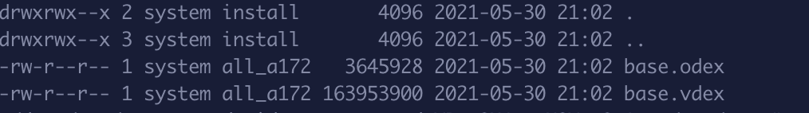
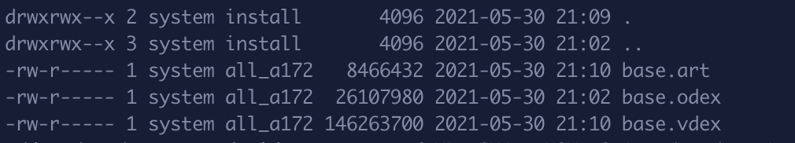

Android代码编译过程理解
====================

### 一些概念

前端编译器：针对特定语言的编译器。根据语言特性做词法分析，语法分析，语义分析，然后生成中间码。

后端编译器：后端编译器与平台有关，将中间文件根据平台的特性生成在对应平台可执行的机器吗。

解释执行： 直接解释执行源代码，会参与到整个程序的运行过程，在运行中不会已文件的形式产生独立的对应机器环境的可执行程序（注意是程序，是指都在内存层面进行不会有产物）。或者将源程序翻译成某种中间代码的形式后再加以运行.

编译执行： 提前将源代码翻译成目标机器可执行的程序（ELF格式机器码）让后再执行。

Java虚拟机：是对具体机器的一种抽象，屏蔽具体机器的系统、软硬件细节，使得Java程序不需要关心运行环境即可在各种设备上运行.对于整个代码编译过程来说，虚拟机起到的是后端编译器的角色，讲中间代码翻译成Android机器可以执行的机器码。

devlik虚拟机：解释执行的虚拟机，在APK启动的时候将dex文件翻译成可执行机器码。时间换空间。

ART虚拟机：编译执行的虚拟机。在APK安装的时候就会会进行dex文件的dexopt过程，产生对应的可执行的程序（ELF格式)。空间换时间。


### Android代码编译过程

* java文件转化为class文件，使用javac命令，对代码做词法语法语义分析。这一步是java的步骤，与Android平台无关。
* 代码混淆。代码混淆是代码优化的步骤，混淆是建立在代码等价的基础上的。通过混淆可以
* dx打包。dex文件是Android的目标中间码。devlik虚拟机和ART虚拟机都执行的都是dex文件。
* dex文件是devlik byte code，对于不同的虚拟机，处理不同
    * 对于devlik虚拟机，在APK安装时做dexopt过程，生成的是odex文件，并不是机器码，这一步属于后端编译器的代码优化步骤。然后在app启动的时候将odex文件转化为机器码。
    * 对于ART虚拟机，在APK安装的时候做dex2oat过程，oat文件是基于ELF格式的可执行文件，属于机器码。在app启动的时候就可以快速执行。

### JIT模式（devlik虚拟机）
在Android 5.0以下的手机，采用的devlik虚拟机，使用JIT模式解释执行代码。Android dex存在65536问题，因此为对dex进行分包。官方提供MultiDex的机制来进行dex的加载。


这里明确可以看到，multidex是对5.0以下设备生效。

所以整个过程如下：

* APK安装是对主dex进行dexopt过程，生成odex文件。
* 在APP启动时，如果存在多dex，需要使用multidex功能加载。
* 对于首次启动，对于secondary dex，需要进行dexopt过程。所以首次启动时较慢。
* 对于非首次启动，已经存在odex文件，可以直接加载。

### AOT模式（ART虚拟机）
在Android5.0~6.0的设备上，采用ART虚拟机，使用AOT模式编译执行。在APK安装的时候对所有dex文件做dex2oat过程，生成对于的oat文件。所以这种模式下会拖慢安装过程，同时生成较大的oat文件。但APP启动的时候会快。

我们使用multidex的话，会有如下的日志：
```
MultiDex: VM with version 2.1.0 has multidex support
MultiDex: check zip files
MultiDex: VM has multidex support, MultiDex support library is disabled.
```

虚拟机已经做了多dex的支持无需在应用启动的时候处理。

### AOT+JIT模式（ART虚拟机）
在Android7.0以上设备，采用AOT+JIT模式。引入了热点代码的概念，同时引入了.vdex、.art、.cdex等文件来进行代码优化。首次运行是采用JIT模式。执行到具体代码时才编译机器码，同时对trace进行记录。当设备空闲时，会扫描分析记录文件对热点代码执行dexoat过程生成机器码，这样对于热点代码下次启动时执行相同代码就可以直接执行机器码。

对热点代码生成机器码的过程并不只执行一次。在用户使用过程中会产生越来越多的热点代码，这些代码在空闲时都会生成机器码。因此这里的AOT模式会被理解成ALL OF THE TIME。

基于这种模式，能提升安装及系统升级速度，节省存储空间。用户在首次使用的时候速度会满一些，在后续使用时会越来越快。


### AOT+JIT模式下代码存续情况
前面都是些理论上的的记录，下面我们看看在AOT+JIT模式下，小米8+Android 10下的代码存续情况。

对于新安装未启动的应用，在/data/app/${package path}/oat/arm(arm64)/目录下会有base.vdex和base.odex文件，以某音app为例：


当我们使用来了一段时间后，对于目录下的情况如下：


Android 平台下所有代码都保存在dex下，vdex文件是对dex文件进行验证流程后的结果保存文件，包括所有的原dex文件数据和quicken info（快速校验）两部分。这样在dex2oat过程中就可以跳过dex的veriify流程，减少时间。

但这个文件并不是安装时生成就不变的，从上图可以看到使用APP后，文件修改时间和大小都有变化。


oatdump --app-oat=tdata_XYq933.odex --image=/system/framework/boot.art


