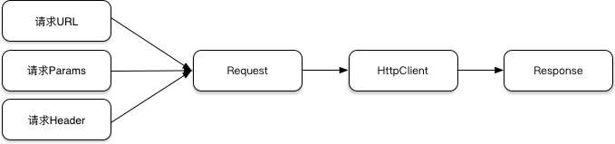
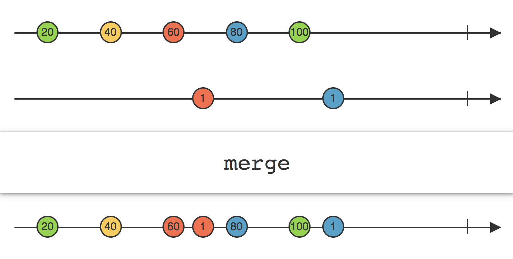

RXAndroid学习思考
====================

### 概念理解

响应式编程的核心是关系，他构建的是事物之间的关系模型。面向对象的编程是对事物的抽象，但各个事物之间是脱离的，使用响应式编程就是将各个独立的对象通过异步、流等方式串联起来，维护其关系。例如接口请求，其过程如下

如果不使用响应式编程，我们可能会如下实现

1. 创建一个线程。
2. 通过URL,params,header创建request。
3. 调用OkHttpClient发生请求。
4. 获取Response回调主线程。

虽然我们将请求封装成Request,具体请求发送封装成OkHttpClient,请求结果封装成Response，但我们整个实现中会有很多代码去构建Request，解析Response，这些过程并没有经过封装。且整个过程是通过编码的形式实现，后续中间新增一个步骤都是需要对过程进行编码式修改。

如果套用响应式编程的方法，我们假设对这些对象间转换的中间过程都能进行抽象成一个操作符A,B,C分别代表上述过程中的2，3，4。这整个过程就变成了A(URL,params,header).B().C().subscribe(Observer)。再通过observeOn(IO)来实现后台线程执行和subscribeOn(mainThread)来实现最终回调到主线程，我们就能在Observer中得到最终的请求响应。这样我们就整个实现过程就只有“事物-转换->事物-转换->事物”这样的流式过程而不会有具体的过程编码，中间需要加另一层装换的话也只需要调用式修改。

### 线程调度
ObserveOn：指定一个观察者(Observer)在哪个调度器上观察这个Observable

SubscribeOn：指定Observable自身（既subscribe方法）在哪个调度器上执行。

官方针对线程调度介绍图：

如图所示：
1. SubscribeOn只需要调用一次，且调用位置不做要求，设置后Observable的subscribe方法会在该线程中执行。
2. ObserveOn调用之后，之后的Observer都会有在这个调度器上观察。
3. 操作符Map等，可以理解为本身就是一个返回Observable的Observer（Observer<Observable>）,也会受ObserveOn的影响。

### 主要类
Observable/Flowable：被观察者，发送者。一旦被订阅，就会将事物A发送给订阅者。

Observer/Subscriber：观察者，订阅者，接受Publisher就会将事物A，转化为事物B。

*在RxJava2.0中，有五种观察者模式：*

1. *Observable/Observer 不支持背压*
2. *Flowable/Subscriber 支持背压*
3. *Single/SingleObserver*
4. *Completable/CompletableObserver*
5. *Maybe/MaybeObserver*

Subscription:Subscription建立了Subscriber和Flowable联系。允许下游Subscriber调用Subscription的request和cancle方法控制上游Flowable的行为。常在处理背压阻塞情况下使用。

### 常用操作符介绍

###### Observable.merge

将多个Observable组合到一起，

