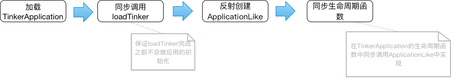
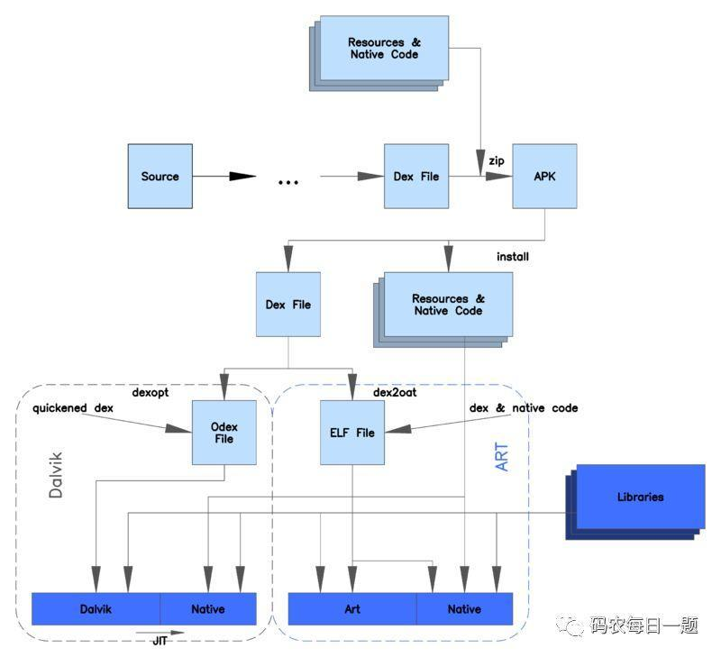

Tinker源码研究分析
==================

### 目录

* [杂谈](#random_talk)
* [入口](#research_entrance)
    - [ApplicationLike](#application-like)
    - [三个接口](#listener)
* [补丁合并](#patch_merge)
    - [dex篇](#dex)
    - [资源篇](#resource)
    - [SO篇](#so)
* [Diff实现](#diff)
    - [DexDiffDecoder](#DexDiffDecoder)
    - [BSPatch](#BSPatch)
* [补丁加载](#patch_use)
    - [Dex加载](#dex_load)
    - [资源加载](#res_load)
    - [SO加载](#so_load)
* [打包补丁](#patch_package)
    - [插件Extension](#plugin_extension)
    - [打包TASK](#package_task)

### <span id="random_talk">杂谈</span>

当前热修复框架可以说是Tinker、SoPhix两家独大，Tinker可以认为是远端静态修复，而Sophix则是远端的动态修复。其他如AndFix，Nuwa等实现也纷纷开源，在整个热修复生态界，整个热修复的原理介绍已经随处可见，自己实现热修复已经不再是难点。但是我们更期望的动态修复方案SoPhix却还未开源，且需要收费接入~

在早期，热修复并没有这么多资料。大概在15年10月份的时候，github上找到了ACDD，是基于OpenAtlas的动态部署框架，与热修复的实现是相同的。因此在ACDD的基础上，参考google-mulitdex的实现完成了热修复框架HotPlugin。其中热修复框架代码修复逻辑网路上都有迹可循，安全上的签名校验和插件打包实现会复杂的多，特别是基于gradle编写的插件打包流程，因为hook了APK打包过程，还需要做打包插件的适配。

在使用过程中，在android系统适配上、多进程修复上等情况下出了很多细节问题，考虑到当前已有成熟免费开源的实现，开始接入Tinker，由此对Tinker实现进行了研究。

### <span id="research_entrance">入口</span>

### <span id="application-like">ApplicationLike</span>

Tinker提供的Application代理的方式，目的是解决Application无法被热修复的问题。



隐藏Application，单纯作为应用入口，但所有的初始化都放在代理类ApplicationLike中。在loadTinker完成之前，虚拟机不会加载ApplicationLike类。

ApplicationLike通过反射创建，这样ApplicationLike的代码不需要放到主dex内。

如果一个类的static方法，private方法，override方法以及构造函数中引用了其他类，而且这些类都属于同一个dex文件，此时该类就会被打上CLASS_ISPREVERIFIED。

Android的primary dex打包时规则中，会将Application相关代码自动加入primary dex中。Tinker并不会对代码做插桩，因此Application会被打上CLASS_ISPREVERIFIED标记。不通过反射方式实现将ApplicationLike类放到secondary dex中，会无法修复。

因此Tinker不建议我们继承TinkerApplication实现Application，会导致这个Application里的引用的类无法修复。

### <span id="listener">三个接口</span>

#### PatchListener

合并补丁接口，默认实现DefaultPatchListener。有新补丁时通过TinkerInstaller.onReceiveUpgradePatch安装，内部调用PatchListener.onPatchReceived。在PatchListener.onPatchReceived中做补丁文件安全性进行了校验，校验通过启动:patch进程做补丁合并，否则通过LoadReporter上报错误。


#### PatchReporter

补丁加载过程事件上报类，补丁合并，加载整个过程中的任何事件都通过这个类反馈给开发者。

#### LoadReporter

补丁修复，升级过程中的回调。

### <span id="patch_merge">补丁合并</span>

补丁下载成功移交给Tinker做合并时，会启动名为:path的服务进程做补丁安全校验和合并。服务进程是后台进程，整个过程是IO操作，启用了进程包活机制保障合并过程能正常进行。


关键方法：
1. TinkerPatchService.doApplyPatch
2. UpgradePatch.tryPatch

#### <span id="dex">dex篇</span>

dex的处理都在DexDiffPatchInternal中，主要是extractDexDiffInternals方法。
补丁的dex信息都保存在dex_meta.txt文件中。共有8项，分别如下：
```java
    final String name = kv[0].trim(); 
    final String path = kv[1].trim(); 
    final String destMd5InDvm = kv[2].trim(); 
    final String destMd5InArt = kv[3].trim();
    final String dexDiffMd5 = kv[4].trim();
    final String oldDexCrc = kv[5].trim();
    final String newDexCrc = kv[6].trim();
    final String dexMode = kv[7].trim();
```

###### dex合并

合并重点过程伪代码如下：

```java
/**
     * 
     * @param context 上下文。
     * @param dir 操作空间。  应用data目录/tinker/{patchName}/dex/
     * @param meta dex_mate数据。
     * @param patchFile 补丁文件。
     * @param type
     * @return
     */
private static boolean extractDexDiffInternals(Context context, String dir, String meta, File patchFile, int type) {
    
    //1.读取dex_mate.txt中补丁信息保存到patchList中。
    ShareDexDiffPatchInfo.parseDexDiffPatchInfo(meta, patchList);

    //2.对于ART虚拟机，检查patchList中待合并项在dir目录中是否已经存在可用的合并结果（classN文件，以tinker_classN.apk的压缩包形成保存在dir目录，文件： --2）。
    //再遍历检查过程中，
    //通过destMd5InArt校验,如果有校验不通过的，清空所有classN文件。
    //校验通过时，若有目录里如果有dex文件（文件：--3），进行删除。并返回合并成功。
    if (checkClassNDexFiles(dir)) {
        return true;
     }

     //3.遍历pathList，做一些信息校验，文件准备等工作。
    for (ShareDexDiffPatchInfo info : patchList) {
        //3.1 根据虚拟机类型手机info的信息。并判断信息是否准确。
        if (!isVmArt && info.destMd5InDvm.equals("0")) {
            continue;
        }
        String extractedFileMd5 = isVmArt ? info.destMd5InArt : info.destMd5InDvm;
        if (!SharePatchFileUtil.checkIfMd5Valid(extractedFileMd5)) {
            manager.getPatchReporter().onPatchPackageCheckFail(patchFile, BasePatchInternal.getMetaCorruptedCode(type));
            return false;
        }
        //3.2 检查目录内是否有可用的dex文件（文件：--3）。若不可用，整理目录。
        if (extractedFile.exists()) {
            if (SharePatchFileUtil.verifyDexFileMd5(extractedFile, extractedFileMd5)) {
                continue;
            } 
        } 

        //3.3 根据不同情况拷贝dex文件到目录。
        if (oldDexCrc.equals("0")) {
            //3.3.1 如果是新增dex文件，做dex拷贝并要求MD5校验通过。
            if (!extractDexFile(patch, patchFileEntry, extractedFile, info)) {
                return false;
            }
        } else if (dexDiffMd5.equals("0")) {
            //3.3.2 如果当前的dex修复项并没有对dex文件做修复，直接从APK中取出这个Entry。
            extractDexFile(apk, rawApkFileEntry, extractedFile, info);
        } else  {
            //3.3.3 其他的则是对以存在的dex做修复，调用patchDexFile函数做dex的合并。合并时调用DexPatchApplier.executeAndSaveTo,将新旧dex合并，并保持到extractedFile。
            patchDexFile(apk, patch, rawApkFileEntry, patchFileEntry, info, extractedFile);

        }
    }
    // 4. 所有补丁信息保存在classNDexInfo中，key是patchInfo，value是上述过程处理好的文件。遍历，将所有文件保存在ClassN文件中。
    if (!mergeClassNDexFiles(context, patchFile, dir)) {
        return false;
    }

}
```

###### dexoptimize过程

Android中所有的代码封装在Dex文件内，dex文件是根据源码编译而成运行在手机中。在实际场景下，不同手机采用的虚拟机不同，同一虚拟机其配置参数也可能有差异，google解决这一场景的方案是增加了一个中间过程来对dex文件提前做适配优化，提升运行效率，这个过程就是dexoptimize过程。

根据虚拟机的不同分类两种实现，dalvik虚拟机下的dexopt过程和art虚拟机下的dex2oat过程。

早期Android采用了dalvik虚拟机，其采用的是JIT(just in Time 即时编译)技术，在程序运行时会对dex文件做编译，将java字节码编译成机器码，将java指令编译成cpu可执行的微处理器指令。这个是一个比较耗时的过程，因此dexopt只对一些多次使用的热代码进行了编译，非热点代码则有解释器在代码使用的时候翻译成机器码有CPU使用。

google采用Android 4.4之后使用了ART虚拟机，采用了AOT(Ahead Of Time 预编译)技术,在APK安装的时候将java字节码全部编译成机器码以可执行的ELF文件形式保存在本地，程序运行时直接读取机器码，提升效益。相应的会消耗更多内存和拖慢安装过程。

两种方式对比如下图：



*google在Android 7.0之后采用和混合编译的方式来做这个过程。*

*上述过程是针对标准的代码文件，加壳之后代码文件隐藏后或者Tinker这种加载额外的代码文件时，这个opt过程就需要自己实现。*

Tinker中对补丁代码dexoptimize过程实相关代码：

1. DexDiffPatchInternal.dexOptimizeDexFiles
2. TinkerDexOptimizer
3. OptimizeWorker

要实现Opt过程也很简单，只需如下调用：
```java
    DexFile.loadDex(dexFile.getAbsolutePath(), optimizedPath, 0);
```

采用ART虚拟机后，为了向下兼容，所以整个过程的对外暴露接口都没有变更，DexFile.loadDex最终会调用系统的Native层代码，在Native层opt实现方式不同。

同时也可以通过命令行来进行这个过程，特别的ART虚拟机，Android系统大于21时，如果系统升级之前的Opt结果会被人问过期，此时会通过这种方式进行Opt(具体在后续dex加载过程有介绍)。此时实现过程在TinkerDexOptimizer.interpretDex2Oat(dexFile.getAbsolutePath(), optimizedPath)中。

* 系统是否有升级可以通过Build.FINGERPRINT值来判断，该值是由基带信息、release版本、设备等信息拼接而成，作为设备的系统指纹 *


#### <span id="resource">资源篇</span>
补丁包中资源的信息都保存在assets/res_meta.txt中。
资源meta中包含所有资源的变更信息，包括a，，

资源的处理主要在ResDiffPatchInternal类中，tryRecoverResourceFiles方法。

###### 资源包的生成

资源包的生成过程重点伪代码如下：

```java
 private static boolean extractResourceDiffInternals(Context context, String dir, String meta, File patchFile, int type) {
    //1 解析meta数据 
    ShareResPatchInfo.parseAllResPatchInfo(meta, resPatchInfo);

    //2 资源合并结果文件存在，且MD5校验结果通过，说明该补丁之前有资源成功合并过，可以直接使用
    if (resOutput.exists()) {
        if (SharePatchFileUtil.checkResourceArscMd5(resOutput, resPatchInfo.resArscMd5)) {
            //it is ok, just continue
            return true;
        } 
    } 

    //3 检查arsc文件的crc，并取出大文件资源，检查不通过或取出操作失败直接跳出资源合并。--1
    if (!checkAndExtractResourceLargeFile(context, apkPath, directory, tempResFileDirectory, patchFile, resPatchInfo, type)) {
        return false;
    }
    //4 遍历APK的TinkerZipEntry，对于符合resPatchInfo.patterns匹配且还需要的资源，从APK中取出作为ZipEntry保存到out
    while (entries.hasMoreElements()) {
        if (ShareResPatchInfo.checkFileInPattern(resPatchInfo.patterns, name)){
            if (!resPatchInfo.deleteRes.contains(name)
                && !resPatchInfo.modRes.contains(name)
                && !resPatchInfo.largeModRes.contains(name)
                && !name.equals(ShareConstants.RES_MANIFEST)) {
                TinkerZipUtil.extractTinkerEntry(oldApk, zipEntry, out);
            }
        }
    }
    //5 APK中取出Manifest文件保存到out中
    TinkerZipUtil.extractTinkerEntry(oldApk, manifestZipEntry, out);

    //6 将步骤3中的resPatchInfo.largeModRes都保存到out中。
    for (String name : resPatchInfo.largeModRes) {
        TinkerZipEntry largeZipEntry = oldApk.getEntry(name);
        TinkerZipUtil.extractLargeModifyFile(largeZipEntry, largeModeInfo.file, largeModeInfo.crc, out);
    }
    //7 对于新增的资源，自动补丁zip中取出Entry，保存到out中
    for (String name : resPatchInfo.addRes) {
        TinkerZipEntry addZipEntry = newApk.getEntry(name);
         //7.1 如果新增的资源在resPatchInfo.storeRes中，在步骤2中已经取出保存在temp目录。将缓存文件作为Entry加入到out中。 
        if (resPatchInfo.storeRes.containsKey(name)) {
            File storeFile = resPatchInfo.storeRes.get(name);
            TinkerZipUtil.extractLargeModifyFile(addZipEntry, storeFile, addZipEntry.getCrc(), out);
        } 
        //7.2 否则直接从补丁zip中取出Entry保存到out中
        else {
            TinkerZipUtil.extractTinkerEntry(newApk, addZipEntry, out);
        }
    }
    //8 对于修改的资源，处理和步骤7一致
    for (String name : resPatchInfo.modRes) {
        TinkerZipEntry modZipEntry = newApk.getEntry(name);
        if (resPatchInfo.storeRes.containsKey(name)) {
            File storeFile = resPatchInfo.storeRes.get(name);
            TinkerZipUtil.extractLargeModifyFile(modZipEntry, storeFile, modZipEntry.getCrc(), out);
        } else {
            TinkerZipUtil.extractTinkerEntry(newApk, modZipEntry, out);
        }
    }
    //9 将APK的comment写入out，保持zip完整性 --2
    out.setComment(oldApk.getComment());
    //10 文件校验，resOutput和补丁信息中的resArscMd5校验，失败进行清理。
    boolean result = SharePatchFileUtil.checkResourceArscMd5(resOutput, resPatchInfo.resArscMd5);

 }
```

至此，所有得资源修改都保存到了resOutput中，out是resOutput的输入流。

###### 注释1：
1. 校验APK中的resources.arsc的crc值与meta信息中的arscBaseCrc是否匹配。
2. 如果存在大文件情况（resPatchInfo.largeModRes或resPatchInfo.storeRes存在）分别遍历。
    1. 遍历resPatchInfo.storeRes，从补丁文件中取出zipEntry保存到res_temp（文件4）文件下，并对resPatchInfo.storeRes这个map赋value值
    2. 遍历resPatchInfo.largeModRes，从APK中取出源文件，通过BSPatch.patchFast方法生成修改后的文件保存并赋值largeModeInfo.file。
    
###### 注释2：
1. comment是文件注释，写在APK文件内。

#### <span id="so">so篇</span>
SO的处理主要在BsDiffPatchInternal.tryRecoverLibraryFiles中。

so的不行信息保存在so_meta.txt中，其中信息为：
```java

final String name = kv[0].trim();
            final String path = kv[1].trim();
            final String md5 = kv[2].trim();
            final String rawCrc = kv[3].trim();
            final String patchMd5 = kv[4].trim();

```

###### SO补丁处理

SO补丁处理处理过程如下：

```java
private static boolean extractBsDiffInternals(Context context, String dir, String meta, File patchFile, int type) {
    //1 解析meta数据，保存在patchList中
    ShareBsDiffPatchInfo.parseDiffPatchInfo(meta, patchList);
    //2 遍历所有的patchList，做处理。
    for (ShareBsDiffPatchInfo info : patchList) {
        //3 如果本SO项处理结果存在且可用，继续处理下一个lib项。
        if (extractedFile.exists()) {
            if (fileMd5.equals(SharePatchFileUtil.getMD5(extractedFile))) {
                continue;
            } 
        } 
        //4 如果本lib项中的patchMd5为0，说明是新增，调用extract方法将补丁patch中对应的Entry取出保存到extractedFile中。
        if (patchFileMd5.equals("0")) {
            if (!extract(patch, patchFileEntry, extractedFile, fileMd5, false))
                return false;
            }
        }
        //5 如果需要对APK中的lib项做修改，从APK中取出oldStream，从patch中取出newStream，调用BSPatch.patchFast做合并。
        else{
            BSPatch.patchFast(oldStream, newStream, extractedFile);
        }

    }

}
```

至此，所有得lib库的修改，都体现在了lib目录下。

### <span id="diff">diff实现</span>

#### <span id="DexDiffDecoder">DexDiffDecoder</span>
对于Tinker中加固应用的dex差分，主要在DexDiffDecoder中，根据是否是加固应用分别调用generateChangedClassesDexFile()和generatePatchInfoFile()。对于generateChangedClassesDexFile函数中，首先将新、老包的DEX文件构建出DexGroup对象，其实就是对DEX格式进行解析，具体DEX文件格式不在展开。真正差分在DexClassesComparator的startCheck。我们直接看比较的重点代码：

```java
    public void startCheck(DexGroup oldDexGroup, DexGroup newDexGroup) {
        
        //oldGroup中有，newGroup中没有的视为删除的类。
        Set<String> deletedClassDescs = new HashSet<>(oldDescriptorOfClassesToCheck);
        deletedClassDescs.removeAll(newDescriptorOfClassesToCheck);

        for (String desc : deletedClassDescs) {
            // These classes are deleted as we expect to, so we remove them
            // from result.
            if (Utils.isStringMatchesPatterns(desc, patternsOfIgnoredRemovedClassDesc)) {
                logger.i(TAG, "Ignored deleted class: %s", desc);
            } else {
                logger.i(TAG, "Deleted class: %s", desc);
                deletedClassInfoList.add(oldClassDescriptorToClassInfoMap.get(desc));
            }
        }
        //newGroup中有，oldGroup中没有的视为新增的类
        Set<String> addedClassDescs = new HashSet<>(newDescriptorOfClassesToCheck);
        addedClassDescs.removeAll(oldDescriptorOfClassesToCheck);

        for (String desc : addedClassDescs) {
            if (Utils.isStringMatchesPatterns(desc, patternsOfIgnoredRemovedClassDesc)) {
                logger.i(TAG, "Ignored added class: %s", desc);
            } else {
                logger.i(TAG, "Added class: %s", desc);
                addedClassInfoList.add(newClassDescriptorToClassInfoMap.get(desc));
            }
        }

        //newGroup中有，oldGroup中也有的可能是有变更的类。
        Set<String> mayBeChangedClassDescs = new HashSet<>(oldDescriptorOfClassesToCheck);
        mayBeChangedClassDescs.retainAll(newDescriptorOfClassesToCheck);

        for (String desc : mayBeChangedClassDescs) {

            DexClassInfo oldClassInfo = oldClassDescriptorToClassInfoMap.get(desc);
            DexClassInfo newClassInfo = newClassDescriptorToClassInfoMap.get(desc);
            switch (compareMode) {
                //COMPARE_MODE_NORMAL模式，直接比较两个类是否有变更，
                //isSameClass内部会查看类的定义：
                //1.accessFlags（public、private等）、2.类描述、3.接口情况、4.类名称、
                //5.注解情况、6.类数据（变量、函数等）、7.静态变量值。
                case COMPARE_MODE_NORMAL: {
                    if (!isSameClass(
                            oldClassInfo.owner,
                            newClassInfo.owner,
                            oldClassInfo.classDef,
                            newClassInfo.classDef
                    )) {
                        if (Utils.isStringMatchesPatterns(desc, patternsOfIgnoredRemovedClassDesc)) {
                            logger.i(TAG, "Ignored changed class: %s", desc);
                        } else {
                            logger.i(TAG, "Changed class: %s", desc);
                            changedClassDescToClassInfosMap.put(
                                    desc, new DexClassInfo[]{oldClassInfo, newClassInfo}
                            );
                        }
                    }
                    break;
                }
                //COMPARE_MODE_REFERRER_AFFECTED_CHANGE_ONLY模式，会检查该类引用到的类是否有变化。
                //isClassChangeAffectedToReferrer函数内部比较逻辑：
                //1.如果父类有变更，认为该类变更。
                //2.如果接口有变更，认为该类变更。
                //3.如果该类的Field和Methods有变更，认为该类便跟
                case COMPARE_MODE_REFERRER_AFFECTED_CHANGE_ONLY: {
                    if (isClassChangeAffectedToReferrer(
                            oldClassInfo.owner,
                            newClassInfo.owner,
                            oldClassInfo.classDef,
                            newClassInfo.classDef
                    )) {
                        if (Utils.isStringMatchesPatterns(desc, patternsOfIgnoredRemovedClassDesc)) {
                            logger.i(TAG, "Ignored referrer-affected changed class: %s", desc);
                        } else {
                            logger.i(TAG, "Referrer-affected change class: %s", desc);
                            changedClassDescToClassInfosMap.put(
                                    desc, new DexClassInfo[]{oldClassInfo, newClassInfo}
                            );
                        }
                    }
                    break;
                }
                default: {
                    break;
                }
            }
        }
    }
```

逻辑的话就是就change的类会复杂些，会进行详细检测，这些检测都是基于Dex格式中读取信息进行。

所有diff信息差分出来之后，写入一个dex文件，会根据所属原dex文件进行归并分别生成新的diff dex文件。这里使用了dexlib2库的DexBuilder类，通过dexBuilder.internClassDef()函数在新dex中添加类信息，这里会通过DexClassInfo在newDex中取出类信息，来进行构建差分dex。这里只用到了added和changed的类，忽略了deleted的类。

对于未加固的APK，使用generatePatchInfoFile()函数，这里就完全根据dex文件格式进行了，比较每个setion是否相同。

#### <span id="DexPatchApplier">DexPatchApplier</span>

#### <span id="BSPatch">BSPatch</span>

### <span id="patch_use">补丁加载</span>

补丁加载的时机在ApplicationLike章节已经介绍。在TinkerLoader.tryLoadPatchFilesInternal中实现,方法一开始做一些必要的校验，TinkerDexLoader.checkComplete、TinkerSoLoader.checkComplete和TinkerResourceLoader.checkComplete方法。

#### <span id="dex_load">dex加载</span>
dex加载实现在TinkerDexLoader.loadTinkerJars中。

```java
public static boolean loadTinkerJars(final TinkerApplication application, String directory, String oatDir, Intent intentResult, boolean isSystemOTA) {
        //1. 获取ClassLoader，与Application中getClassloader的是同一个。
        PathClassLoader classLoader = (PathClassLoader) TinkerDexLoader.class.getClassLoader();
        //2. dex文件校验，通过保存在legalFiles中
        for (ShareDexDiffPatchInfo info : loadDexList) {
            legalFiles.add(file);
        }
        legalFiles.add(classNFile);
        // verify merge classN.apk
        if (isVmArt && !classNDexInfo.isEmpty()) {
            legalFiles.add(classNFile);
        }
        //3. 针对ART虚拟机，Andreoid系统在L和O之间如果系统OTA升级了，之前的dexoptimize已经过期，重新TinkerDexOptimizer.optimizeAll进行dexopt过程
        if (isSystemOTA) {
            deleteOutOfDateOATFile(directory);

            TinkerDexOptimizer.optimizeAll(
                legalFiles, optimizeDir, true, targetISA,
                new TinkerDexOptimizer.ResultCallback() {
                
                }
            );
        }
        //4. 分Android版本对将dex插入ClassLoader的dex路径dexElements中。这一步的实现逻辑已经很清晰了。
        try {
            SystemClassLoaderAdder.installDexes(application, classLoader, optimizeDir, legalFiles);
        } catch (Throwable e) {
            return false;
        }

        return true;
    }
```

dex的加载和multidex，Zone等方法一致，通过反射Hook ClassLoader的dex路径dexElements，将补丁中额外的dex源，添加到dexElements数组的最前面，这样ClassLoader在加载类的时候回先从补丁dex源中寻找。

特别的，Tinker针对Android N（24，7.0）以上手机，定义了AndroidNClassLoader类，实现克隆并替换系统的ClassLoader来处理类。

*不清楚这步是基于什么考虑*

#### <span id="res_load">资源加载</span>

资源的加载实现在TinkerResourceLoader.loadTinkerResources中。要理解补丁资源加载的实现逻辑，需要对Android资源加载过程有所了解。

Tinker对资源加载实现HOOK点有两个，一个是ActivityThread的LoadApk，设置LoadApk的mPackages和mResourcePackages。另一个是ResourcesManager的mActiveResources，mActiveResources是Map，value是Resources，设置所有Resource的mAssets。

具体逻辑伪代码如下：
```java
    public static void monkeyPatchExistingResources(Context context, String externalResourceFile) throws Throwable {
        //1 LoadApk的HOOK实现，27以下需要同时设置mPackages和mResourcePackages，27以上只需要设置mPackages
        if (Build.VERSION.SDK_INT < 27) {
            packagesFields = new Field[]{packagesFiled, resourcePackagesFiled};
        } else {
            packagesFields = new Field[]{packagesFiled};
        }

        //2 遍历所有的LoadedAPK，找出指向原APK资源路径的LoadedAPK将资源路径指向新的externalResourceFile
        for (Field field : packagesFields) {
            for (Map.Entry<String, WeakReference<?>> entry
                    : ((Map<String, WeakReference<?>>) value).entrySet()) {
                if (appInfo.sourceDir.equals(resDirPath)) {
                    resDir.set(loadedApk, externalResourceFile);
                }
            }
        }

        // 3. 构造的新的newAssetManager，调用addAssetPathMethod，设置newAssetManager的资源路径为externalResourceFile
        if (((Integer) addAssetPathMethod.invoke(newAssetManager, externalResourceFile)) == 0) {
            throw new IllegalStateException("Could not create new AssetManager");
        }

        //4. 在Kitkat上需要设置AssetManager的mStringBlocks，其他不要求但设置了也不会有影响。这里都做设置
        if (stringBlocksField != null && ensureStringBlocksMethod != null) {
            stringBlocksField.set(newAssetManager, null);
            ensureStringBlocksMethod.invoke(newAssetManager);
        }

        //5，遍历ResourcesManager的mActiveResources的所有Resource，用newAssetManager替换Resource的mAssets属性，并调用resources.updateConfiguration方法通知资源的变更。
        for (WeakReference<Resources> wr : references) {
            assetsFiled.set(resources, newAssetManager);
            resources.updateConfiguration(resources.getConfiguration(), resources.getDisplayMetrics());
        }
    }
```

国内手机厂商对Android系统定制的原因，导致资源修复存在很多兼容性问题，例如小米手机的资源类是MiuiResource等一系列问题，具体处理可参考源码。

#### <span id="so_load">SO加载</span>
SO的加载都在TinkerSoLoader类中实现，看源码的话就会发现它余资源、dex的加载过程相比有很奇怪的一点，只有TinkerSoLoader方法，却没有Loader方法，看着貌似完全没有实现加载过程。其实是有原因的。

Android中SO的加载有两种方式，分别是System.loadLibrary和System.load两种。System.loadLibrary的入参是libName，只是库的名称。System.load加载的是fileName，是库的路径。

System.loadLibrary方式加载SO时，方法调用链：
System.loadLibrary ->Runtime.loadLibrary0->ClassLoader.findLibrary->DexPathList.findLibrary。SO的加载路径是[/data/app/{package}/lib/arm, /data/app/{package}/base.apk!/lib/armeabi, /vendor/lib, /system/lib]。在安装过程中很明显其so并为安装在上述目录。

System.load方式加载SO时，传入的是SO库的文件路径。Tinker使用这种方式做SO修复。因此修复SO是需要修改对应load的类文件，通过System.load（文件路径）的方式加载SO，两相配合完成SO的修复。
*待验证*
### <span id="patch_package">打包补丁</span>

Tinker补丁打包的插件可通过apply plugin: 'com.tencent.tinker.patch'导入。插件的实现在源码的/tinker-build/tinker-patch-gradle-plugin/项目中。插件类为TinkerPatchPlugin。

#### <span id="plugin_extension">插件Extension</span>
Tinker的Extension如下：

```groovy
    project.extensions.create('tinkerPatch', TinkerPatchExtension)
    project.tinkerPatch.extensions.create('buildConfig', TinkerBuildConfigExtension, project)
    project.tinkerPatch.extensions.create('dex', TinkerDexExtension, project)
    project.tinkerPatch.extensions.create('lib', TinkerLibExtension)
    project.tinkerPatch.extensions.create('res', TinkerResourceExtension)
    project.tinkerPatch.extensions.create('packageConfig', TinkerPackageConfigExtension, project)
    project.tinkerPatch.extensions.create('sevenZip', TinkerSevenZipExtension, project)
```
具体可以参考源码中/tinker-sample-android/app/build.gradle中的配置。

其中部分配置与合并过程中的meta文件向对应，例如tinkerPatch.buildConfig.res.pattern。

如需实现针对设备或其他条件的修复，可配置tinkerPatch.packageConfig，在补丁安装的时候进行判断实现有条件加载。

特别的，针对加固APP，需要设置tinkerPatch.buildConfig.isProtectedApp = true。这样所有的代码变动会被整合到统一的class_changes.dex中，相对于dex合并的时候就是新增的dex。实际上是没有做dex的全量合并的，相当于降级到了Qzone实现。

#### <span id="package_task">打包TASK</span>

###### TinkerPatchSchemaTask
打包补丁时使用的tinkerPatchRelease命令执行的就是TinkerPatchSchemaTask的Task。


