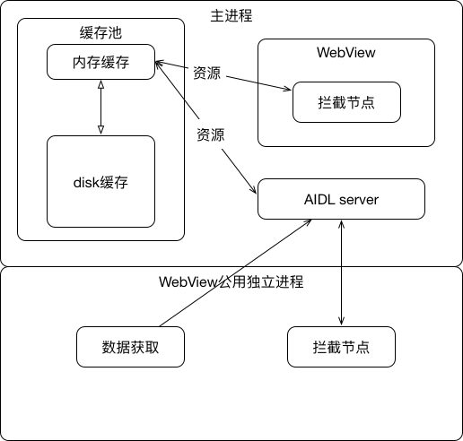
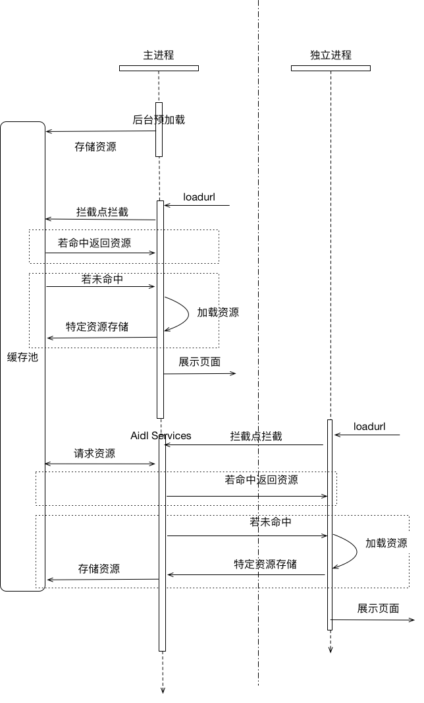
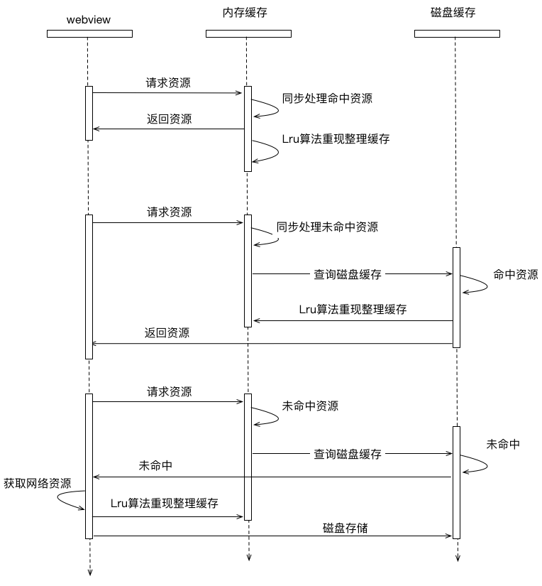

webview资源缓存方案分析
======================

## 简介 ##


webview资源缓存方案是针对h5页面是用的图片，css等资源进行缓存。在webview的页面资源加载逻辑中注入拦截点，对于特定的资源（例如url以特定的协议头）加载时，首先在资源缓存池里获取，取不到再从网络上获取，同时保存到缓存池。

考虑到webview会使用独立的进程来保障crash，内存等对主进程的影响，因此对内存池的访问需要同时考虑到跨进程的情况，使用aidl的方式来实现跨进程的内存池访问。


## 方案设计 ##

+ 使用缓存池来做资源的存储和读取，主进程和独立进程间通过aidl进行通信。
+ 除首页等特定的webview，其他统一运行在独立进程。
+ 缓存池在主进程里实现，提供跨进程调用的方式。
+ webview对资源的拦截点在自己的进程里处理，如果发生在独立进程，再通过aidl与主进程进行通信。
+ 独立进程对token等数据，通过aidl从主进程获取。

具体架构图如下：



具体序列图如下：



## 拦截点 ##
拦截发生在各自的进程内。通过在兼听webview的shouldInterceptRequest()方法实现，该方法是在异步线程力调用的，因此在缓存池设计的时候不用考虑线程问题，但需要考虑同步问题。。

```java
    webView.setWebViewClient(new WebViewClient() {
        ...

        @TargetApi(21)
        @Override
        public WebResourceResponse shouldInterceptRequest(WebView view, WebResourceRequest request) {
            //TODO: 资源处理逻辑
            return super.shouldInterceptRequest(view,request);
        }

        @Override
        public WebResourceResponse shouldInterceptRequest(WebView view, String url) {
            //TODO: 资源处理逻辑
            return super.shouldInterceptRequest(view, url);
        }
    });
```

拦截点处理后返回WebResourceResponse对象。

```java
    public class WebResourceResponse {
        public WebResourceResponse(String mimeType, String encoding, InputStream data) {
            throw new RuntimeException("Stub!");
        }

        public WebResourceResponse(String mimeType, String encoding, int statusCode, String reasonPhrase, Map<String, String> responseHeaders, InputStream data) {
            throw new RuntimeException("Stub!");
        }
        ...
    }

```

该对象的构建需要用到mimeType，因此对资源缓存的时候同时需要缓存mimeType和encoding的数据。

## 缓存池设计 ##

缓存池分为内存缓存和磁盘缓存。资源先从内存缓存池中获取，未命中再从磁盘缓存中获取。如果都未命中，需要从网络上获取并进行存储。

具体序列图如下：



#### 内存缓存 ####

使用lrucache算法实现内存缓存。限定总共内存池大小，当当前剩余内存大小不足以保证资源加载时，清理最近最少使用的对象。

内存缓存由于存在对内存池内增删的操作，所以在异步实现的时候需要考虑同步问题。

#### 磁盘缓存 ####

磁盘中资源以文件的形式存储，以url的md5值为文件名称。文件包括头部和资源内容两部分，头部存储mimeType，encoding等必要数据，如有失效策略，还可以存储时间戳。

|名称     |大小     |
|--------|--------|
|mimeType| 4 byte |
|encoding| 4 byte |
|timestamp|13 byte|
|date    | ...    |


