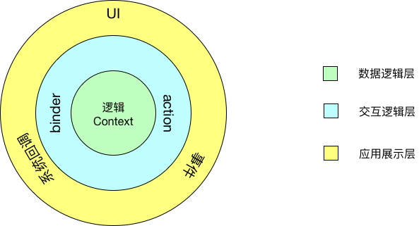
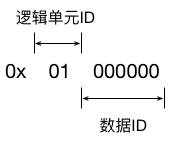

AndX
======

AndX是Android侧的响应式编程框架，构建数据和视图的链接关系。在数据变更的时候，能够自动的反应到视图中并引起视图更新。同时针对特定的控件，在控件内容变更后自动同步到绑定源数据。

### 使用
###### 数据逻辑定义
继承AndXContextWrapper，通过public final int变量定义状态和计算式。
```Java
public class LoginLogicContext extends AndXContextWrapper {
    //状态定义
    public final int PLANE_TYPE = sInit(0);
    //计算式定义
    public final int PWD_STYLE = cInit(new AndXForm<ViewStyle>() {
        @Override
        public ViewStyle equation() {
            ViewStyle style = ViewStylePool.getInstance().getStyle();
            if(getIntState(PLANE_TYPE) == 0){
                style.textColor = R.color.gh_cm_text_color_1;
            }else{
                style.textColor = R.color.gh_cm_text_color_4;
            }

            return style;
        }
    });
}
```

AndXContextWrapper创建后，建议调用attachActivity函数和finish函数，开启Activity代理和生命周期感知功能。

```Java
    LoginLogicContext logic = new LoginLogicContext()
                .attachActivity(this)
                .finish();
```


###### UI视图绑定数据逻辑。
继承AndXBinder实现页面自己的绑定逻辑。AndXBinder不提供组合功能，但页面可以拥有多个AndXBinder对象。AndXBinder只是绑定逻辑的抽象，可以跟着视图区域ViewHoler走。但每个AndXBinder都需要有指定的AndXContextWrapper类，负责将ViewHoler和ndXContextWrapper进行逻辑绑定。

在自己的AndXBinder类里，定义页面的绑定逻辑，并在合适的时机调用。例如在页面初始化的时候需要绑定的定义为bindInitView，动态显示UI可以在显示的时候再绑定。

```Java
    public void bindInitView(LoginRealizeActivity holder) {
        //原生控件绑定，将mModePasswordLLayout的显示逻辑绑定到mLogic.PLANE_TYPE中
        getAdapter(holder.mModePasswordLLayout).bindVisible(mLogic.PLANE_TYPE, new TransformFunc<Integer, Boolean>() {
            @Override
            public Boolean transform(Integer value) {
                return value == 0;
            }
        });

        bind(mLogic.PLANE_TYPE, new Consumer<Integer>() {
            @Override
            public void accept(Integer integer) throws Exception {
                
            }
        });
    }
```

针对Android的原生控件，都提供Adapter类，给出了该控件的绑定实现，可以调用getAdapter方法获取。同时针对部分绑定方法，提供了数据转化逻辑TransformFunc，使用TransformFunc可以很方便的实现状态数据的转化，例如字符串拼接，类型转化等。

同时也可以通过bind函数自己实现绑定逻辑。提供一个Consumer，内部会订阅数据逻辑的变化。

###### 数据操作

当用户操作引起数据变更的时候，都建议通过Action实现。

继承AndXActionRegistry实现自己的Registry。AndXActionRegistry不提供组合功能，同时一个页面只共用一个AndXActionRegistry，这样可以实现页面各部分（ViewHolder）之间互相交互。

```Java
    public final int MUTATION_REQUEST_DATA = addAction(new AndXAction() {
        @Override
        public void action(Object... args) {
            String name = mContext.getAndXValue(mContext.NAME,String.class);
            String password = args[0].toString();

            //模拟请求

            //请求成后更新状态
            user = new User("王一","123456");
//            mContext.putState(mContext.IMAGE_SRC,R.string.app_name);
            mContext.putState(mContext.USER,user);
        }
    });
```

页面中通过mRegistry.commit(mRegistry.MUTATION_REQUEST_DATA,params)既可触发。

AndXContextWrapper同时也提供getAndXValue函数，来获取状态和计算式的结果。

### 实现



###### 数据逻辑层：
继承AndXContextWrapper实现，定义状态数据和逻辑计算式。

###### 交互逻辑层：
联通数据逻辑层和应用展示层。上行通过Binder，数据变更后会通过绑定关系通知到UI。下行通过Action，UI事件和系统回调都通过Action来操作数据逻辑，形成一个闭环。

###### 应用展示层：
Activity，View等，负责页面的具体展示。

##### AndXContextWrapper
AndX框架的数据逻辑单元类AndXContext的包装实现。

AndXContext继承了ContextWrapper并代理了当前Activity的Context，因此可以作为上下文环境Context使用。

###### 逻辑串联机制
AndXContextWrapper提供逻辑串联机制，适应多逻辑单元组合的场景。一个页面可能有多个逻辑单元，这些逻辑单元通过串联组合形成了页面的数据逻辑层。AndXContextWrapper内部实现了向上代理的逻辑，当本逻辑单元无法响应指定操作时，会抛给父逻辑单元处理，以此类推。使用逻辑串联机制，使用时使用link函数添加子逻辑单元。

```Java

    public AndXContextWrapper link(Class<? extends AndXContextWrapper> clazz){
        try {
            return clazz.getConstructor(AndXContextWrapper.class).newInstance(this);
        } catch (Exception e) {
            e.printStackTrace();
        }
        return this;
    }

    public <T> void putState(int stateId, @NonNull T value) {
        //通过ID分配机制确定是否是本逻辑单元的数据逻辑
        if(checkId(stateId)){
            super.putState(stateId - getHexPref(),value);
        }else{
            if(parent != null){
                //使用父逻辑单元进行响应
                parent.putState(stateId,value);
            }else{
                AssertInfo.assertNullState(stateId);
            }
        }
        computeJobSchedule();
    }
```

特别的，如果子逻辑单元的某个数据逻辑定义中使用到了父逻辑单元的数据，需要在构造函数中定义。

###### 自动commit机制
AndXContextWrapper提供计算式自动commit机制。每次状态变更都都会注册一个提交事件，16ms内没有再次发生状态变更会自动commit。状态依赖的视图可能会延迟1帧刷新。

```Java
    public void computeJobSchedule() {
        if(mDisposable != null && !mDisposable.isDisposed()){
            mDisposable.dispose();
        }
        mDisposable = Observable.timer(16,TimeUnit.MILLISECONDS).subscribe(new Consumer<Long>() {
            @Override
            public void accept(Long aLong) throws Exception {
                commitCompute();
            }
        });
    }
```

##### 状态StatePool-AndXStateRegistry
###### 状态保存
通过sInit方法定义状态，例如使用部分的定义一个值为0,类型为Int,ID为PLANE_TYPE的状态。内部创建了一个AndXState对象，保存在AndXStateRegistry的集合mStates中，其ID反应了其在集合中的位置。

当调用了putState时，通过传入的ID找到集合内对应的AndXState对象进行操作。
###### 粘性实现
状态的绑定是粘性的，既视图通过了bind函数绑定了一个状态时，就会将最新的状态值发送出去更新视图。
```Java
    public boolean subscribeActual(Consumer<? super T> onNext) {
        try{
            //粘性实现，发送最新的值
            if(t != null){
                AssertInfo.assertSubscribeNullState(stateId);
                onNext.accept(t);
            }
            mSubject.subscribe(onNext);
            return true;
        }catch (Exception e){
            e.printStackTrace();
            return false;
        }
    }
```

##### 计算式ComputePool-AndXComputeRegistry
通过cInit、cInitStrict方法定义计算式。需要传入一个计算逻辑对象AndXForm。定义的计算式都保存在mCompute集合中

###### 感知依赖状态
在计算式内如果用到状态数据，通过getState函数（或者确定类型的函数getIntState等）来获取。计算式的计算，会做为一个事物，在一个子线程中单独执行，过程中会自动感知所依赖的状态，并订阅这些状态的变更。同时这个子线程的创建使用了一个单线程的线程池，来保证多次计算不会干扰，且不会创建过度的计算线程。

```Java

    public AndXCompute(AndXForm<R> equation,int computeId,boolean useStrict){
        this.mEquation = equation;
        this.mComputeId = computeId;
        this.mUseStrict = useStrict;
        //开启一个计算事物
        mContext.startEquation(computeId);
        //真正计算
        mValue = mEquation.equation();
        //结束一个计算事物并获取依赖的状态ID。
        dependencies = mContext.endEquation(computeId);
        //获取状态依赖标记
        mMark = generateMark();
        //订阅依赖的状态
        bindState();
        AssertInfo.assertComputeInfo(mComputeId,mUseStrict,mMark,mValue);
    }

```

特别的cInit、cInitStrict的区别在于，cInitStrict定义的计算式每次计算，都会重新感知所依赖的状态，如果有变化会重新订阅新的额状态。因此在依赖的状态不变是可以使用cInit来提高效率。

###### 粘性实现
和状态一样，计算式也是粘性的，绑定计算式既会收到最新的计算结果。

###### 精准变更实现
计算式依赖的状态变化时，计算式只需要响应最后一次的变更，中间的都是无效变更。

因此计算式会自动感知依赖状态的变化，但并不会立即重新计算。当依赖的状态变更时，计算式会被标记为changed。当一次状态变化逻辑完成后调用commit方法，会刷新这些计算式并通知视图变更。

```Java

    public void commit(){
        synchronized (mChanged){
            for(int computeId:mChanged){
                mCompute.get(computeId-AndXContext.COMPUTE_ID_START).commitChange();
            }
            mChanged.clear();
        }
    }


    protected void onValueChange(){
        synchronized (mChanged){
            if(!mChanged.contains(mComputeId)){
                mChanged.add(mComputeId);
            }
        }
    }
```


##### ID分配机制



###### 逻辑单元ID
逻辑单元ID一个逻辑单元对象的ID，是在逻辑串联组合中的识别码。同一逻辑单元在不同的逻辑串联组合中其ID不一定相同。

最顶层逻辑单元是0x01,子逻辑单元在父逻辑单元的基础上递增0x01，也反应了在逻辑串联组合中的层级。
```Java
    public int getHexPref(){
        if(parent == null){
            return 0x01000000;
        }else{
            return parent.getHexPref()+0x01000000;
        }
    }
```

###### 数据ID
数据ID是该数据在缓存集合中的position，状态数据取值0x000000~0x7fffff,计算式数据取值0x800000~0xffffff。

因此在使用一个ID时，通过逻辑单元ID确定是由哪个逻辑单元定义，并去除前两位逻辑单元ID。逻辑单元听过ID的范围确定是状态还是计算式取得集合position。最后在对应的集合中获取对应的数据。

##### 生命周期感知
使用Lifecycle组件实现生命周期感知，AndXContextWrapper实现了LifecycleObserver接口。在finish函数的时候注册到Activity内，实现感知。

感知生命周期的变化，当页面在后台的时候，状态变更并不通知订阅者，但会改变状态的值，同时记录这个状态。当页面回到前台后自动发送这些状态。

```Java

    public void onResume() {
        mPerception = CONTEXT_PERCEPTION_ACTIVE;
        mStateRegistry.notifyChanges();
    }

    public void onPause() {
        mPerception = CONTEXT_PERCEPTION_PAUSE;
    }

```


### 数据逻辑层单元测试实现

