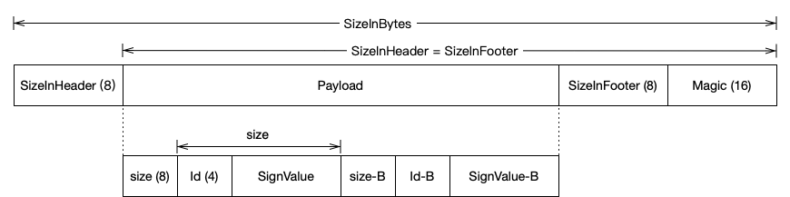

基于V2签名的渠道包生成方案
=======================

针对V2签名的渠道包生成方案的实现，网上说的都是在”APK签名分块“中添加渠道信息的“ID-值”对来实现，包括美团开源的walle实现。确实这个方案貌似是当前的主流方案。

### V2签名介绍

针对V2签名的实现可以查看google的官方介绍：https://source.android.com/security/apksigning/v2.html

针对我们渠道包生成的方案，重点需要关注的一下几点：

> 为了保护 APK 内容，APK 包含以下 4 个部分：
>
>   * ZIP 条目的内容（从偏移量 0 处开始一直到“APK 签名分块”的起始位置）
>   * APK 签名分块
>   * ZIP 中央目录
>   * ZIP 中央目录结尾
>   
>   
>
>   图 2. 签名后的各个 APK 部分
>
>    APK 签名方案 v2 负责保护第 1、3、4 部分的完整性，以及第 2 部分包含的“APK 签名方案v2 分块”中的 signed data 分块的完整性。

*这里说道”APK 签名分块“中除了“APK 签名方案 v2 分块”中的 signed data 分块外，其他部分不负责保护完整性。因此我们可以在该区域内保存我们的渠道信息。*

> 在 APK 文件中，“APK 签名分块”位于“ZIP 中央目录”（位于文件末尾）之前并紧邻该部分。该分块包含多个“ID-值”对，所采用的封装方式有助于更轻松地在 APK 中找到该分块。APK 的 v2 签名会存储为一个“ID-值”对，其中 ID 为 0x7109871a。

*APK 签名分块都是以“ID-值”对的形式存在的，其中V2签名的数据会以固定ID为0x7109871a存在，我们也可以用一个固定ID的“ID-值”对来保存我们的渠道信息*

>  “APK 签名分块”的格式如下（所有数字字段均采用小端字节序）：
>
>   * size of block，以字节数（不含此字段）计 (uint64)
>   * 带 uint64 长度前缀的“ID-值”对序列：
>       * ID (uint32)
>       * value（可变长度：“ID-值”对的长度 - 4 个字节）
>   * size of block，以字节数计 - 与第一个字段相同 (uint64)
>   * magic“APK 签名分块 42”（16 个字节） 
>
>   在解析 APK 时，首先要通过以下方法找到“ZIP 中央目录”的起始位置：在文件末尾找到“ZIP 中央目录结尾”记录，然后从该记录中读取“中央目录”的起始偏移量。通过 magic 值，可以快速确定“中央目录”前方可能是“APK 签名分块”。然后，通过 size of block 值，可以高效地找到该分块在文件中的起始位置。

*这里说明里如何找到”APK签名分块“的起始位置，从而插入我们的渠道信息，但这里有一点没有说明，就是“ZIP 中央目录结尾”块的格式是如何的，如何从“ZIP 中央目录结尾”记录中找到“中央目录”的起始偏移量，*

>由于第 4 部分（ZIP 中央目录结尾）包含“ZIP 中央目录”的偏移量，因此该部分的保护比较复杂。当“APK 签名分块”的大小发生变化（例如，添加了新签名）时，偏移量也会随之改变。因此，在通过“ZIP 中央目录结尾”计算摘要时，必须将包含“ZIP 中央目录”偏移量的字段视为包含“APK 签名分块”的偏移量。

*文档中说的 必须将包含“ZIP 中央目录”偏移量的字段视为包含“APK 签名分块”的偏移量 不是很容易理解。*

*最开始的引用段落中说道"ZIP 中央目录结尾"部分是受到完整性保护的，其变更后签名校验的时候肯定是通过不了的。但包括我们插入渠道信息之后“ZIP 中央目录”偏移量也都是会变化的。因此在计算"ZIP 中央目录结尾"的摘要的时候用“APK 签名分块”的偏移量作为“ZIP 中央目录”偏移量的值来计算，签名校验的时候也用“APK 签名分块”的偏移量做校验，“ZIP 中央目录”偏移量这个值本身确实要保存“ZIP 中央目录”偏移量。但这个于我们加签渠道信息没有影响，是对APK签名和APK签名校验这两个流程有影响*

### 渠道签名

V2签名使用ApkSigner工具实现，我们的渠道包生成其实也可以理解为对APK文件在进行加签，我们从google针对签名实现的源码入手，来实现生成渠道包。通过代码对比可以发现美团开源的walle实现，也是从ApkSigner工具源码中衍生出来的，很多关键函数都是一样的。

9.0的相关源码在这里 <a href="https://android.googlesource.com/platform/tools/apksig/+/refs/tags/android-9.0.0_r41/src/main/java/com/android/apksig">apksig</a>。我们结合源码，根据官方文档的V2签名介绍来实现我们的渠道包签名。当在这之前我们需要详细了解下
APK 签名块结构和ZIP 中央目录结尾块结构，以了解V2签名的google的官方介绍中不清楚的点。
#### APK 签名块结构

APK 签名块详细结构如下：



官方文档中对APK 签名分块介绍还是不够具象。

>size of block，以字节数（不含此字段）计 (uint64)

签名块中保存的“size of block”(图中的SizeInHeader及SizeInFooter)并不是整个签名块的size，这里的“（不含此字段）”意思是计算size的时候改字段的长度不计入APK 签名分块的长度。但是我们在获取APK 签名分块字节数据的时候，是需要计入的（图中的SizeInBytes）

>   * 带 uint64 长度前缀的“ID-值”对序列：
>       * ID (uint32)
>       * value（可变长度：“ID-值”对的长度 - 4 个字节）

文档中介绍签名payload的时候给出的结构是如上，但事实结果应该如图所示。介绍中“带 uint64 长度前缀“的意思就是签名还有一个”uint64“结构的8个字节，这8个字节用来保存这个payload的长度。

这些可以看下ApkSigner源码中生成ApkSigningBlock的实现，在V2SchemeSigner类中：

```java
private static byte[] generateApkSigningBlock(byte[] apkSignatureSchemeV2Block) {
        // FORMAT:
        // uint64:  size (excluding this field)
        // repeated ID-value pairs:
        //     uint64:           size (excluding this field) 重点，有8字节的长度字段
        //     uint32:           ID
        //     (size - 4) bytes: value
        // uint64:  size (same as the one above)
        // uint128: magic

        int resultSize =
                8 // size
                + 8 + 4 + apkSignatureSchemeV2Block.length // v2Block as ID-value pair
                + 8 // size
                + 16 // magic
                ;
        ByteBuffer result = ByteBuffer.allocate(resultSize);
        result.order(ByteOrder.LITTLE_ENDIAN);
        long blockSizeFieldValue = resultSize - 8; //重点：少算了8字节 
        result.putLong(blockSizeFieldValue);

        long pairSizeFieldValue = 4 + apkSignatureSchemeV2Block.length;
        result.putLong(pairSizeFieldValue);
        result.putInt(APK_SIGNATURE_SCHEME_V2_BLOCK_ID);
        result.put(apkSignatureSchemeV2Block);

        result.putLong(blockSizeFieldValue);
        result.put(APK_SIGNING_BLOCK_MAGIC);

        return result.array();
    }
```
#### ZIP 中央目录结尾块结构

|Offset|Bytes|Description[23]|
|------|-----|---------------|
|0     |4    |End of central directory signature = 0x06054b50|
|4     |2    |Number of this disk|
|6     |2    |Disk where central directory starts|
|8     |2    |Number of central directory records on this disk|
|10    |2    |Total number of central directory records|
|12    |4    |Size of central directory (bytes)|
|16    |4    |Offset of start of central directory, relative to start of archive|
|20    |2    |Comment length (n)|
|22    |n    |Comment|

我们关心的ZIP 中央目录的偏移量（Offset of start of central directory, relative to start of archive）在第16到20字节。

其中”Comment“块的长度不确定，因此我们无法直接获的想要的ZIP 中央目录的偏移量。但其中”End of central directory signature“快是固定值为0x06054b50的，我们通过for循环不断增加Comment块的长度，然后比较”Comment length“快和”End of central directory signature“块，通过这种方式确定”Comment“块的长度后，即可确定了ZIP 中央目录的偏移量。

#### 具体实现

完整的代码实现可以看：这里简略介绍整个思路，可以结合代码查看。

###### 加签渠道信息

* 确定ZIP 中央目录结尾的数据，以得到ZIP 中央目录的偏移量。

* 根据ZIP 中央目录的偏移量，往前寻找ApkSigningBlock。
    - 通过往前16字节的魔数（Magic 字段)校验是否存在签名块ApkSigningBlock。
    - 再往前8字节获取ApkSigningBlock长度
    - 获取整个签名块的byte数据，这类获取的时候就需要用ApkSigningBlock介绍中的SizeInBytes获取
    
* 根据ZIP 中央目录结尾的和APK 签名块的位置信息，确定原APK的四大块。

* 在ApkSigningBlock加签我们的渠道信息。
    - 将我们的渠道信息包装成一个Payload结构,size(8)+id(4)+value(n)，id固定为0x88888888。
    - 将我们的签名Payload插入到签名块所有Payload之后，不对APK签名校验造成影响。
    - 更新ApkSigningBlock的SizeInHeader、SizeInFooter值。

* 更新ZIP 中央目录结尾块中的ZIP 中央目录的偏移量。

* 至此，渠道信息加签完成。我们用 原ZIP 条目的内容、新APK 签名分块、原ZIP 中央目录、新ZIP 中央目录结尾按顺序组合byte数据，就生成了加签渠道信息之后的新渠道APK。

###### 获取渠道信息过程

* 确定ZIP 中央目录结尾的数据，以得到ZIP 中央目录的偏移量。

* 根据ZIP 中央目录的偏移量，往前寻找ApkSigningBlock。
    - 通过往前16字节的魔数（Magic 字段)校验是否存在签名块ApkSigningBlock。
    - 再往前8字节获取ApkSigningBlock长度
    - 获取整个签名块的byte数据，这类获取的时候就需要用ApkSigningBlock介绍中的SizeInBytes获取
    
* 取出签名块的所有Payload信息的byte数据进行遍历
    - 取前8字节作为该Payload的长度。
    - 取后4字节作为该Payload的ID。
    - 判断ID是否为渠道签名的固定ID0x88888888。
    - 若为渠道签名，往后取Payload的长度-4字节的数据即为渠道信息。否则跳过该Payload，继续寻找。

### 结尾

至此，渠道签名及渠道获取的整个流程已经完成。

真正使用时，由于渠道包一次性会生成多个，APK结构四大块寻找的过程是可以复用的，因此还可以做一下批处理优化。


