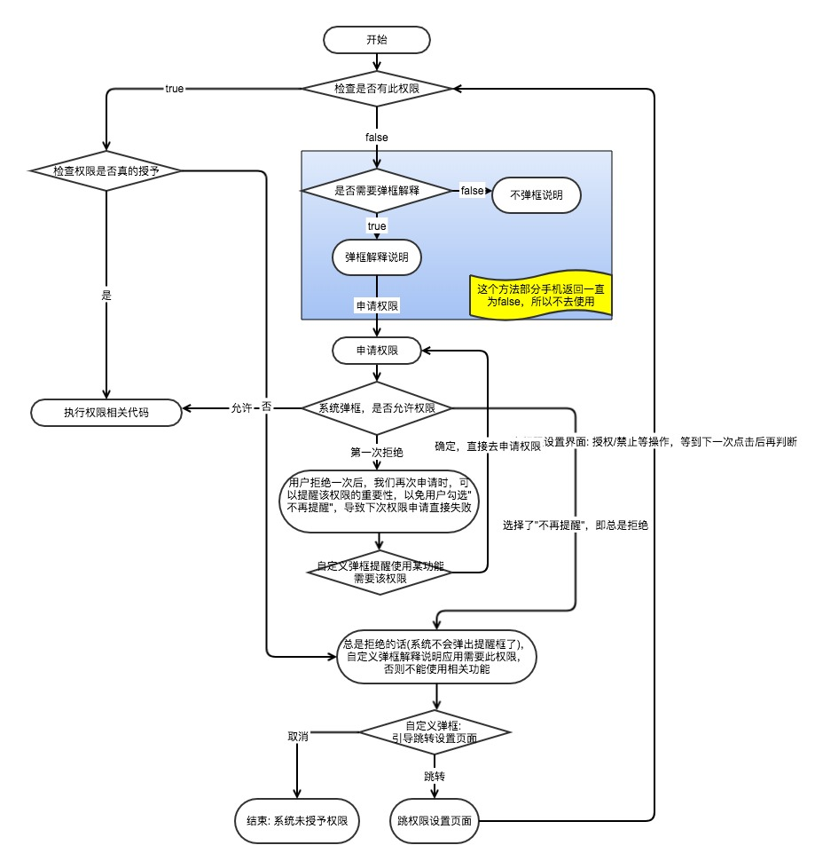

#### Android6.0 动态权限
> 如果App运行在Android 5.1 (API level 22)或者更低级别的设备中，或者targetSdkVersion<=22时（此时设备可以是Android 6.0 (API level 23)或者更高），在所有系统中仍将采用旧的权限管理策略，系统会要求用户在安装的时候授予权限。

- 普通权限（Normal Permissions）：只需要在Androidmanifest.xml中声明相应的权限，安装即许可；
- 需要运行时申请的权限（Dangerous Permissions）： 
    - 必要权限：最好在应用启动的时候，进行请求许可的一些权限（主要是应用中主要功能需要的权限）；
    - 附带权限：不是应用主要功能需要的权限(如：选择图片时，需要读取SD卡权限)；


#### 权限相关API（使用兼容库`support-v4`中的方法）
步骤

1、普通权限和危险权限都需要在AndroidManifest.xml中申请；

2、检查系统是否拥有权限；

`int checkSelfPermission(context, 某个权限)`
> 使用兼容库support-v4中的方法，检查某一个权限的当前状态，返回int类型值；

    PackageManager中的两个常量
    - PackageManager.PERMISSION_DENIED：该权限是被拒绝的；
    - PackageManager.PERMISSION_GRANTED：该权限是被授权的；

3、 检测是否需要显示申请权限解释说明；

`boolean shouldShowRequestPermissionRationale()`
> - false：不需要显示权限解释说明；
> - true：需要显示权限解释说明；

> 第一次调用此方法，返回false，调用requestPermissions请求权限，系统弹出对话框，用户拒绝了；
上一次拒绝，下一次调用该方法返回true，并且调用requestPermissions请求权限，授权的对话框会出现“不再提醒”选项，一旦选中了，那么下次申请时，此方法将会一直返回false，并且不会弹框提示用户；

4、 申请权限

`void requestPermissions(activity, new String[]{...}, requestCode)`
> 请求用户授权几个权限，调用后系统会显示一个请求用户授权的提示对话框，APP不能配置和修改这个对话框；
（方法异步，用户处理完授权操作时，会回调Activity或者Fragment的onRequestPermissionResult()方法）

##### 正常流程
```
if (ContextCompat.checkSelfPermission(context, permission != PackageManager.PERMISSION_GRANTED) {
    // 没有权限，需要去申请
    if (ActivityCompat.shouldShowRequestPermissionRationale(activity, permission)) {
        // 需要用户弹框解释应用为什么需要此权限，以免下一次弹框用户选择“不再提醒”，导致后面直接返回拒绝授权
        
    }
    // 申请权限
    ActivityCompat.requestPermissions(activity, new String[]{...}, requestCode);
} else {
    // 有权限了，随便你咋搞
}
```

#### 注意说明
1. Android 6.0以下的全部默认授予权限；
2. `ContextCompat.checkSelfPermission(Context, String)：`返回true(授予权限)，也并不能确定此权限就是被授予了；==需要检查系统是否真的授予权限；==
> 比如：OPPO的部分机型针对此方法的判断是根据是否`AndroidManifest.xml`中声明了该权限来决定返回值的，所以此方法返回true也有可能是未授予权限，且不一定弹出权限申请对话框；
3. `ActivityCompat.shouldShowRequestPermissionRationale(Activity, String)：`也有手机可能会一直返回false；==所以此方法不做使用；==
4. 应用权限：就是调用了会触发权限的代码，这个时候就会激活对话框的弹出，但是这个时候点击拒绝授权，可能还是会回调授权成功的方法；==（系统授权弹框可能在真正使用触发权限的代码时才会弹框）；==
5. 系统弹框：不能由开发者定制；


---

#### WYPermission使用

##### 针对微医运行时权限策略
- 整理出微医应用里面普通权限和需要运行时动态申请的权限（必要权限在应用启动时就申请，非必要权限在应用时再申请）；
- 为防止一次请求太多权限或请求次数太多，用户可能感到厌烦，所以在应用启动的时候最好先去请求应用一些必须的权限，非必须的权限可以在使用的时候再去请求；
- 对于权限解释说明：自定义弹框解释说明为什么需要这些权限；
- 对于权限总是被用户选择拒绝：那么自定义弹框选择跳转到应用权限设置页面；
- 针对在用户可以自己选择在设置里面操作权限：我们在使用的时候一定会去判断权限的情况；
- 在真正执行权限相关代码的时候，异常的情况说明权限未授予，重新走权限授予流程；

##### 流程图


##### 使用
`单个权限请求`

```
private void requestSinglePermission() {
        WYPermissions.get(this)
                // 请求的权限
                .requestPermissions(Manifest.permission.CAMERA)
                // 请求码
                .requestCodes(101)
                // 请求权限回调
                .requestPermissionListener(new PermissionRequestListener() {
                    @Override
                    public void permissionGranted(int code) {
                        Toast.makeText(context, "权限允许", Toast.LENGTH_SHORT).show();
                    }

                    @Override
                    public void permissionDenied(int code) {
                        Toast.makeText(context, "权限被拒", Toast.LENGTH_SHORT).show();
                    }
                })
                // 如果请求权限被拒绝，且用户选择不再弹框提醒，则弹框提醒用户去设置页面开启权限
                .requestPage(new PermissionPageListener() {
                    @Override
                    public void pageIntent(int code, final Intent intent) {
                        new AlertDialog.Builder(MainActivity.this)
                                .setMessage("用户您好，我们需要您开启使用摄像头权限申请：\n请点击前往设置页面")
                                .setPositiveButton("前往设置页面", new DialogInterface.OnClickListener() {
                                    @Override
                                    public void onClick(DialogInterface dialog, int which) {
                                        startActivity(intent);
                                    }
                                })
                                .setNegativeButton("取消", new DialogInterface.OnClickListener() {
                                    @Override
                                    public void onClick(DialogInterface dialog, int which) {
                                        dialog.dismiss();
                                    }
                                })
                                .show();
                    }
                })
                .request();
    }
```

`多个权限请求`

```
WYPermissions.get(this)
    .requestPermissions(PERMISSIONS)
    .requestCodes(100, 200, 300)
    .requestPermissionListener(new PermissionRequestListener() {
        @Override
        public void permissionGranted(int code) {
            switch (code) {
                case 100:
                    Toast.makeText(context, "录音权限授权成功", Toast.LENGTH_SHORT).show();
                    break;
                case 200:
                    Toast.makeText(context, "访问位置权限授权成功", Toast.LENGTH_SHORT).show();
                    break;
                case 300:
                    Toast.makeText(context, "读文件权限授权成功", Toast.LENGTH_SHORT).show();
                    break;
            }
        }

        @Override
        public void permissionDenied(int code) {
            switch (code) {
                case 100:
                    Toast.makeText(context, "录音权限授权拒绝", Toast.LENGTH_SHORT).show();
                    break;
                case 200:
                    Toast.makeText(context, "访问位置权限授权拒绝", Toast.LENGTH_SHORT).show();
                    break;
                case 300:
                    Toast.makeText(context, "读文件权限授权拒绝", Toast.LENGTH_SHORT).show();
                    break;
            }
        }
    })
    .requestPage(new PermissionPageListener() {
        @Override
        public void pageIntent(int code, Intent intent) {
            gotoSettingPage(code, intent);
        }
    })
    .request();
```

`权限响应`

```
@Override
public void onRequestPermissionsResult(int requestCode, @NonNull String[] permissions, @NonNull int[] grantResults) {
    super.onRequestPermissionsResult(requestCode, permissions, grantResults);
    // 处理权限请求响应
    WYPermissions.onRequestPermissionsResult(this, requestCode, permissions, grantResults);
}
```

    


`参考：`

[https://blog.csdn.net/yanzhenjie1003/article/details/52503533]()

[https://github.com/jokermonn/permissions4m]()


