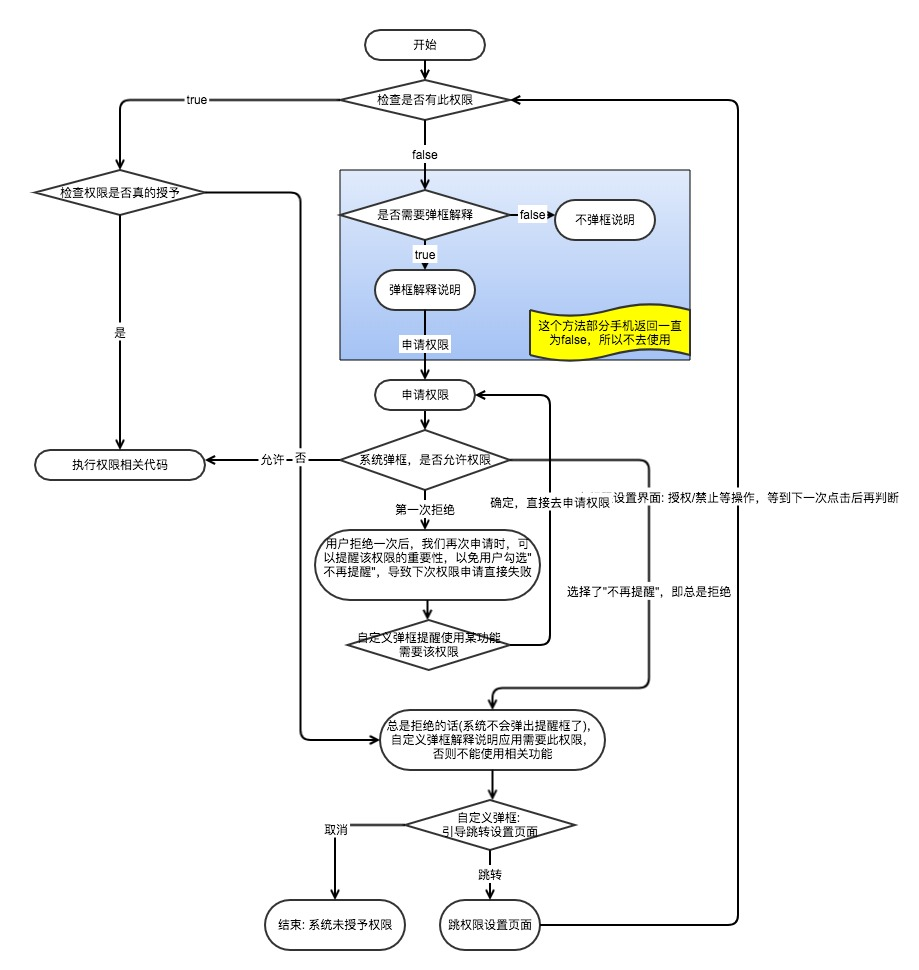

权限适配说明
=============
### 必要性
当前适配的目标系统是Android 4.4（API LEVEL:19），系统对APK校验规则上都使用的是4.4相关方案，当下该方案在安全性上已经有很多不足。例如权限授权并不是按需授予的。

当前google play市场上线要求必须适配8.0（API LEVEL:26）。

前段时间收到华为市场邮件，后续适配API LEVEL<26的应用将会被拒绝上架。其他应用市场后期应该也会跟进相关规定。可以认为我们的APP当前存在下架风险。
### 当前需要确认的问题
1.应用启动的时候的必要的权限：读取电话状态、存储权限，不授予会影响应用的使用功能。

建议:如果用户拒绝则弹框提醒去设置页面手动开启权限，否则退出应用。这里给斗鱼打波广告：


2.在使用中需要授权的权限，比如定位、相机、打电话等，如果这些权限用户拒绝并设置为不在询问，后续系统不会自动弹出授权确认框。

建议:如果用户始终拒绝的话，用户使用到该权限是，需要弹一个toast提示提醒用户去开启权限；或者弹一个弹框让用户选择去设置页面开启权限；


### Android6.0 动态权限
> 如果App运行在Android 5.1 (API level 22)或者更低级别的设备中，或者targetSdkVersion<=22时（此时设备可以是Android 6.0 (API level 23)或者更高），在所有系统中仍将采用旧的权限管理策略，系统会要求用户在安装的时候授予权限。

- 普通权限（Normal Permissions）：只需要在Androidmanifest.xml中声明相应的权限，安装即许可；
- 需要运行时申请的权限（Dangerous Permissions）： 
    - 必要权限：最好在应用启动的时候，进行请求许可的一些权限（主要是应用中主要功能需要的权限）；
    - 附带权限：不是应用主要功能需要的权限(如：选择图片时，需要读取SD卡权限)；


### 权限相关API（使用兼容库`support-v4`中的方法）
步骤

1、普通权限和危险权限都需要在AndroidManifest.xml中申请；

2、检查系统是否拥有权限；

`int checkSelfPermission(context, 某个权限)`
> 使用兼容库support-v4中的方法，检查某一个权限的当前状态，返回int类型值；

    PackageManager中的两个常量
    - PackageManager.PERMISSION_DENIED：该权限是被拒绝的；
    - PackageManager.PERMISSION_GRANTED：该权限是被授权的；

3、 检测是否需要显示申请权限解释说明；

`boolean shouldShowRequestPermissionRationale()`
> - false：不需要显示权限解释说明；
> - true：需要显示权限解释说明；

> 第一次调用此方法，返回false，调用requestPermissions请求权限，系统弹出对话框，用户拒绝了；
上一次拒绝，下一次调用该方法返回true，并且调用requestPermissions请求权限，授权的对话框会出现“不再提醒”选项，一旦选中了，那么下次申请时，此方法将会一直返回false，并且不会弹框提示用户；

4、 申请权限

`void requestPermissions(activity, new String[]{...}, requestCode)`
> 请求用户授权几个权限，调用后系统会显示一个请求用户授权的提示对话框，APP不能配置和修改这个对话框；
（方法异步，用户处理完授权操作时，会回调Activity或者Fragment的onRequestPermissionResult()方法）

#### 正常流程
```
if (ContextCompat.checkSelfPermission(context, permission != PackageManager.PERMISSION_GRANTED) {
    // 没有权限，需要去申请
    if (ActivityCompat.shouldShowRequestPermissionRationale(activity, permission)) {
        // 需要用户弹框解释应用为什么需要此权限，以免下一次弹框用户选择“不再提醒”，导致后面直接返回拒绝授权
        
    }
    // 申请权限
    ActivityCompat.requestPermissions(activity, new String[]{...}, requestCode);
} else {
    // 有权限了，随便你咋搞
}
```

### 注意说明
1. Android 6.0以下的全部默认授予权限；
2. `ContextCompat.checkSelfPermission(Context, String)：`返回true(授予权限)，也并不能确定此权限就是被授予了；==需要检查系统是否真的授予权限；==
> 比如：OPPO的部分机型针对此方法的判断是根据是否`AndroidManifest.xml`中声明了该权限来决定返回值的，所以此方法返回true也有可能是未授予权限，且不一定弹出权限申请对话框；
3. `ActivityCompat.shouldShowRequestPermissionRationale(Activity, String)：`也有手机可能会一直返回false；==所以此方法不做使用；==
4. 应用权限：就是调用了会触发权限的代码，这个时候就会激活对话框的弹出，但是这个时候点击拒绝授权，可能还是会回调授权成功的方法；==（系统授权弹框可能在真正使用触发权限的代码时才会弹框）；==
5. 系统弹框：不能由开发者定制；


### 针对APP运行时权限的策略建议
- 整理出应用里面普通权限和需要运行时动态申请的权限（必要权限在应用启动时就申请，非必要权限在应用时再申请）；
- 为防止一次请求太多权限或请求次数太多，用户可能感到厌烦，所以在应用启动的时候最好先去请求应用一些必须的权限，非必须的权限可以在使用的时候再去请求；
- 对于权限解释说明：自定义弹框解释说明为什么需要这些权限；
- 对于权限总是被用户选择拒绝：那么自定义弹框选择跳转到应用权限设置页面；
- 针对在用户可以自己选择在设置里面操作权限：我们在使用的时候一定会去判断权限的情况；
- 在真正执行权限相关代码的时候，异常的情况说明权限未授予，重新走权限授予流程；

##### 流程图


`参考：`

[https://blog.csdn.net/yanzhenjie1003/article/details/52503533]()

[https://github.com/jokermonn/permissions4m]()