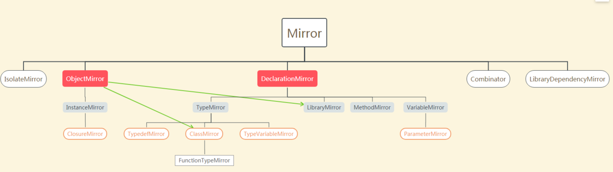

dart:mirrors库及注解Metadata
===========================


### Mirror

A Mirror reflects some Dart language entity. Every Mirror originates from some MirrorSystem.

mirror的概念指对Dart语法实体的映射，是对Dart对象的映射，所有的Mirror都是有MirrorSystem生成的。Mirror有CombinatorMirror DeclarationMirror IsolateMirror LibraryDependencyMirror ObjectMirror的实现类，他们之间的关系入下：



### ObjectMirror
ObjectMirror是一个接口，定义了ClassMirror、InstanceMirror、LibraryMirror的一些公共能力。提供了一些操作函数。

```
abstract class ObjectMirror implements Mirror {
  
  InstanceMirror invoke(Symbol memberName, List positionalArguments,
      [Map<Symbol, dynamic> namedArguments]);

  InstanceMirror getField(Symbol fieldName);

  
  InstanceMirror setField(Symbol fieldName, Object value);

  
  delegate(Invocation invocation);
}
```

可以看到ObjectMirror有操作函数，因此只有ClassMirror、InstanceMirror、LibraryMirror有相关功能。这个和Java相反，Java的反射是调用Method的invoke同时传入对象。

### DeclarationMirror
我们在ClassMirror中通过declarations可以获得多有的DeclarationMirror，包括函数，getters, setters,变量等，是对类属性的反射类型。例如我们需要找到对所有的变量，只需要对declarations中进行类型判断即可。
```
    for(DeclarationMirror declaration in klassMirror.declarations.values){
      if(declaration is VariableMirror){
        fields.add(Field()
          ..name = MirrorSystem.getName(declaration.simpleName)
          ..dataType = MirrorSystem.getName(declaration.type.simpleName)
        );
      }
    }
```

对于DeclarationMirror有一个特别的getter
```
/**
   * A list of the metadata associated with this declaration.
   *
   * Let *D* be the declaration this mirror reflects.
   * If *D* is decorated with annotations *A1, ..., An*
   * where *n > 0*, then for each annotation *Ai* associated
   * with *D, 1 <= i <= n*, let *ci* be the constant object
   * specified by *Ai*. Then this method returns a list whose
   * members are instance mirrors on *c1, ..., cn*.
   * If no annotations are associated with *D*, then
   * an empty list is returned.
   *
   * If evaluating any of *c1, ..., cn* would cause a
   * compilation error
   * the effect is the same as if a non-reflective compilation error
   * had been encountered.
   */
  List<InstanceMirror> get metadata;
```

这里的metadata即为Java里面的注解。我们处理注解的时候就是通过这个getter获取。通过上面的关系图我们可以知道InstanceMirror是没有注解的，其他的都可以获取（如果有的话）。

### TypeMirror
对于TypeMirror，Dart的定义是"A [TypeMirror] reflects a Dart language class, typedef, function type or type variable."。Dart语法和Java有很多差异，倒是和JS等脚本语言类似。在Java中我们基本认为Type等价于class。当在Dart中我们一切皆对象，函数、变量都是对象。例如我们可以通过如下代码来定义一个addOne的函数对象并使用。

```
typedef int addOne(int value);

addOne a = (int value)=>value+1;

void main(List args){
  a(1);
}
```

TypeMirror的具体子类有TypedefMirror、TypeVariableMirror、ClassMirror、FunctionTypeMirror。其中TypedefMirror、TypeVariableMirror都比较简单。TypedefMirror是对Typedef对象的反射，可以通过referent获取到对应的FunctionTypeMirror。TypeVariableMirror是对变量对象类的方式。

### FunctionTypeMirror
我们在TypeMirror部分说道，Dart中一切皆对象，我们可以通过TypeDef关键子将一个函数定义为类，然后创建这个函数类对象进行使用。对于这种类的方式我们使用FunctionTypeMirror，是ClassMirror的一个子类。对于这种函数对象，其本质上就是一个函数。但FunctionTypeMirror和MethodMirror是有区别的。

```
abstract class FunctionTypeMirror implements ClassMirror {
  /**
   * Returns the return type of the reflectee.
   */
  TypeMirror get returnType;

  /**
   * Returns a list of the parameter types of the reflectee.
   */
  List<ParameterMirror> get parameters;

  /**
   * A mirror on the [:call:] method for the reflectee.
   */
  // This is only here because in the past the VM did not implement a call
  // method on closures.
  MethodMirror get callMethod;
}
```

FunctionTypeMirror的代码可以看到，对具体函数的MethodMirror进行了一次包装，同时FunctionTypeMirror时候一个ObjectMirror。因此可以直接执行。

### ClassMirror
ClassMirror可以和java中的Class做类比，是对Dart中类的反射。和java中的Class一样，内部保存了类的所有信息，除了包含该类声明的接口、基类、mixin（java中没有，和JS的mixin概念一致）、类标识外，我们常用功能如下：

```
/**
   * 返回该类定义中的所有declarations，包括函数，getters, setters,变量。但并不包括通过继承所拥有的相关内容
   * 这里哈java不通的是java的getters, setters就是好函数。但并不包括通过继承所拥有的相关内容这一点是一致的。
   *
   */

  Map<Symbol, DeclarationMirror> get declarations;

  /**
   * 返回该类的实例函数，也包括实例的getters、setters 
   *
   */
  Map<Symbol, MethodMirror> get instanceMembers;

  /**
   * 返回该类的静态函数，也包括静态的getters、setters 
   *
   */
  Map<Symbol, MethodMirror> get staticMembers;

  /**
   * 和java反射一致，创建一个实例
   *
   */
  InstanceMirror newInstance(Symbol constructorName, List positionalArguments,
      [Map<Symbol, dynamic> namedArguments]);
```


###  InstanceMirror
对于ClassMirror我们可以调用newInstance函数来创建一个对象，这个对象是一个InstanceMirror。按照Java里面的类比返回值类似于Object，但这里是有不同的，InstanceMirror可以认为是对java中的Object的一个装饰。同时也继承ObjectMirror，我们可以直接对其执行invoke函数，比java更加简便。

我们通过reflectee的getter来获取InstanceMirror包裹的真正对象。这个对象就和java中newInstance返回的Object相同的概念。是一个实例对象。

### ClosureMirror
对于 Dart，（Closure）闭包也是一个方法对象，因此我们也可以对闭包进行反射获取。我们可以通过“MethodMirror get function;”的getter获取，也可以通过apply函数进行调用。

### MethodMirror
MethodMirror是对一个函数的所有信息的集合，和Java的Method相比，除了不能直接invoke外其他部分基本一致。但多了一个“String get source;”的getter，可以拿到函数内代码片段。

### VariableMirror
VariableMirror是对一个变量所有信息的集合，和Java的Field相比，除了不能直接操作对应变量值外其他部分基本一致。

### ParameterMirror
ParameterMirror是VariableMirror的子类，专指对函数的入参对象的反射。对于Dart，有position parameter和named parameter的区别，同时对parameter可以提供默认值。在ParameterMirror中都能够获取到。
### LibraryMirror

如果说ClassMirror和InstanceMirror在Java中有迹可循的话，LibraryMirror就完全是Dart自己的概念了。Dart的library是对Dart代码模块化的一种封装共享。例如“dart:mirrors”就是一个系统库。'package:args/args.dart';等都是三方库，我们通过pub进行管理。

对于LibraryMirror，有“Map<Symbol, DeclarationMirror> get declarations;”的getter可以获取该library下的所有DeclarationMirror。

对于LibraryMirror，有“List<LibraryDependencyMirror> get libraryDependencies;”的getter可以获取该library下的所有引入（import）和导出（export）。


### LibraryDependencyMirror


### Symbol

Opaque name used by mirrors, invocations and [Function.apply].

用来关联一个Mirror的Name的封装，也是一些simpleName、fieldName的封装。


### MirrorSystem

反射实现的最核心的类。MirrorSystem于isolate环境相关，我们可以通过currentMirrorSystem()函数获取。有了MirrorSystem对象后就可以进行反射操作了。

```
abstract class MirrorSystem {
  /**
   * 获取所有的LibraryMirror
   */
  Map<Uri, LibraryMirror> get libraries;

  /**
   * 通过libraryName查找LibraryMirror
   */
  external LibraryMirror findLibrary(Symbol libraryName);

  /**
   * 获取IsolateMirror
   */
  IsolateMirror get isolate;

  /**
   * 获取[:dynamic:] 类型的TypeMirror.
   */
  TypeMirror get dynamicType;

  /**
   * 获取 [:void:] 类型的TypeMirror.
   */
  TypeMirror get voidType;

  /**
   * 获取Symbol对应的值
   */
  external static String getName(Symbol symbol);

  /**
   * 获取library库中命名为name的Symbol
   */
  external static Symbol getSymbol(String name, [LibraryMirror library]);
}
```

### 反射操作流程

在dart:mirrors库中除了定义相关类定义外还有如下函数

```
/**
 * 获取当前isolate对应的MirrorSystem。
 */
external MirrorSystem currentMirrorSystem();

/**
 * 通过一个对象获取其反射InstanceMirror
 */
external InstanceMirror reflect(Object reflectee);

/**
 * 通过一个类定义获取其反射ClassMirror。Type即为我们任意定义的一个类，和Java的object类似。
 */
external ClassMirror reflectClass(Type key);

/**
 * 
 */
external TypeMirror reflectType(Type key, [List<Type> typeArguments]);
```

基于上述的了解，我们可以整理一般反射运用流程如下：

* 对于特定了类型，通过reflectClass获取其类型反射对象进行操作。（包括使用Typedef定义的类型对象等）。
* 对于一个实例，通过reflect获取其InstanceMirror进行操作。
* 特别的不确定的时候，可以通过currentMirrorSystem()获取MirrorSystem，然后通过获取libraries，获取所有的declarations来进行遍历搜索。

获取到ClassMirror、InstanceMirror、DeclarationMirror后，我们就可以通过其getter来获取Method、Field等。

### 注解MeteData

在Dart中对于MeteData，我们没有特定的关键字来进行识别，任何类都可以定义为注解，包括变量，例如下列定义中，我们可以通过@HostApi、@async来使用注解。

```
class _Asynchronous{
  const _Asynchronous();
}

const _Asynchronous async = _Asynchronous();

class HostApi{
  const HostApi({this.dartHostTestHandler});

  final String dartHostTestHandler;
}
```

我们可以通过DeclarationMirror和LibraryDependencyMirror来获取MeteData。我们可以根据反射操作流程中的介绍，来获取MeteData。


