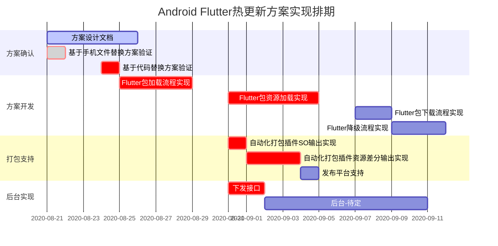

```mermaid
gantt         
       dateFormat  YYYY-MM-DD   
       title Android Flutter热更新方案实现排期

       section 方案确认
       方案设计文档           :active,    design1, 2020-08-21,2020-08-26
       基于手机文件替换方案验证              :crit,done,  design2, 2020-08-21, 1d
    	 基于代码替换方案验证:crit,  design3, 2020-08-24, 1d

       section 方案开发
       Flutter包加载流程实现 		:crit,flutter1,2020-08-25,4d
       Flutter包资源加载实现 		:crit,flutter2,2020-08-31,5d
       Flutter包下载流程实现     :flutter3, 2020-09-07, 2d
       Flutter降级流程实现 :flutter4, 2020-09-09, 3d
    
			 section 打包支持
       自动化打包插件SO输出实现 			:crit,package1, 2020-08-31,1d
       自动化打包插件资源差分输出实现 			:crit,package1, 2020-09-01,3d
       发布平台支持         :package2, 2020-09-04, 1d
       
       section 后台实现
       下发接口 			:crit, backage1, 2020-08-31, 2d
       后台-待定					 :backage2, 2020-09-02, 2020-09-11
       
```

