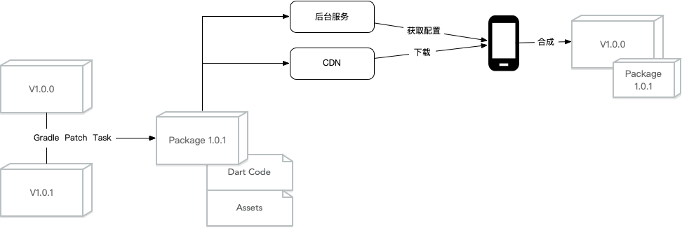
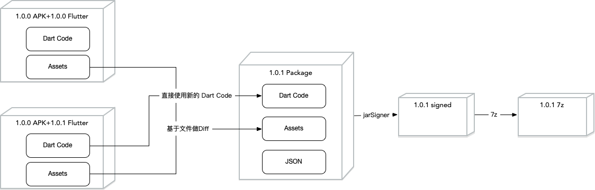

Flutter Android热更新方案设计
===========================

### 整体架构



整体分为差分包输出流程和下发使用流程。

在做完1.0.1版本的迭代开发并通过测试输出最终包后，通过Gradle Task做差分，生成差分包zip文件。这里长远考虑的话应该bsdiff算法来做差分，当前代码量少，从文件的维度做差分生成更新包package1.0.0。同时上传CDN以及后台配置服务。

用户设备下载好更新包有在本地做合并操作，最终将更新后的功能呈现给用户

这里的版本有APP基础包版本和Flutter包的版本两个概念。APP基础包版本按照Android的机制正常维护。Flutter包的版本根据功能迭代进行更新。当涉及到APP基础包需要更新时需要重新发版本。

### 代码部分更新实现方案


在AOT模式下Flutter相关代码以SO的形式存在
* 1.libflutter.so:flutter引擎框架相关实现，我们不变更flutter版本的情况下这个是不变的。
* 2.libapp.so:业务代码，我们要热更新只需要替换这一部分代码。

Flutter框架对libapp.so的加载与通过System类来加载的方式有所不同，是以shellArgs的方式传递给libflutter.so中的FlutterJNI.nativeInit进行使用，在C++层进行加载libapp.so。
```java
shellArgs.add("--aot-shared-library-name=" + this.aotSharedLibraryName);
shellArgs.add("--aot-shared-library-name=" + applicationInfo.nativeLibraryDir + File.separator + this.aotSharedLibraryName);
```
这里有两个要求，1.aotSharedLibraryName对应的SO需要能够被加载到、2.初始APK中内置的libapp.so没法删除，我们需要保证加载到的是我们更新后的libapp.so，这里考虑到版本管理的需要会对so的命名做修改为libapp1.0.0.so，但这样就需要用到反射机制动态修改aotSharedLibraryName的额值。基于这两点我们进行如下设计：

######  方案一

基于同一进程内SO重复加载的机制，在Flutter使用前手动加载一次。

* 在拼接shellArgs前通过反射机制替换aotSharedLibraryName的值为新的libapp1.0.0.so。
* 通过System.loadLibrary(fileName)的方式手动加载代码SO。
* Flutter框架加载新的代码文件达到更新目的。

######  方案二

基于SO的加载的机制，将更新包中的libapp1.0.0.so目录添加在SO加载路径数组内。
```java
    public String findLibrary(String libraryName) {
        String fileName = System.mapLibraryName(libraryName);

        for (Element element : nativeLibraryPathElements) {
            String path = element.findNativeLibrary(fileName);

            if (path != null) {
                return path;
            }
        }

        return null;
    }
```

SO的加载最终会在DexPathList.nativeLibraryPathElements数组中寻找，我们在Flutter加载代码前反射在nativeLibraryPathElements中插入更新包中的libapp1.0.0.so目录即可。

###### 分析比较

方案一尽量减少了hook点，Tinker修复SO采用的是这种方案，但他是配合自己的一个SO加载实现类进行配合使用，Flutter能否有效还需要完成后进行验证。方案二是Android也是很多SO更新框架在使用的方案，但这个hook点需要针对Android版本进行适配。


### 资源部分更新实现

对于资源assets部分，和Android的热更新框架没有区别，需要进行hook资源加载流程。一个是ActivityThread的LoadApk，设置LoadApk的mPackages和mResourcePackages。另一个是ResourcesManager的mActiveResources，mActiveResources是Map，value是Resources，设置所有Resource的mAssets。

具体逻辑伪代码如下：
```java
    public static void monkeyPatchExistingResources(Context context, String externalResourceFile) throws Throwable {
        //1 LoadApk的HOOK实现，27以下需要同时设置mPackages和mResourcePackages，27以上只需要设置mPackages
        if (Build.VERSION.SDK_INT < 27) {
            packagesFields = new Field[]{packagesFiled, resourcePackagesFiled};
        } else {
            packagesFields = new Field[]{packagesFiled};
        }

        //2 遍历所有的LoadedAPK，找出指向原APK资源路径的LoadedAPK将资源路径指向新的externalResourceFile
        for (Field field : packagesFields) {
            for (Map.Entry<String, WeakReference<?>> entry
                    : ((Map<String, WeakReference<?>>) value).entrySet()) {
                if (appInfo.sourceDir.equals(resDirPath)) {
                    resDir.set(loadedApk, externalResourceFile);
                }
            }
        }

        // 3. 构造的新的newAssetManager，调用addAssetPathMethod，设置newAssetManager的资源路径为externalResourceFile
        if (((Integer) addAssetPathMethod.invoke(newAssetManager, externalResourceFile)) == 0) {
            throw new IllegalStateException("Could not create new AssetManager");
        }

        //4. 在Kitkat上需要设置AssetManager的mStringBlocks，其他不要求但设置了也不会有影响。这里都做设置
        if (stringBlocksField != null && ensureStringBlocksMethod != null) {
            stringBlocksField.set(newAssetManager, null);
            ensureStringBlocksMethod.invoke(newAssetManager);
        }

        //5，遍历ResourcesManager的mActiveResources的所有Resource，用newAssetManager替换Resource的mAssets属性，并调用resources.updateConfiguration方法通知资源的变更。
        for (WeakReference<Resources> wr : references) {
            assetsFiled.set(resources, newAssetManager);
            resources.updateConfiguration(resources.getConfiguration(), resources.getDisplayMetrics());
        }
    }
```

### 安全风险措施

除正常的接口走HTTPS，做证书校验等常规措施外还会进行一下处理：

##### 签名校验

对更新包进行签名，在更新版安装过程中使用APK包的签名信息做签名校验，确保下发的更新包是来源于我们公司的。

##### 更新包文件校验

在更新包中内置一个json文件，记录版本信息、所有文件摘要等，安装完成后释放这个文件到特定目录。

考虑到对所有文件进行摘要校验是比较耗时的操作，会按天进行校验。一般情况下只做简单的文件修改时间检验。

同时在启动请求是否有更新包的接口中上报改文件的MD5做校验，确保改文件没有被窜改。

### 补丁包生成



考虑到如果完全按照BSDiff来做二进制维度的差分的话，下发到手机端后需要做文件合成，这一步是重IO操作，因此暂时使用文件维度的差分。

定制通过Gradle插件，基于加固前的原包做差分取出libapp.so以及有修改的assets资源，同时生成插件信息的json文件，一起打包进zip包，然后通过jarSigner工具做签名，最后用7z工具压缩生成更新包。

### 后台

##### 接口预定义
入参：

| 字段名 | 字段类型 | 说明 |
|-------|---------|-----|
|version|String|当前使用的版本|
|jsonMD|String|配置文件MD5|


出参：

| 字段名 | 字段类型 | 说明 |
|-------|---------|-----|
|version|String|待下载包的版本|
|MD5|String|文件MD5，校验文件完整性|
|url|String|下载链接|

### 问题

##### 需要二次生效
考虑到我们的项目可能第一个页面就是Flutter实现的，Flutter代码的加载时机要在第一个页面打开之前，且我们对启动时间的要求不建议在启动的时候阻塞住等待更新包请求接口放回。因此我们初始会加载当前已安装的最新Flutter版本代码加载展示。此时有更新包安装后会在下次启动生效。


