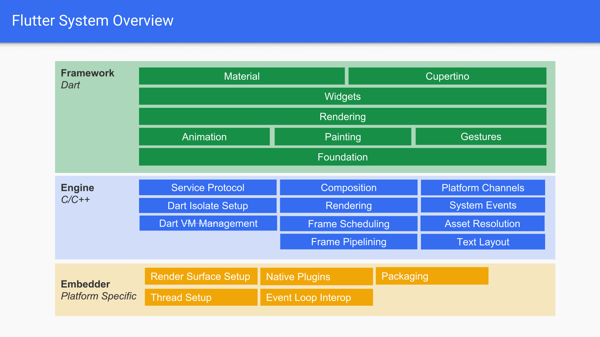
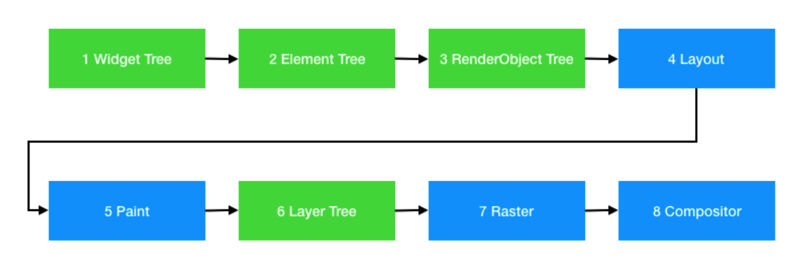

Flutter架构在Android平台下的理解
=================

###Flutter架构
Flutter的架构都是用一张图表示的。

#### Framework
我们开发Flutter应用，直接面对的Framework层，主要提供的是Widget开发框架。这部分与具体是Android、iOS还是Fuchisa无关。

Framework都是dart实现的，具体代码就在我们开发使用过的Flutter SDK中。路径如下：/flutter/packages/flutter。可以看到它其实是一个Flutter package工程。

在图中属于Framework层从上到下Material/Cuperitno、Widgets、Rendering、Animation/Painting/Gesutres、Foundation都是其中的一个library，同时根据层级上层依赖下层。
###### Widget相关
在Flutter的开发中，万物皆为Widget，除了组件，我们可以将统一Padding、Margin等Style抽象成Widget，我们可以将业务逻辑封装成一个Widget，甚至可以将功能对象封装成一个Widget在一定范围内使用（Navigator等）。这些我们基本上只使用了Material/Cuperitno、Widgets两层，写一个简单的展示类APP的话使用这两层基本就够了。

###### Rendering
Flutter的渲染流程如下：

我们UI开发都是通过Widget组合而成，这个就是Widget tree，Widget Tree通过测量确定宽高位置之后就是Element Tree。这两个过程是在框架的Widget相关部分完成的。

Element Tree确定后，Flutter会根据智能优化算法和上一次的缓存做布局（Layout）、绘制（Paint）和合成（Layer Tree）。这里就是讲绘制过程一定会说到写渲染三个步骤。

当然这里一看就知道纯Framework层是无法完成这些工作的，是需要engine参与的。确实，Rendering这部分是依赖dart:ui库，很多功能都会通过dart:ui调用engine来实现。例如object.dart中用到了dart:ui中的PictureRecorder、layer.dart中用到了dart:ui的EngineLayer等。

对于渲染流程来说，Framework层到生成Layer Tree就完成工作了。之后Layer Tree会被提交到engine层做光栅化（Raster）和排版（Compositor）最终上屏。

###### Painting

这个库就是绘制流程中的绘制（Paint）实现的相关封装，看注释就能明确：
>///
>/// This library includes a variety of classes that wrap the Flutter
>/// engine's painting API for more specialized purposes, such as painting scaled
>/// images, interpolating between shadows, painting borders around boxes, etc.
>///

###### Animation
动画实现，

>/// This library provides basic building blocks for implementing animations in
>/// Flutter. Other layers of the framework use these building blocks to provide
>/// advanced animation support for applications. For example, the widget library
>/// includes [ImplicitlyAnimatedWidget]s and [AnimatedWidget]s that make it easy
>/// to animate certain properties of a [Widget]. If those animated widgets are
>/// not sufficient for a given use case, the basic building blocks provided by
>/// this library can be used to implement custom animated effects.
>///
>/// This library depends only on core Dart libraries and the `physics.dart`
>/// library.

包括具体如何使用，在animation.dart文件注释中都有介绍。当然Animation也是依赖dart:ui的。

###### Gestrues

用户手势相关封装。用户操作的输入肯定是硬件层面采集，Framework的Gestrues不会直接对接硬件，因此也是通过dart:ui;库来实现的。Gestrues主要做的是将Engine层面取得的用户手势信息，根据具体具体数据确定是tap(.dart)、drag(.dart)、multitap(.dart)等事件，同时包括事件的注册、分发、调用具体事件响应都在Gestrues中实现。

###### Foundation
Foundation是Framwork最底层的部分，主要提供一些基类和和通用封装。在foundation.dart中的文件注释如下：

>/// Core Flutter framework primitives.
>///
>/// The features defined in this library are the lowest-level utility
>/// classes and functions used by all the other layers of the Flutter
>/// framework.

需要注意的是，Foundation并不是针对engine的桥接层。可以认为是base模块，提供了例如日志打印：print.dart、Widget的Key实现：key.dart、Widget入参会用到的required等实现meta.dart等等一系列功能的封装实现。

#### 其他未体现的Framework图中未体现部分

###### Flutter SDK中其他功能
其实除了这些，Flutter SDK中还提供了services、physics、scheduler、semantics库。

特别是services，我们经常会用到，例如读取assets文件等，这个库是框架提供的原生能力桥接集合。

###### SKY_ENGINE

我们开发直接面对的是Framework，用dart实现，核心工作都交给engine来做，用C++实现。为了dart能够调用engine中的功能函数，这中间就有一层Engine面向Framework的dart封装，这部分在sky_engine中。在官方架构图中完全体现这一层可能是因为这里面只是调用桥接。

sky_engine本身也是一个Flutter package。其代码在目录在Flutter SDK下：/flutter/bin/cache/pkg/sky_engine。cache部分本身并不在Flutter SDK内，是在我们下载完Flutter SDK后第一次执行Flutter命令时根据/flutter/bin/iinternall/xxx.version中指定的版本号进行下载的。

其中包括：1.library dart.ui;是engine绘制、布局渲染等的调用接口抽象。2.library dart.math;是对数学方法函数的调用接口抽象。3.library dart.isolate;是Dart VM中线程调用的接口抽象。4.library dart.io;是对engine中IO操作接口的抽象。等等还有很多。

在前面学到Rendering中有提到了library dart.ui;库。

#### Engine

#### Embedder

