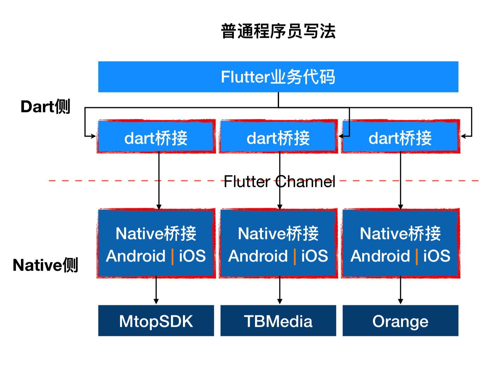
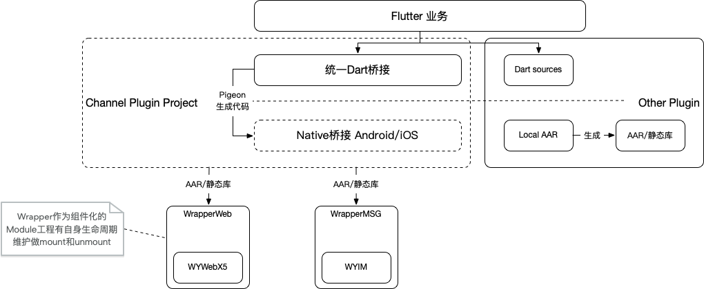
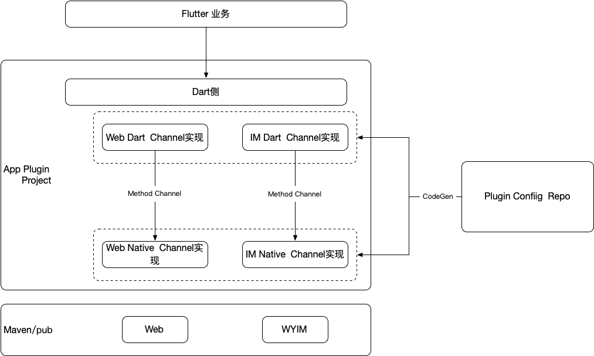

Flutter统一插件工程优化 
=================

### 目标
一次开发、一个配置文件、一行命令，完成一个插件的完整接入。

### 一般项目插件存续情况

套用淘系技术Flutter分享第六期中说法，我们对插件的开发模式就是普通程序员的写法。

我们最进程的开发模式中，功能插件都是通过对现有能力封装实现，在保持单独插件功能的独立的前提下进行开发，特别是对于重复代码，并没有考虑到CodeGen方案。因此我们的插件工程会以下几点问题：

1. 对于Plugin工程，dart和native的开发是混在一起，开发同学同时开两个工程进行开发。
2. 当前我们没法做到一个开发者同时为维护iOS和Android的代码，一个Plugin工程同时有Dart、iOS、Android三个源码库，对我们来说过于复杂了，多人开发容易发生开发者误提交代码引起的问题。
3. 我们的插件基本都是基于原有功能SDK封装而来，对于插件中Native层代码还是有SDK开发同学维护更加合适。
4. 每引入一个插件，都会引入一个Android源码项目，对于复杂项目会极速膨胀。
5. 对于使用到的外部开源插件，在不更改pubspec.yaml文件是是完全不需要重新基于源码编译的。

### 理想中的插件项目

针对上述问题我们提出如下的项目插件维护方案：

##### 插件工程开发模式的优化
对于内部插件我们将dart和平台原生分离，wrapper工程只包括平台原生代码。

我们基于功能SDK来开发Wrapper工程，SDK是全平台统一的，但对于SDK的接入部分涉及到常量、上下文环境获取等可能会不同，这部分可以由同一个人维护。

我们将所有插件的dart层统一到一个Channel Plugin Project的工程中，专门负责桥接相关工作。这里引入CodeGen来规范统一三端的接口协议。具体能力实现通过AAR/静态库的方式依赖Wrapper工程。这部涉及到的平台原生代码十分简单只是调用，只要Wrapper工程能力够用，理想状态下可以考虑三端由同一人员维护。

同时通过这种方式分离之后，我们可以在Channel Plugin Project中提供功能的默认实现，这样即使不依赖全量Wrapper工程也可以进行开发。

##### 打包编译的优化
对于APP中国Android开发时参与编译的源码库过多拖慢速度的问题，对于内部插件通过dart和native分离后，所有Wrapper工程都是通过AAR形式依赖，只存在Channel Plugin Project一个源码工程。

对于外部插件，我们通过工具对于源码生成中间AAR库来优化，该方案可通过修改Flutter构建过程的Gradle脚本实现。

##### Channel的优化

采用官方Flutter Channel+Pigeon来构建Channel。

Pigeon是今年3月份Fluter官方发布的CodeGen方案，主要是用来规范插件的开发。通过在dart脚本自动生成一致的多端接口。本身不依赖Flutter SDK版本。但并没有解决Flutter Channel低效的问题。
### 插件工程拆分

对于Flutter提供的插件实现，对于每一个功能单独封装插件工程，会导致我们的工程急剧膨胀。在淘系的分享中将这种做法称为普通的实现方式。相对的就会有高级的实现，对于高级实现，我们将所有功能插件都聚合到一个插件工程中。这种做法避免了工程的膨胀，当这种聚合的插件工程失去了插件的公用性，这样的一个聚合插件工程没法在多APP之间公用，每个APP的需要的插件基本是不一致的。同时淘系的分享中也提出了他们的‘艺术程序员’的实现方式，使用FFI来提升性能，通过Code_gen来生成功能接口，对于FFI的实现和功能的具体实现再进行开发。

结合淘系的分享与我们的实际开发情况，我们可以采用聚合插件的方式，同时通过全面代码生成的方式来保证其公共性。在对于一个插件工程的代码我们从上到下依次划分为：1.桥接层、2.胶水层、3.原生功能层三部分。然后对官方的Pigeon方案进行扩展，我们将三部分的代码统一到一个dart文件中，然后通过一个命令来完成Channel构建、功能实现、接入的工作，大大减小了插件使用的复杂度。

###### 桥接层
Flutter和原生的通信实现，如果用官方的MethodChannel，就是Channel的原生及Flutter实现。

对于这一层，我们可以使用官方的Pigeon进行生成。详见<a href="https://mp.weixin.qq.com/s/E24bY7nt2HL0Pl-vEkECXghttps://mp.weixin.qq.com/s/E24bY7nt2HL0Pl-vEkECXg">Pigeon- Flutter多端接口一致性以及规范化管理实践</a>

通过Pigeon，我们生成了Channel的实现、能力使用方的调用对象、能力提供方的的接口定义。Pigeon主要是用来保证接口的一致性，避免的手动开发接口导致的出错等，但对于一个具体的插件，其功能还是需要进行开发的。

因此我们扩展了Pigeon的功能。将对功能接口的实现代码也在dart脚本中进行声明，并扩展出根据代码声明还原功能实现的能力。

###### 胶水层
我们的Flutter启动较晚，我们都会将一个功能的现有实现库封装成Flutter插件。当由于我们Flutter的推进进度较缓慢，我们不想因为Flutter上引用的简便性而去修改原生库。因此我们这里引入胶水层来抹平这部分差异。

我们也将所有胶水层的代码都定义在Dart脚本中，扩展Pigeon使其生成对应代码。

###### 原生功能库

我们的原生库都是以gradle/podfile的形式引入的。我们对于每个插件的配置单独作为一个gradle/podfile配置，也将这分定义放在dart文件配置文件中。

但对于库的应用有所不同，我们除了还原出gradle/podfile配置外还需要将其添加到统一插件中，对于 Android我们通过‘apply from:'./{plugin}.gradle'’的方式引入，iOS通过 @许益成 的 方式引入，我们只需要修改统一插件中的gradle/podfile文件添加这一行代码即可，这个也通过扩展Pigeon的功能。

###### 总结

我们整一个架构入上。我们有一个plugin config repo的库。用来开发我们想要的插件，这本身时候一个聚合插件工程，我们在这个聚合插件工程中维护dart配置文件。

但我们需要在某个工程里引入一个插件功能的时候，只需要在改聚合工程下执行“flutter pub run flagon --input=./flagons/geetest.dart”命令即可完成接入。
