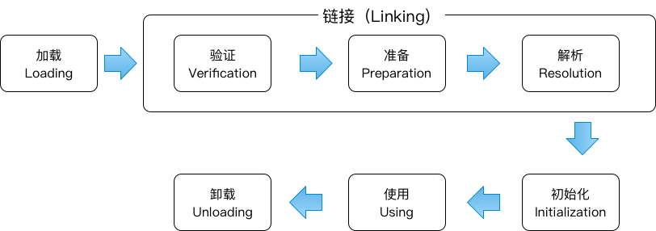
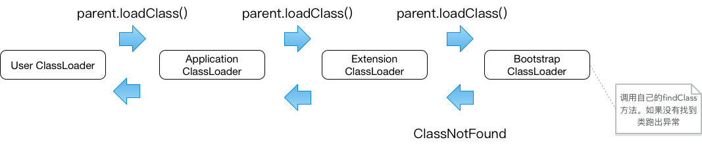

类加载机制
============

### 概述
虚拟机把描述类的数据从Class文件加载到内存，并对数据进行校验、转化解析和初始化，最终形成可以被虚拟机直接使用的Java类型。

### 类的生命周期



类的初始化只有在使用时才会被初始化，1，new、getstatic、putstatic、invokestatic四条指令。2，反射调用，3，子类初始化会先触发父类的初始化，4，包含main函数的主类虚拟机启动是初始化，5，动态代理。

被动引用情况不会被初始化：

1. 通过子类引用父类的静态字段，父类不会初始化。
2. 数组中的引用类，数组的定义不会触发类的初始化。
3. 常量定义类在常量使用时不会被初始化。常量在编译阶段会被传播优化，例如Android的R文件。

### 类的加载过程

1. 通过类的全限定名来获取类的二进制字节流。
2. 将字节流所代表的静态存储结构转化为方法区的运行数据结果。
3. 在内存中生成代表该类的java.lang.Class对象，作为方法区这个类的各种数据访问入口。

*虚拟机不限制类的二进制字节流的来源，可以通过网络获取或者运行时生成（动态代理技术java.lang.reflect.Proxy）,可以用来考虑实现一些Android动态性。*

类的加载通过类加载器实现（ClassLoader），可以通过自定义类加载器来控制类的加载。

*数组类的加载与非数组类加载不一样，数组类本身不是有类加载器创建，但会与加载数组内元素类的加载器做关联。*

### 类的验证

1. 文件格式验证。
2. 元数据验证。
3. 字节码验证。
4. 符号引用验证。（java.lang.IllegalAccessError、java.lang.NoSuchFieldError、java.lang.NoSuchMethodError等异常。

### 类的准备

正式为类变量（静态变量，不包括实例变量）在方法区内分配内存并设置类变量的初始值（通常情况是零值）。

```java
    public static int value1 = 123;
    public static final int value2 = 123;
```

其中准备阶段value1=0，value2=123。因为value1的赋值是在类构造器<clinit\>()中通过putstatic指令赋值，在初始化阶段才会被赋值。而static final的常量是存在字段表的ConstantValue的属性里，会被直接赋值。

### 类的解析


### 类的初始化
初始化阶段虚拟机才真正开始执行类中定义的java程序代码，是执行类构造器<cinit\>()的过程
类构造器<cinit\>()于够着函数不同，是编译器自动收集类中所有类变量（静态变量）的赋值和静态代码块生成的。

虚拟机会保证父类的<cinit\>()在子类的<cinit\>()方法执行之前已经执行完毕。即子类中可以在类变量和静态代码块中直接使用父类的静态资源。

虚拟机会保证构造器在多线程情况下的线程安全性，所以不应再静态代码块中执行耗时操作，可能会造成线程阻塞。当同一个类加载器下，一个类只会被初始化一次，因此静态代码块也只会被执行一次。

### 类加载器

让程序自己决定如何去获取所需要的类。

Java虚拟机中类的唯一性有类加载器和类本身确认。每个类加载器都拥有一个独立的类名称空间，因此使用instanceof判断对象所属关系，或者类型强转的时候，同一个类可能也会不同。

从Java虚拟机角度，类加载器可分为两类：

1. 启动类加载器（Bootstrap ClassLoader）。
2. 其他所有的类加载器，这些加载器都继承类java.lang.ClassLoader。

从开发者角度，类加载器可分为三类：

1. 启动类加载器（Bootstrap ClassLoader）。负责加载$JAVA_HOME\lib路径或-Xbootclasspath参数指定路径类（例如rt.jar）,不可直接使用。
2. 扩展类加载器（Extension ClassLoader）。负责加载$JAVA_HOME\lib\ext路径或java.ext.dirs系统变量指定路径类（例如rt.jar）,可直接使用。
3. 应用程序类加载器（Application Classloader）。 ClassLoader.getSystemClassLoader()获取的ClassLoader，负责加载用户类路径（ClassPath)上的类，一般情况下这个是程序默认的类加载器。
4. ）


###### 双亲委派机制

工作流程：类加载器收到了类加载请求，首先将这个请求委派给父类加载器去完成，父类加载器也是如此。因此请求最终会到顶层的启动类加载器中。当父类加载器没有找到这个类时，再委派给子类加载器尝试加载，相对的子类加载器也是如此，如果多不能处理最终又回到了最初的类加载器。



*特别注意的是，双亲委派机制是通过组合而不是继承实现的，所以上面说的都是父-类加载器*

###### 破坏双亲委派机制


