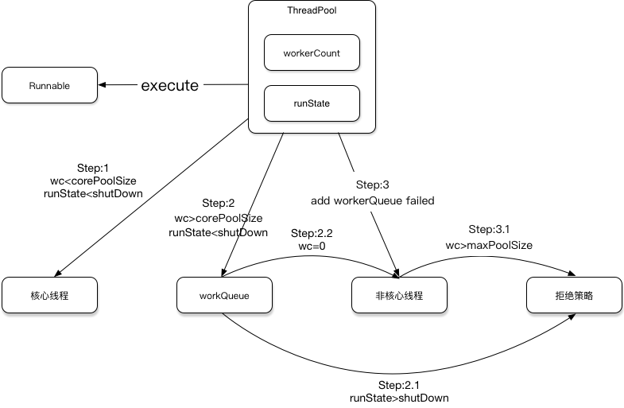

Java线程池使用介绍
=================

系统CPU，内存等资源有限。如果无限开启线程执行异步任务，会引起OOM等系统奔溃。同时频繁的创建销毁线程也是一种对系统资源的浪费。线程的设计中，Thread和Runnable分开，提供了Thread复用执行不同Runnable的实现基础。引入线程池能够很好的解决这些问题。

### 线程池的创建
线程池的构造函数如下：

```Java
/**
     * Creates a new {@code ThreadPoolExecutor} with the given initial
     * parameters.
     *
     * @param corePoolSize the number of threads to keep in the pool, even
     *        if they are idle, unless {@code allowCoreThreadTimeOut} is set
     * @param maximumPoolSize the maximum number of threads to allow in the
     *        pool
     * @param keepAliveTime when the number of threads is greater than
     *        the core, this is the maximum time that excess idle threads
     *        will wait for new tasks before terminating.
     * @param unit the time unit for the {@code keepAliveTime} argument
     * @param workQueue the queue to use for holding tasks before they are
     *        executed.  This queue will hold only the {@code Runnable}
     *        tasks submitted by the {@code execute} method.
     * @param threadFactory the factory to use when the executor
     *        creates a new thread
     * @param handler the handler to use when execution is blocked
     *        because the thread bounds and queue capacities are reached
     * @throws IllegalArgumentException if one of the following holds:<br>
     *         {@code corePoolSize < 0}<br>
     *         {@code keepAliveTime < 0}<br>
     *         {@code maximumPoolSize <= 0}<br>
     *         {@code maximumPoolSize < corePoolSize}
     * @throws NullPointerException if {@code workQueue}
     *         or {@code threadFactory} or {@code handler} is null
     */
    public ThreadPoolExecutor(int corePoolSize,
                              int maximumPoolSize,
                              long keepAliveTime,
                              TimeUnit unit,
                              BlockingQueue<Runnable> workQueue,
                              ThreadFactory threadFactory,
                              RejectedExecutionHandler handler) {
        if (corePoolSize < 0 ||
            maximumPoolSize <= 0 ||
            maximumPoolSize < corePoolSize ||
            keepAliveTime < 0)
            throw new IllegalArgumentException();
        if (workQueue == null || threadFactory == null || handler == null)
            throw new NullPointerException();
        this.corePoolSize = corePoolSize;
        this.maximumPoolSize = maximumPoolSize;
        this.workQueue = workQueue;
        this.keepAliveTime = unit.toNanos(keepAliveTime);
        this.threadFactory = threadFactory;
        this.handler = handler;
    }
```


corePoolSize: 核心线程数量，即使线程空闲，也不会销毁，会等待执行新任务。

maximumPoolSize：最大线程数目，当核心线程已满，且工作队列workQueue已满的情况下，允许开启非核心线程执行任务，但所有线程数目将少于maximumPoolSize。

keepAliveTime：非核心线程空闲后销毁前，允许等待执行新任务的最长时间。

unit：等待时间单元。

workQueue：工作队列、缓存队列。当核心线程已满，会将任务保存到工作队列内，

threadFactory：线程创建工厂类。

handler：任务拒绝策略实现类。当线程池已经饱和的情况下，会调用handler处理任务。

### 任务调度逻辑

线程池执行一个任务是调用execute(Runnable command)方法。

```Java
public void execute(Runnable command) {
    if (command == null)
        throw new NullPointerException();
    /*
     * Proceed in 3 steps:
     *
     * 1. If fewer than corePoolSize threads are running, try to
     * start a new thread with the given command as its first
     * task.  The call to addWorker atomically checks runState and
     * workerCount, and so prevents false alarms that would add
     * threads when it shouldn't, by returning false.
     *
     * 2. If a task can be successfully queued, then we still need
     * to double-check whether we should have added a thread
     * (because existing ones died since last checking) or that
     * the pool shut down since entry into this method. So we
     * recheck state and if necessary roll back the enqueuing if
     * stopped, or start a new thread if there are none.
     *
     * 3. If we cannot queue task, then we try to add a new
     * thread.  If it fails, we know we are shut down or saturated
     * and so reject the task.
     */
    int c = ctl.get();
    if (workerCountOf(c) < corePoolSize) {
        if (addWorker(command, true))
            return;
        c = ctl.get();
    }
    if (isRunning(c) && workQueue.offer(command)) {
        int recheck = ctl.get();
        if (! isRunning(recheck) && remove(command))
            reject(command);
        else if (workerCountOf(recheck) == 0)
            addWorker(null, false);
    }
    else if (!addWorker(command, false))
        reject(command);
}
```

调度逻辑如英文注释，归纳起来可以表述为下图：



*根据任务调度的逻辑，通过corePoolSize、maximumPoolSize、workQueue长度的不同组合，可以实现我们需要的各种线程池*

*线程执行都是异步的，因此在execute方法里有多次重复判断已保证其准确性*

*特别的，当是设置corePoolSize=0，workQueue可添加任务的情况下，通过调用addWorker(null, false)来开启非核心线程执行任务*


### 任务拒绝策略

###### AbortPolicy

忽略新的任务，并抛出RejectedExecutionException异常

###### DiscardPolicy

单纯忽略新的任务，不做任何处理。

###### DiscardOldestPolicy

删除等待队列WorkerQueue中最老的任务，再执行本任务。

###### 自定义策略

声明RejectedExecutionHandler接口，实现rejectedExecution方法。例如比较其优先级，替换最低优先级任务实现。


