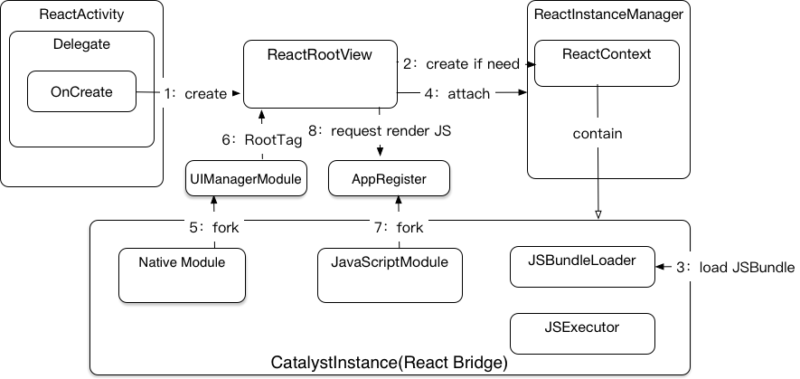
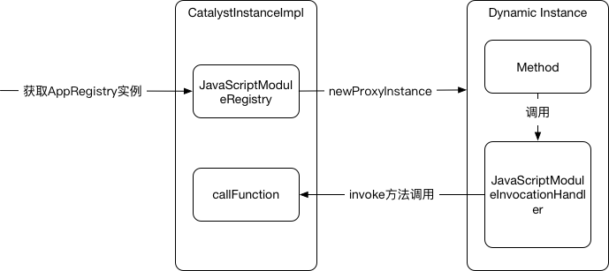

Android端源码分析
================

### react component显示过程

React Native的页面都跑在ReactActivity内。然而这个ReactActivity只是一个壳，代理了ReactActivityDelegate类。RN的所有页面显示逻辑都在ReactActivityDelegate类中，其中同步了Activity的生命周期函数，以及页面间跳转，传值等所有函数，这样RN页面就伪装成了一个正常的Activity。。

打开React Native页面后，进入ReactActivityDelegate的onCreate方法。如果是开发模式，会请求应用上浮层权限，这个就是我们开发模式下每次运行app的时候都会需要授权的原因。然后进入loadApp(mMainComponentName)方法，创建一个ReactRootView，调用ReactRootView.startReactApplication方法，最后将ReactRootView设置为Activity的ContentView显示，关键就在startReactApplication方法中

```JavaScrpit
    public void startReactApplication(
      ReactInstanceManager reactInstanceManager,
      String moduleName,
      @Nullable Bundle initialProperties) {
    
      //1：赋值
      mReactInstanceManager = reactInstanceManager;
      mJSModuleName = moduleName;
      mAppProperties = initialProperties;
      //2：创建ReactContext
      if (!mReactInstanceManager.hasStartedCreatingInitialContext()) {
        mReactInstanceManager.createReactContextInBackground();
      }
      //3：将mJSModuleName的React component显示到ReactRootView中
      attachToReactInstanceManager();
    } finally {
      Systrace.endSection(TRACE_TAG_REACT_JAVA_BRIDGE);
    }
  }
```

第一次打开一个React Native页面的时候会有白屏情况，这个时候其实就是因为上述方法中的第2步，确认ReactContext是否被初始化，如果没有就需要进行初始化，此时会去加载JSBundle，这个IO操作比较耗时，因此如果使用拆包的话会显著减少白屏时间。

React Native真正显示出react component是在attachToReactInstanceManager()方法中。这里用到了UIManagerModule，这是一个Native Module，为JS提供创建和更新Native视图的能力。将UIManagerModule和ReactContext互相绑定，这样就为JS层提供了使用Native层视图能力的管道。

然后调用AppRegistry（JavaScrpit Module）的runApplication方法，传入需要显示的react component以及上一步构建的JS层和Native层视图能力通信的管道（通过Tag实现传递），JS层进行渲染，然后通过管道反馈到ReactRootView上。

整体流程可以通过下图表述：



自持 

### JSBundle加载及JS代码加载过程

我们在创建Bridge实现CatalystInstanceImpl类的时候，需要用到JSBundleLoader。根据开发模式不同、JSBundle包地址不同有各自的实现，而JSBundleLoader类就提供了不同情况下加载JSBundle的实现，最终都是在CatalystInstanceImpl中通过JNI调用Native层实现。

查看Android Native层的实现，在CatalystInstanceImpl.cpp中。以从assets目录加载过程为例：

```C++
void CatalystInstanceImpl::jniLoadScriptFromAssets(
    jni::alias_ref<JAssetManager::javaobject> assetManager,
    const std::string& assetURL,
    bool loadSynchronously) {
  const int kAssetsLength = 9;  // strlen("assets://");
  auto sourceURL = assetURL.substr(kAssetsLength);

  auto manager = extractAssetManager(assetManager);
  auto script = loadScriptFromAssets(manager, sourceURL);
  if (JniJSModulesUnbundle::isUnbundle(manager, sourceURL)) {
    auto bundle = JniJSModulesUnbundle::fromEntryFile(manager, sourceURL);
    auto registry = RAMBundleRegistry::singleBundleRegistry(std::move(bundle));
    instance_->loadRAMBundle(
      std::move(registry),
      std::move(script),
      sourceURL,
      loadSynchronously);
    return;
  } else {
    instance_->loadScriptFromString(std::move(script), sourceURL, loadSynchronously);
  }
}
```

首先从assets目录下读取出bundle保存到script中。然后通过是否有js-module目录来判断是否是unbundle打包。

unbundle打包情况下：

1. 读取js-module目录下代码文件保存到bundle。
2. 通过bundle创建<a href="https://github.com/facebook/react-native/blob/master/ReactCommon/cxxreact/RAMBundleRegistry.cpp">RAMBundleRegistry.cpp</a>，RAMBundleRegistry会将所有的bundle信息保存到m_bundles中，并提供了getModule函数，通过moduleId来获取对应的代码。相当于registry提供了获取各个module代码的能力。
3. 最后调用<a href="https://github.com/facebook/react-native/blob/master/ReactCommon/cxxreact/Instance.cpp">Instance.cpp</a>的loadRAMBundle方法，方法里通过<a href="https://github.com/facebook/react-native/blob/master/ReactCommon/cxxreact/NativeToJsBridge.cpp">JsToNativeBridge.cpp</a>、<a href="https://github.com/facebook/react-native/blob/master/ReactCommon/cxxreact/JSCExecutor.cpp">JSCExecutor.cpp</a>等一系列实现最终将JS代码都加载到Native memory里并安装一定规范存储。

*这里JSBundle是大文件，放到Native memory加载在性能上、内存消耗上会比java层优秀的多。*

bundle打包的情况下所有JS代码都在bundle文件中，只需要直接调用Instance的loadScriptFromString方法即可。

*asset下和文件下加载bundle的实现对比可以发现，文件下加载函数jniLoadScriptFromFile并没有处理unbundle情况。与我们从文件下加载unbundle包时有奔溃现象一致*

### ReactBridge实现

###### CatalystInstanceImpl


###### JavaScriptModule 

JS暴露给原生使用的功能接口。原生实现和JS实现中类名和公共方法名必须一直，原生调用实例的方法时，RN框架会去调用JS中对应类的对应方法。

* 特别的，JavaScriptModule的实现类不允许出现方法重载，因为JS是不支持方法重载的。 *

所有支持的JavaScriptModule实现都保存在CatalystInstanceImpl的JavaScriptModuleRegistry中，可以通过ReactContext#getJSModule或者CatalystInstance#getJSModule获取。

这里有一个很巧妙的实现，我们以AppRegistry为例，在原生侧根本找不到AppRegistry接口的实现类。

前面说到JS暴露给原生使用的功能接口，其具体实现是在JS端，我们在原生定义的所有JavaScriptModule都只是interface。那我们在原生中调用了AppRegistry的runApplication方法其具体调用的实例又是什么？其具体实现如下图：



这里是通过Java中的动态代理实现的，通过Proxy.newProxyInstance来动态创建对应的JavaScriptModule实例，调用的具体方法则由InvocationHandler实现，可以看到所有方法实际都是调用了mCatalystInstance.callFunction。

```Java
public @Nullable Object invoke(Object proxy, Method method, @Nullable Object[] args) throws Throwable {
    NativeArray jsArgs = args != null
      ? Arguments.fromJavaArgs(args)
      : new WritableNativeArray();
    mCatalystInstance.callFunction(getJSModuleName(), method.getName(), jsArgs);
    return null;
}
```

这样就是实现可原生通过定义的接口

###### NativeModule 

相对应的，NativeModule是原生实现暴露给JS使用的功能。Java层的功能一般继承ContextBaseJavaModule类。我们需要提供给JS调用的方法，必须是public的，且应加上@ReactMethod注解。如果需要给回调JS，通过Promise入参解决。

我们提供的所有NativeModule都需要封装在一个ReactPackage内提供给ReactNativeHost。 在CatalystInstanceImpl创建的时候回调用initializeBridge的native方法，传入所有的Nativemodule。

```Java
void CatalystInstanceImpl::initializeBridge(
    jni::alias_ref<ReactCallback::javaobject> callback,
    // This executor is actually a factory holder.
    JavaScriptExecutorHolder* jseh,
    jni::alias_ref<JavaMessageQueueThread::javaobject> jsQueue,
    jni::alias_ref<JavaMessageQueueThread::javaobject> nativeModulesQueue,
    jni::alias_ref<jni::JCollection<JavaModuleWrapper::javaobject>::javaobject> javaModules,
    jni::alias_ref<jni::JCollection<ModuleHolder::javaobject>::javaobject> cxxModules) {
assertCondition(mBridge == null, "initializeBridge should be called once");
  moduleMessageQueue_ = std::make_shared<JMessageQueueThread>(nativeModulesQueue);

  moduleRegistry_ = std::make_shared<ModuleRegistry>(
    buildNativeModuleList(
       std::weak_ptr<Instance>(instance_),
       javaModules,
       cxxModules,
       moduleMessageQueue_));

  instance_->initializeBridge(
    folly::make_unique<JInstanceCallback>(
    callback,
    moduleMessageQueue_),
    jseh->getExecutorFactory(),
    folly::make_unique<JMessageQueueThread>(jsQueue),
    moduleRegistry_);
}
```

CatalystInstanceImpl.cpp的initializeBridge方法中，调用<a href="https://github.com/facebook/react-native/blob/master/ReactCommon/cxxreact/Instance.cpp">Instance</a>的initializeBridge初始化，将所有的NativeModule对象保存到moduleRegistry_中，在<a href="https://github.com/facebook/react-native/blob/master/ReactCommon/cxxreact/ModuleRegistry.cpp">ModuleRegistry</a>中有callNativeMethod方法,这个方法的会根据moduleId和methodId调用具体的NativeModule对象的方法，这样就实现JS调用原生module。

```
void ModuleRegistry::callNativeMethod(unsigned int moduleId, unsigned int methodId, folly::dynamic&& params, int callId) {
  if (moduleId >= modules_.size()) {
    throw std::runtime_error(
      folly::to<std::string>("moduleId ", moduleId, " out of range [0..", modules_.size(), ")"));
  }
  modules_[moduleId]->invoke(methodId, std::move(params), callId);
}
```


然后用调用<a href="https://github.com/facebook/react-native/blob/master/ReactCommon/cxxreact/Instance.cpp">Instance</a>的initializeBridge初始化Instance实例。这时会实例化<a href="https://github.com/facebook/react-native/blob/master/ReactCommon/cxxreact/NativeToJsBridge.cpp">NativeToJsBridge</a>


###### ReactPackage


