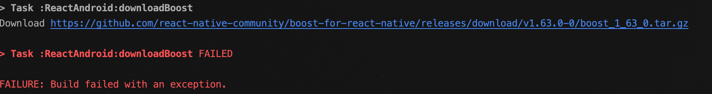

RN 源码编译及修改
===============

### 一些知识点

###### 预构建库
预构建库是指将三方库的.so或者.a作为代码src直接引入使用的方式。主要解决的是非源码提供和提升编译速度的作用。

在使用时我们需要将三方库定义为一个独立模块，其Android.mk的定义如下：
```
LOCAL_PATH:= $(call my-dir) //LOCAL_PATH，call my-dir及输出当前目录。
include $(CLEAR_VARS) //清理本地变量，防止上一次编译使用的本地变量对本次的影响。
LOCAL_MODULE:= jsc //指明该独立module的名称。预构建库的使用方需要用这个module名称引入。
LOCAL_SRC_FILES := jni/$(TARGET_ARCH_ABI)/libjsc.so //预构建库文件，区分不同的CPU架构。
LOCAL_EXPORT_C_INCLUDES := $(LOCAL_PATH) //预构建库对外导出的头文件目录。
include $(PREBUILT_SHARED_LIBRARY) //指明这是一个预构建共享库。
```

可以查看Android Developers 中对<a href="https://developer.android.google.cn/ndk/guides/prebuilts?hl=zh_cn">预构建库</a>的介绍。

###### 动态库、静态库

动态库（.so）文件是elf格式文件。是特定平台下的机器码。使用SO文件参与编译后会以独立的库存在。
静态库（.a）文件是一种归档文件。参与编译后会直接合并入打包产物库。

###### hpp
对于c++，基本接触到的是.h头文件和.cpp文件两个。hpp文件就是讲具体实现cpp文件混入到头文件h文件中，定义与实现都包含在同一文件，则该类的调用者只需要include该hpp文件即可，无需再将cpp加入到project中进行编译。

###### BUCK
Buck是facebook内部使用的依赖管理方案，使用python语法。功能与gradle一直，具体细节上如依赖传递规则等有写出入。在源码中我们直接使用gradle构建，暂时不需要用到BUCK。

### 源码结构

###### 整体源码结构


###### ReactAndroid结构
ReactAndroid首先是一个支持NDK的Android Library模块，Android侧设计的源码都在这个模块中。我们可以也可以将ReactAndroid直接集成。

* Java侧源码，在/src/main/java目录下。
* Java侧fb内部库，在/src/main/libraries目录下，使用BUCK进行依赖管理。当我们使用gradle构建的情况下可以不关注着部分。
* Java侧三方库，在/src/main/third-party目录下，使用BUCK进行依赖管理。当我们使用gradle构建的情况下可以不关注着部分。
* JNI侧三方库，在/src/main/jni/third-party目录下。主要有boost、double-conversion、folly、glog、jsc（其中glibc没有使用到），源码目录下只有一个Android.mk文件。其中jsc使用预构建动态库库，glog、folly是动态库，boost、double-conversion是静态库。
* JNI侧FB内部库，在/src/main/jni/first-party目录下，以源码的形式存在。
* JNI侧源码，在/src/main/jni/react目录下。
* 还有一个/src/main/jni/prebuilt目录。这个是一个编译结果保存目录，后面SO打包流程中会用到。

### SO打包流程

我们输出打包执行task，可以取得SO打包按顺序执行了以下task：

```
:ReactAndroid:createNativeDepsDirectories SKIPPED //相关目录创建
:ReactAndroid:downloadBoost SKIPPED //下载Boost。
:ReactAndroid:prepareBoost SKIPPED //解压拷贝等准备工作。
:ReactAndroid:downloadDoubleConversion SKIPPED
:ReactAndroid:prepareDoubleConversion SKIPPED
:ReactAndroid:downloadFolly SKIPPED
:ReactAndroid:prepareFolly SKIPPED
:ReactAndroid:downloadGlog SKIPPED
:ReactAndroid:prepareGlog SKIPPED
:ReactAndroid:downloadJSC SKIPPED
:ReactAndroid:prepareJSC SKIPPED
:ReactAndroid:buildReactNdkLib SKIPPED //使用ndk-build命令打包SO
:ReactAndroid:packageReactNdkLibs SKIPPED //拷贝产物到指定的jniLibs目录下，
```
SO打包相关Task是通过
```
    tasks.withType(JavaCompile) {
        compileTask -> compileTask.dependsOn(packageReactNdkLibs)
    }
```
添加到整个APP打包过程中的，指明JavaCompile会依赖packageReactNdkLibs。

重点在buildReactNdkLib Task：
```groovy
//使用NDK命令来编译SO库
task buildReactNdkLib(dependsOn: [prepareJSC, prepareBoost, prepareDoubleConversion, prepareFolly, prepareGlog], type: Exec) {
    inputs.dir("src/main/jni/react")
    outputs.dir("$buildDir/react-ndk/all")
    commandLine(getNdkBuildFullPath(),
            "NDK_PROJECT_PATH=null",
            "NDK_APPLICATION_MK=$projectDir/src/main/jni/Application.mk",
            "NDK_OUT=" + temporaryDir,
            "NDK_LIBS_OUT=$buildDir/react-ndk/all",
            "THIRD_PARTY_NDK_DIR=$buildDir/third-party-ndk",
            "REACT_COMMON_DIR=$projectDir/../ReactCommon",
            "REACT_SRC_DIR=$projectDir/src/main/java/com/facebook/react",
            "-C", file("src/main/jni/react/jni").absolutePath,
            "--jobs", project.findProperty("jobs") ?: Runtime.runtime.availableProcessors()
    )
}
```

* NDK_APPLICATION_MK指定Application.mk文件。
* 通过-C指定工作目录是src/main/jni/react/jni。
* 然后通过Application.mk中的配置进行NDK编译。
* //TODO:


### 编译爬坑

###### boost等库下载失败



经典墙的问题。默认这些库是下载到build文件夹下的，会被clean掉。可以备份到其他目录。后期就不需要下载。

###### android库导入类不存在


使用的是react-native 0.59-stable分支，未支持androidx。但创建壳项目的时候使用了androidx导致冲突。在gradle.properties中修改下配置即可
```
android.useAndroidX=false
android.enableJetifier=false
```


### RN全埋点

###### 问题分析

对于原生，例如点击事件，是通过setClickLinstener实现的，设置之后控件的clickable会变为true，会消费事件。但在RN中，点击事件的响应逻辑都在RN侧，切并不是通过在控件中设置点击监听实现的。特别的，因为没有设置监听，所有RN控件的clickable都是false。

在RN里面的根视图容器是ReactRootView。

```java
  @Override
  public boolean onInterceptTouchEvent(MotionEvent ev) {
    dispatchJSTouchEvent(ev);
    return super.onInterceptTouchEvent(ev);
  }

  @Override
  public boolean onTouchEvent(MotionEvent ev) {
    dispatchJSTouchEvent(ev);
    super.onTouchEvent(ev);
    // In case when there is no children interested in handling touch event, we return true from
    // the root view in order to receive subsequent events related to that gesture
    return true;
  }
```

对于ReactRootView的onInterceptTouchEvent和onTouchEvent函数中都是通过dispatchJSTouchEvent函数将event分发到JS侧。

因此对于对于埋点方案，通过点击坐标寻找消费该事件的控件方式会失效。实际测试发现百度热力图功能在RN页面失效。


###### 功能实现
对于用户的点击，我们需要判断出是否是有效点击，对于有效点击才最有一次有效记录上报生成热力图。对于原生，我们是通过是能找到响应事件的控件（isClickable）来确认。对于RN页面，我们也需要找到类似的逻辑。

在问题分析中我们说道，touch时间都是通过dispatchJSTouchEvent函数分发到了RN，我们看下这个函数的实现。

```Java
private void dispatchJSTouchEvent(MotionEvent event) {
    
    ...

    ReactContext reactContext = mReactInstanceManager.getCurrentReactContext();
    EventDispatcher eventDispatcher = reactContext.getNativeModule(UIManagerModule.class).getEventDispatcher();
    mJSTouchDispatcher.handleTouchEvent(event, eventDispatcher);
  }
```

这里的核心点就是调用mJSTouchDispatcher.handleTouchEvent函数，在这个函数里我们看到会将MotionEvent.ACTION_DOWN、MotionEvent.ACTION_UP、MotionEvent.ACTION_MOVE、MotionEvent.ACTION_POINTER_DOWN、MotionEvent.ACTION_POINTER_UP、MotionEvent.ACTION_CANCEL六类事件传递给JS，有这六类事件基本上的用户操作在JS侧都可以响应。我们这里重点看MotionEvent.ACTION_DOWN。

```
public void handleTouchEvent(MotionEvent ev, EventDispatcher eventDispatcher) {
    int action = ev.getAction() & MotionEvent.ACTION_MASK;
    if (action == MotionEvent.ACTION_DOWN) {
      if (mTargetTag != -1) {
        FLog.e(
          ReactConstants.TAG,
          "Got DOWN touch before receiving UP or CANCEL from last gesture");
      }

      // First event for this gesture. We expect tag to be set to -1, and we use helper method
      // {@link #findTargetTagForTouch} to find react view ID that will be responsible for handling
      // this gesture
      mChildIsHandlingNativeGesture = false;
      mGestureStartTime = ev.getEventTime();
      mTargetTag = findTargetTagAndSetCoordinates(ev);
      eventDispatcher.dispatchEvent(
        TouchEvent.obtain(
          mTargetTag,
          TouchEventType.START,
          ev,
          mGestureStartTime,
          mTargetCoordinates[0],
          mTargetCoordinates[1],
          mTouchEventCoalescingKeyHelper));
    } 
    ...省略了其他事件处理
}
```

对于down事件，我们默认会直接传递给RN响应，默认将mChildIsHandlingNativeGesture设置为false。handleTouchEvent函数是void的，ReactRootView中不会因为RN响应了事件就拦截这个事件还会继续传递。因此如果我们将ReactRootView和原生其他空间混用时，是可以通过mChildIsHandlingNativeGesture来控制RN不处理事件。

在down事件上我们看到是通过findTargetTagAndSetCoordinates函数来确定RN响应的具体控件，也就是我们需要的点。函数链最终调用：

```
public static int findTargetTagAndCoordinatesForTouch(
      float eventX,
      float eventY,
      ViewGroup viewGroup,
      float[] viewCoords,
      @Nullable int[] nativeViewTag) {
    UiThreadUtil.assertOnUiThread();
    int targetTag = viewGroup.getId();
    // Store eventCoords in array so that they are modified to be relative to the targetView found.
    viewCoords[0] = eventX;
    viewCoords[1] = eventY;
    View nativeTargetView = findTouchTargetView(viewCoords, viewGroup);
    if (nativeTargetView != null) {
      View reactTargetView = findClosestReactAncestor(nativeTargetView);
      if (reactTargetView != null) {
        if (nativeViewTag != null) {
          nativeViewTag[0] = reactTargetView.getId();
        }
        targetTag = getTouchTargetForView(reactTargetView, viewCoords[0], viewCoords[1]);
      }
    }
    return targetTag;
}
```

这个函数返回的就是
###### 打包验证