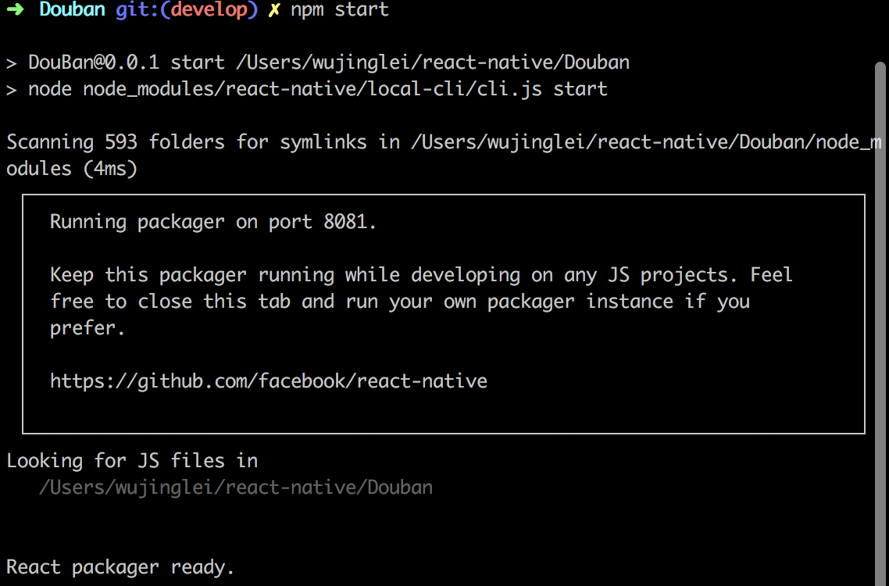
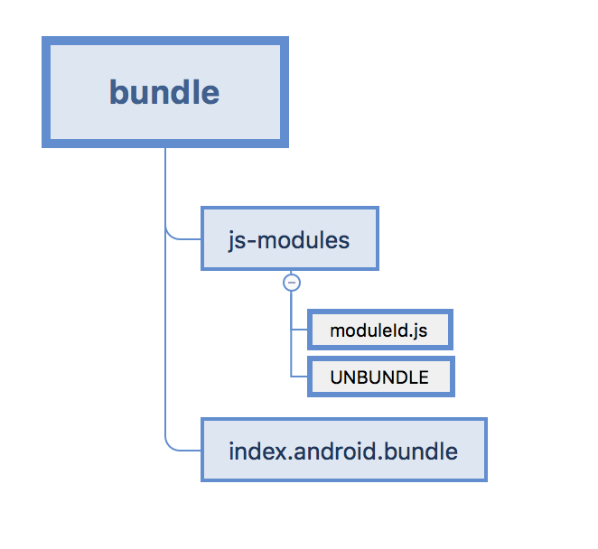

React Native的运行、打包、热更新过程分析
===================================

### React Native运行过程

运行RN项目是，我们会在命令行里输入react-native run-android命令此时会有如下过程：

1. 启动node.js服务。这一步实际上是在项目目录调用npm start命令实现的，启动成功时会在终端输出如下成功日志，其指明node服务端口8081、JS代码路径。最终输出React Packager ready表面启动完成。


2. 构建Android APK，并安装到设备中。这一步和Android打包一致。

整个实现过程源码在 ./node_modules/react-native/runAndroid/runAndroid.js中，执行命令后，会调用runAndroid方法。这个方法里做两件事，与启动的过程相对应，分别是startServerInNewWindow()和buildAndRun(args)。


### React Native的打包

打包命令：react-native bundle --platform android --dev false --entry-file ./index.js --bundle-output ./{dest-dir}/index.android.jsbundle --assets-dest ./{dest-dir}

同样的，其实现源码在./node_modules/react-native/bundle/bundle.js中。

这个命令打包生成代码bundle和图片assets，对于Android平台，图片assets下的的图片会{目录}_{文件}的方式保存到drawable-xdpi等目录。

我们可以将dest-dir设置为Android的assets目录路径，dest-dir设置为Android的res目录路径，这样Android打包APK的时候不用任何调整。

### React Native的热更新

#### bundle的热更新
接入React Native的时候，要求我们的Application声明ReactApplication接口，这个接口要求我们提供一个ReactNativeHost对象，在App整个生命周期中提供React Native的支持。

App加载的React Native的包可以通过setJSBundleFile和setBundleAssetName设置。

assets目录下可以通过setBundleAssetName(bundleName)来设置，这个bundleName默认是“index.android.bundle”，因此我们默认React Native包以该名称保存在assets目录下，就无需做任何设置。

其他自定义目录可以通过setJSBundleFile方法设置，我们的热更新实现就是通过这个方法。需要更新时只需要下载好bundle包通过这个方法提供给ReactInstanceManager即可完成热修复。

#### 图片资源的热更新
RN打包会生成代码相关的bundle文件和图片资源，这点在上面的RN打包相关已经做介绍。热更新的时候将bundle文件和图片资源一起更新到手机并保持相同目录，上面bundle的热更新机制实现后，RN会自动在该目录下寻找图片资源。

但如果我们需要单独对部分图片资源做热更新时，这种全量更新的方式就不太适合了。

RN中图片显示使用Image组件，Android对应的实现在Image.android.js中。
```JavaScript
    propTypes: {
        source: PropTypes.oneOfType([
          PropTypes.shape({
            uri: PropTypes.string,
            headers: PropTypes.objectOf(PropTypes.string),
          }),
          // Opaque type returned by require('./image.jpg')
          PropTypes.number,
          // Multiple sources
          PropTypes.arrayOf(
            PropTypes.shape({
              uri: PropTypes.string,
              width: PropTypes.number,
              height: PropTypes.number,
            }))
        ]),
    }
```

定义了source的属性来指明图片的来源，可能是通过require('./image.jpg')的到的资源ID，也可能是图片的URI。

再看render方法，Image组件在绘制的时候会对source属性做一系列的处理，最终通过RKImage组件进行显示。

这里看resolveAssetSource函数。

```JavaScript
    function resolveAssetSource(source: any): ?ResolvedAssetSource {
      if (typeof source === 'object') {
        return source;
      }

      var asset = AssetRegistry.getAssetByID(source);
      if (!asset) {
        return null;
      }

      const resolver = new AssetSourceResolver(getDevServerURL(), getBundleSourcePath(), asset);
      if (_customSourceTransformer) {
        return _customSourceTransformer(resolver);
      }
      return resolver.defaultAsset();
    }
```

创建了一个AssetSourceResolver对象，传入了DevServerURL和BundleSourcePath分别对应dev模式下的服务器地址和release模式下的Bundle包地址。在resolver.defaultAsset()方法里，isLoadedFromFileSystem为true时调用drawableFolderInBundle()函数拼接图片路径。

```JavaScript
  defaultAsset(): ResolvedAssetSource {
      if (this.isLoadedFromServer()) {
        return this.assetServerURL();
      }
      if (Platform.OS === 'android') {
        return this.isLoadedFromFileSystem() ?
          this.drawableFolderInBundle() :
          this.resourceIdentifierWithoutScale();
      } else {
        return this.scaledAssetPathInBundle();
      }
    }

    drawableFolderInBundle(): ResolvedAssetSource {
    const path = this.bundlePath || '';
    return this.fromSource(
      'file://' + path + getAssetPathInDrawableFolder(this.asset)
    );
  }
```

可以看到从bundle包路径下去获取图片（例如：file:///sdcard/AwesomeModule/drawable-mdpi/icon.png）。

因此我么只需要修改defaultAsset()函数来实现图片的热更新。简单的实现例如提供一个目录，热更新图片都保存在该目录，defaultAsset()函数内先判断在热更新目录内是否有指定图片，如果有则使用热更新目录下的图片。

### React Native的拆包

React Native打包生成的JSBundle中，除了我们的业务代码，还有RN框架部分的JS代码，正因为如此，我们可以通过修改RN框架源码来实现我们的一些特定功能。

然而，这种方式有理必有弊，对于我们正常开发中，我们不会所有的业务代码都在一个bundle中，特别是原生、RN混合app中，可能有好几个闭环业务通过RN实现，那如果每个闭环业务的JSBundle都包含RN框架部分的JS代码，对APK包体积来说是很大的浪费，同时如果我们队RN框架部分的JS代码做了修改需要热更新，每个业务的JSBundle都需要做更新。因此针对RN才出现拆包一说，所谓的拆包就是对JSBundle包针对RN框架部分代码，及不同闭环业务做拆分，互相隔离。

###### unbundle拆包

React Native提供的拆包工具unbundle命令，使用时可以react-native unbundle --platform android --dev false --entry-file index.android.js --bundle-output ./release/index.android.bundle --assets-dest ./release进行打包。

打包后bundle包解构如下：



未拆包情况下bundle包文件，可以分为三部分，

1. 头部，主要是各依赖模块引用部分。
```JavaScript
  !function(e){e.__DEV__=!1,e.__BUNDLE_START_TIME__=e.nativePerformanceNow?e.nativePerformanceNow():Date.now()}("undefined"!=typeof global?global:"undefined"!=typeof self?self:this);

```

2. 中间部分，入口模块和各业务模块定义部分；
```JavaScript
  __d(function(e,t,a,r){var l=t(12),o=(babelHelpers.interopRequireDefault(l),t(24)),i=t(281),n=t(342),b=babelHelpers.interopRequireDefault(n),u=t(343),f=babelHelpers.interopRequireDefault(u),s=t(344),p=babelHelpers.interopRequireDefault(s),c=t(357),d=babelHelpers.interopRequireDefault(c),D=t(361),R=babelHelpers.interopRequireDefault(D),q=t(367),v=babelHelpers.interopRequireDefault(q),H=(0,i.TabNavigator)({MovieTab:{screen:b.default},BookTab:{screen:f.default},LocalTab:{screen:d.default},MusicTab:{screen:p.default}},{tabBarOptions:{activeTintColor:"#589bff",style:{backgroundColor:"#f5fafd"},labelStyle:{fontSize:10,color:"red"}},tabBarPosition:"bottom",position:"bottom"}),T=(0,i.StackNavigator)({Tabs:{screen:H},ActivityDetail:{screen:R.default},ActivitySearch:{screen:v.default,headerMode:"float"}});o.AppRegistry.registerComponent("DouBan",function(){return T})},0);
```

__d是RN自定义的define，定义的所有模块，可以认为是我们的所有js代码部分，包括我们开发的代码以及框架部分代码。其中最后一个数字即为模块ID。

3. 尾部，入口模块注册部分。
```JavaScript
  ;require(58);//申明JavaScriptApp引擎的初始化。
  ;require(0);//app入口
```


