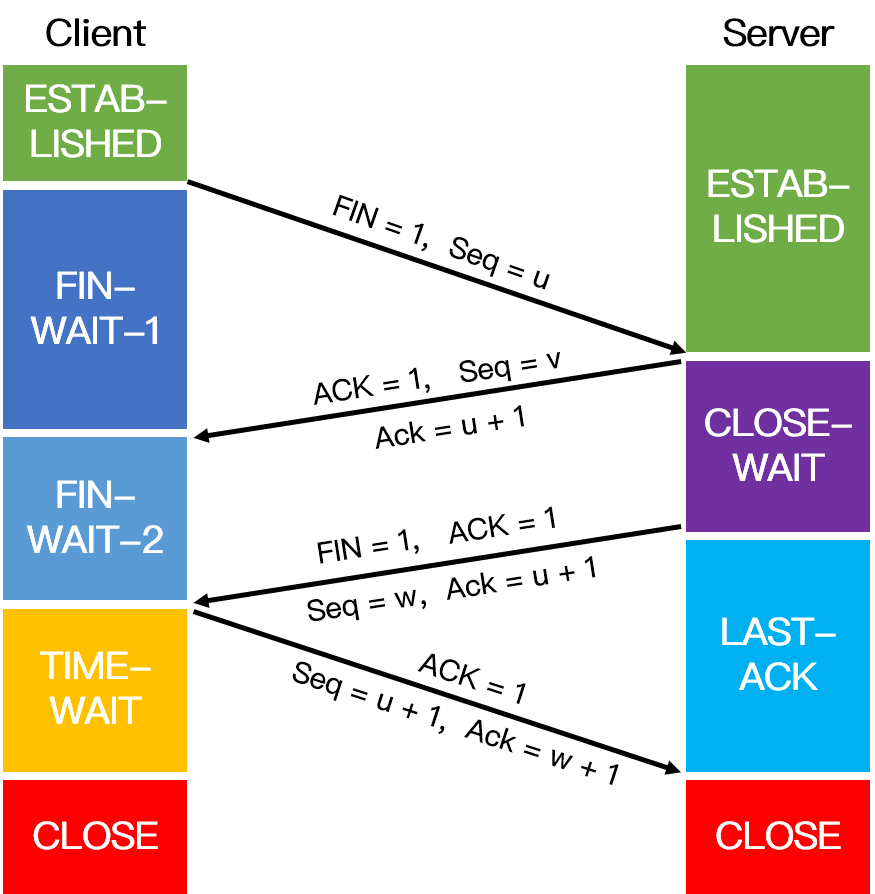
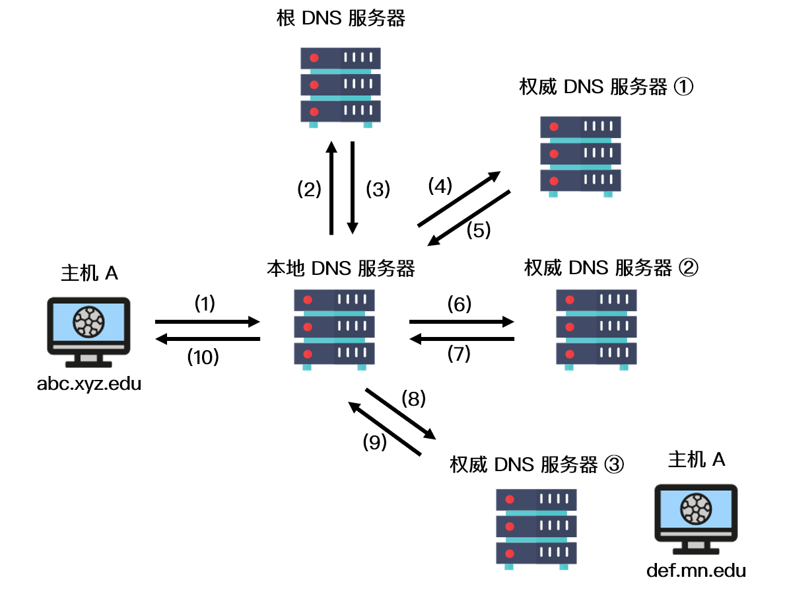

# 网络学习笔记

阅读内容：计算机网络面试突击

作者：力扣 (LeetCode)
链接：https://leetcode-cn.com/leetbook/read/networks-interview-highlights/eg0dl5/
来源：力扣（LeetCode）
著作权归作者所有。商业转载请联系作者获得授权，非商业转载请注明出处。


### 七层网络结构

### GET 和 POST 的区别

1. get 提交的数据会放在 URL 之后，并且请求参数会被完整的保留在浏览器的记录里，由于参数直接暴露在 URL 中，可能会存在安全问题，因此往往用于获取资源信息。而 post 参数放在请求主体中，并且参数不会被保留，相比 get 方法，post 方法更安全，主要用于修改服务器上的资源。
2. get 请求只支持 URL 编码，post 请求支持多种编码格式。
3. get 只支持 ASCII 字符格式的参数，而 post 方法没有限制。
4. get 提交的数据大小有限制（这里所说的限制是针对浏览器而言的），而 post 方法提交的数据没限制
5. get 方式需要使用 Request.QueryString 来取得变量的值，而 post 方式通过 Request.Form 来获取。
6. get 方法产生一个 TCP 数据包，post 方法产生两个（并不是所有的浏览器中都产生两个）。


对于GET方式的请求，浏览器会把http header和data一并发送出去，服务端响应200，请求成功。

对于POST方式的请求，浏览器会先发送http header给服务端，告诉服务端等一下会有数据过来，服务端响应100 continue，告诉浏览器我已经准备接收数据，浏览器再post发送一个data给服务端，服务端响应200，请求成功。


### 链接复用 Keep-Alive

在早期的 HTTP/1.0 中，浏览器每次 发起 HTTP 请求都要与服务器创建一个新的 TCP 连接，服务器完成请求处理后立即断开 TCP 连接，服务器不跟踪每个客户也不记录过去的请求。然而创建和关闭连接的过程需要消耗资源和时间，为了减少资源消耗，缩短响应时间，就需要重用连接。在 HTTP/1.1 版本中默认使用持久连接，在此之前的 HTTP 版本的默认连接都是使用非持久连接，如果想要在旧版本的 HTTP 协议上维持持久连接，则需要指定 connection 的首部字段的值为 Keep-Alive 来告诉对方这个请求响应完成后不要关闭，下一次咱们还用这个请求继续交流，我们用一个示意图来更加生动的表示两者的区别：


对于非 Keep=Alive 来说，必须为每一个请求的对象建立和维护一个全新的连接。对于每一个这样的连接，客户机和服务器都要分配 TCP 的缓冲区和变量，这给服务器带来的严重的负担，因为一台 Web 服务器可能同时服务于数以百计的客户机请求。在 Keep-Alive 方式下，服务器在响应后保持该 TCP 连接打开，在同一个客户机与服务器之间的后续请求和响应报文可通过相同的连接进行传送。甚至位于同一台服务器的多个 Web 页面在从该服务器发送给同一个客户机时，可以在单个持久 TCP 连接上进行。

然而，Keep-Alive 并不是没有缺点的，当长时间的保持 TCP 连接时容易导致系统资源被无效占用，若对 Keep-Alive 模式配置不当，将有可能比非 Keep-Alive 模式带来的损失更大。因此，我们需要正确地设置 keep-alive timeout 参数，当 TCP 连接在传送完最后一个 HTTP 响应，该连接会保持 keepalive_timeout 秒，之后就开始关闭这个链接。


### HTTPS 和 HTTP的区别


- HTTP 协议以明文方式发送内容，数据都是未加密的，安全性较差。HTTPS 数据传输过程是加密的，安全性较好。
- HTTP 和 HTTPS 使用的是完全不同的连接方式，用的端口也不一样，前者是 80 端口，后者是 443 端口。
- HTTPS 协议需要到数字认证机构（Certificate Authority, CA）申请证书，一般需要一定的费用。
- HTTP 页面响应比 HTTPS 快，主要因为 HTTP 使用 3 次握手建立连接，客户端和服务器需要握手 3 次，而 HTTPS 除了 TCP 的 3 次握手，还需要经历一个 SSL 协商过程。


### HTTP的工作流程

HTTP（Hyper Text Transfer Protocol: 超文本传输协议） 是一种简单的请求 - 响应协议，被用于在 Web 浏览器和网站服务器之间传递消息。HTTP 使用 TCP（而不是 UDP）作为它的支撑运输层协议。其默认工作在 TCP 协议 80 端口，HTTP 客户机发起一个与服务器的 TCP 连接，一旦连接建立，浏览器和服务器进程就可以通过套接字接口访问 TCP。客户机从套接字接口发送 HTTP 请求报文和接收 HTTP 响应报文。类似地，服务器也是从套接字接口接收 HTTP 请求报文和发送 HTTP 响应报文。其通信内容以明文的方式发送，不通过任何方式的数据加密。当通信结束时，客户端与服务器关闭连接。


### HTTPS的工作流程（秘钥协定）

HTTPS（Hyper Text Transfer Protocol over Secure Socket Layer）是以安全为目标的 HTTP 协议，在 HTTP 的基础上通过传输加密和身份认证的方式保证了传输过程的安全性。其工作流程如下：

① 客户端发起一个 HTTPS 请求，并连接到服务器的 443 端口，发送的信息主要包括自身所支持的算法列表和密钥长度等；

② 服务端将自身所支持的所有加密算法与客户端的算法列表进行对比并选择一种支持的加密算法，然后将它和其它密钥组件一同发送给客户端。

③ 服务器向客户端发送一个包含数字证书的报文，该数字证书中包含证书的颁发机构、过期时间、服务端的公钥等信息。

④ 最后服务端发送一个完成报文通知客户端 SSL 的第一阶段已经协商完成。

⑤ SSL 第一次协商完成后，客户端发送一个回应报文，报文中包含一个客户端生成的随机密码串，称为 pre_master_secre，并且该报文是经过证书中的公钥加密过的。

⑥ 紧接着客户端会发送一个报文提示服务端在此之后的报文是采用pre_master_secre 加密的。

⑦ 客户端向服务端发送一个 finish 报文，这次握手中包含第一次握手至今所有报文的整体校验值，最终协商是否完成取决于服务端能否成功解密。

⑧ 服务端同样发送与第 ⑥ 步中相同作用的报文，已让客户端进行确认，最后发送 finish 报文告诉客户端自己能够正确解密报文。

当服务端和客户端的 finish 报文交换完成之后，SSL 连接就算建立完成了，之后就进行和 HTTP 相同的通信过程，唯一不同的是在 HTTP 通信过程中并不是采用明文传输，而是采用对称加密的方式，其中对称密钥已经在 SSL 的建立过程中协商好了。


### TSL协商过程

我们这里来看OkHttp里面的过程，从RealConnection的connectTls函数开始入手：

```kotlin
@Throws(IOException::class)
private fun connectTls(connectionSpecSelector: ConnectionSpecSelector) {
    val address = route.address
    val sslSocketFactory = address.sslSocketFactory
    var success = false
    var sslSocket: SSLSocket? = null
    try {
        // Create the wrapper over the connected socket.
        //rawSocket是java中TCP链接的实现类，在之前已经完成三次握手建立了链接。
        //这里通过rawSocket创建出sslSocket，这里也和SSL(Secure Sockets Layer 安全套接层)的定义互相验证。
        sslSocket = sslSocketFactory!!.createSocket(
            rawSocket, address.url.host, address.url.port, true /* autoClose */) as SSLSocket

        // Configure the socket's ciphers, TLS versions, and extensions.
        val connectionSpec = connectionSpecSelector.configureSecureSocket(sslSocket)
        if (connectionSpec.supportsTlsExtensions) {
            Platform.get().configureTlsExtensions(sslSocket, address.url.host, address.protocols)
        }

        // Force handshake. This can throw!
        sslSocket.startHandshake()
        // block for session establishment
        val sslSocketSession = sslSocket.session
        val unverifiedHandshake = sslSocketSession.handshake()

        // Verify that the socket's certificates are acceptable for the target host.
        if (!address.hostnameVerifier!!.verify(address.url.host, sslSocketSession)) {
            val peerCertificates = unverifiedHandshake.peerCertificates
            if (peerCertificates.isNotEmpty()) {
                val cert = peerCertificates[0] as X509Certificate
                throw SSLPeerUnverifiedException("""
              |Hostname ${address.url.host} not verified:
              |    certificate: ${CertificatePinner.pin(cert)}
              |    DN: ${cert.subjectDN.name}
              |    subjectAltNames: ${OkHostnameVerifier.allSubjectAltNames(cert)}
              """.trimMargin())
            } else {
                throw SSLPeerUnverifiedException(
                    "Hostname ${address.url.host} not verified (no certificates)")
            }
        }

        val certificatePinner = address.certificatePinner!!

        handshake = Handshake(unverifiedHandshake.tlsVersion, unverifiedHandshake.cipherSuite,
                              unverifiedHandshake.localCertificates) {
            certificatePinner.certificateChainCleaner!!.clean(unverifiedHandshake.peerCertificates,
                                                              address.url.host)
        }

        // Check that the certificate pinner is satisfied by the certificates presented.
        certificatePinner.check(address.url.host) {
            handshake!!.peerCertificates.map { it as X509Certificate }
        }

        // Success! Save the handshake and the ALPN protocol.
        val maybeProtocol = if (connectionSpec.supportsTlsExtensions) {
            Platform.get().getSelectedProtocol(sslSocket)
        } else {
            null
        }
        socket = sslSocket
        source = sslSocket.source().buffer()
        sink = sslSocket.sink().buffer()
        protocol = if (maybeProtocol != null) Protocol.get(maybeProtocol) else Protocol.HTTP_1_1
        success = true
    } finally {
        if (sslSocket != null) {
            Platform.get().afterHandshake(sslSocket)
        }
        if (!success) {
            sslSocket?.closeQuietly()
        }
    }
}
```


### 传输层-三次握手和四次挥手机制-TCP的建立和释放

###### 三次握手


三次握手是 TCP 连接的建立过程。在握手之前，主动打开连接的客户端结束 CLOSE 阶段，被动打开的服务器也结束 CLOSE 阶段，并进入 LISTEN 阶段。随后进入三次握手阶段：

① 首先客户端向服务器发送一个 SYN 包，并等待服务器确认，其中：

    标志位为 SYN，表示请求建立连接；
    序号为 Seq = x（x 一般为 1）；
    随后客户端进入 SYN-SENT 阶段。

② 服务器接收到客户端发来的 SYN 包后，对该包进行确认后结束 LISTEN 阶段，并返回一段 TCP 报文，其中：

    标志位为 SYN 和 ACK，表示确认客户端的报文 Seq 序号有效，服务器能正常接收客户端发送的数据，并同意创建新连接；
    序号为 Seq = y；
    确认号为 Ack = x + 1，表示收到客户端的序号 Seq 并将其值加 1 作为自己确认号 Ack 的值，随后服务器端进入 SYN-RECV 阶段。

③ 客户端接收到发送的 SYN + ACK 包后，明确了从客户端到服务器的数据传输是正常的，从而结束 SYN-SENT 阶段。并返回最后一段报文。其中：

    标志位为 ACK，表示确认收到服务器端同意连接的信号；
    序号为 Seq = x + 1，表示收到服务器端的确认号 Ack，并将其值作为自己的序号值；
    确认号为 Ack= y + 1，表示收到服务器端序号 seq，并将其值加 1 作为自己的确认号 Ack 的值。
    随后客户端进入 ESTABLISHED。

当服务器端收到来自客户端确认收到服务器数据的报文后，得知从服务器到客户端的数据传输是正常的，从而结束 SYN-RECV 阶段，进入 ESTABLISHED 阶段，从而完成三次握手。

四次挥手：

四次挥手.png



四次挥手即 TCP 连接的释放，这里假设客户端主动释放连接。在挥手之前主动释放连接的客户端结束 ESTABLISHED 阶段，随后开始四次挥手：

① 首先客户端向服务器发送一段 TCP 报文表明其想要释放 TCP 连接，其中：

    标记位为 FIN，表示请求释放连接；
    序号为 Seq = u；
    随后客户端进入 FIN-WAIT-1 阶段，即半关闭阶段，并且停止向服务端发送通信数据。

② 服务器接收到客户端请求断开连接的 FIN 报文后，结束 ESTABLISHED 阶段，进入 CLOSE-WAIT 阶段并返回一段 TCP 报文，其中：

    标记位为 ACK，表示接收到客户端释放连接的请求；
    序号为 Seq = v；
    确认号为 Ack = u + 1，表示是在收到客户端报文的基础上，将其序号值加 1 作为本段报文确认号 Ack 的值；
    随后服务器开始准备释放服务器端到客户端方向上的连接。

客户端收到服务器发送过来的 TCP 报文后，确认服务器已经收到了客户端连接释放的请求，随后客户端结束 FIN-WAIT-1 阶段，进入 FIN-WAIT-2 阶段。

③ 服务器端在发出 ACK 确认报文后，服务器端会将遗留的待传数据传送给客户端，待传输完成后即经过 CLOSE-WAIT 阶段，便做好了释放服务器端到客户端的连接准备，再次向客户端发出一段 TCP 报文，其中：

    标记位为 FIN 和 ACK，表示已经准备好释放连接了；
    序号为 Seq = w；
    确认号 Ack = u + 1，表示是在收到客户端报文的基础上，将其序号 Seq 的值加 1 作为本段报文确认号 Ack 的值。

随后服务器端结束 CLOSE-WAIT 阶段，进入 LAST-ACK 阶段。并且停止向客户端发送数据。

④ 客户端收到从服务器发来的 TCP 报文，确认了服务器已经做好释放连接的准备，于是结束 FIN-WAIT-2 阶段，进入 TIME-WAIT 阶段，并向服务器发送一段报文，其中：

    标记位为 ACK，表示接收到服务器准备好释放连接的信号；
    序号为 Seq= u + 1，表示是在已收到服务器报文的基础上，将其确认号 Ack 值作为本段序号的值；
    确认号为 Ack= w + 1，表示是在收到了服务器报文的基础上，将其序号 Seq 的值作为本段报文确认号的值。

随后客户端开始在 TIME-WAIT 阶段等待 2 MSL。服务器端收到从客户端发出的 TCP 报文之后结束 LAST-ACK 阶段，进入 CLOSED 阶段。由此正式确认关闭服务器端到客户端方向上的连接。客户端等待完 2 MSL 之后，结束 TIME-WAIT 阶段，进入 CLOSED 阶段，由此完成「四次挥手」。


### 应用层-DNS


DNS（Domain Name System）是域名系统的英文缩写，是一种组织成域层次结构的计算机和网络服务命名系统，用于 TCP/IP 网络。

###### DNS 的作用

通常我们有两种方式识别主机：通过主机名或者 IP 地址。人们喜欢便于记忆的主机名表示，而路由器则喜欢定长的、有着层次结构的 IP 地址。为了满足这些不同的偏好，我们就需要一种能够进行主机名到 IP 地址转换的目录服务，域名系统作为将域名和 IP 地址相互映射的一个分布式数据库，能够使人更方便地访问互联网。

###### DNS 域名解析原理

DNS 采用了分布式的设计方案，其域名空间采用一种树形的层次结构：


上图展示了 DNS 服务器的部分层次结构，从上到下依次为根域名服务器、顶级域名服务器和权威域名服务器。其实根域名服务器在因特网上有13个，大部分位于北美洲。第二层为顶级域服务器，这些服务器负责顶级域名（如 com、org、net、edu）和所有国家的顶级域名（如uk、fr、ca 和 jp）。在第三层为权威 DNS 服务器，因特网上具有公共可访问主机（例如 Web 服务器和邮件服务器）的每个组织机构必须提供公共可访问的 DNS 记录，这些记录由组织机构的权威 DNS 服务器负责保存，这些记录将这些主机的名称映射为 IP 地址。

除此之外，还有一类重要的 DNS 服务器，叫做本地 DNS 服务器。本地 DNS 服务器严格来说不在 DNS 服务器的层次结构中，但它对 DNS 层次结构是很重要的。一般来说，每个网络服务提供商（ISP） 都有一台本地 DNS 服务器。当主机与某个 ISP 相连时，该 ISP 提供一台主机的 IP 地址，该主机具有一台或多台其本地 DNS 服务器的 IP 地址。主机的本地 DNS 服务器通常和主机距离较近，当主机发起 DNS 请求时，该请求被发送到本地 DNS 服务器，它起着代理的作用，并将该请求转发到 DNS 服务器层次结构中。

我们以一个例子来了解 DNS 的工作原理，假设主机 A（IP 地址为 abc.xyz.edu） 想知道主机 B 的 IP 地址 （def.mn.edu），如下图所示，主机 A 首先向它的本地 DNS 服务器发送一个 DNS 查询报文。该查询报文含有被转换的主机名 def.mn.edu。本地 DNS 服务器将该报文转发到根 DNS 服务器，根 DNS 服务器注意到查询的 IP 地址前缀为 edu 后向本地 DNS 服务器返回负责 edu 的顶级域名服务器的 IP 地址列表。该本地 DNS 服务器则再次向这些 顶级域名服务器发送查询报文。该顶级域名服务器注意到 mn.edu 的前缀，并用权威域名服务器的 IP 地址进行响应。通常情况下，顶级域名服务器并不总是知道每台主机的权威 DNS 服务器的 IP 地址，而只知道中间的某个服务器，该中间 DNS 服务器依次能找到用于相应主机的 IP 地址，我们假设中间经历了权威服务器 ① 和 ②，最后找到了负责 def.mn.edu 的权威 DNS 服务器 ③，之后，本地 DNS 服务器直接向该服务器发送查询报文从而获得主机 B 的IP 地址。



在上图中，IP 地址的查询其实经历了两种查询方式，分别是递归查询和迭代查询。

###### 拓展：域名解析查询的两种方式

    递归查询：如果主机所询问的本地域名服务器不知道被查询域名的 IP 地址，那么本地域名服务器就以 DNS 客户端的身份，向其他根域名服务器继续发出查询请求报文，即替主机继续查询，而不是让主机自己进行下一步查询，如上图步骤（1）和（10）。
    迭代查询：当根域名服务器收到本地域名服务器发出的迭代查询请求报文时，要么给出所要查询的 IP 地址，要么告诉本地服务器下一步应该找哪个域名服务器进行查询，然后让本地服务器进行后续的查询，如上图步骤（2）~（9）。

### 网络层-IP

IP 协议（Internet Protocol）又称互联网协议，是支持网间互联的数据包协议。该协议工作在网络层，主要目的就是为了提高网络的可扩展性，和传输层 TCP 相比，IP 协议提供一种无连接/不可靠、尽力而为的数据包传输服务，其与TCP协议（传输控制协议）一起构成了TCP/IP 协议族的核心。IP 协议主要有以下几个作用：

    寻址和路由：在IP 数据包中会携带源 IP 地址和目的 IP 地址来标识该数据包的源主机和目的主机。IP 数据报在传输过程中，每个中间节点（IP 网关、路由器）只根据网络地址进行转发，如果中间节点是路由器，则路由器会根据路由表选择合适的路径。IP 协议根据路由选择协议提供的路由信息对 IP 数据报进行转发，直至抵达目的主机。
    分段与重组：IP 数据包在传输过程中可能会经过不同的网络，在不同的网络中数据包的最大长度限制是不同的，IP 协议通过给每个 IP 数据包分配一个标识符以及分段与组装的相关信息，使得数据包在不同的网络中能够传输，被分段后的 IP 数据报可以独立地在网络中进行转发，在到达目的主机后由目的主机完成重组工作，恢复出原来的 IP 数据包。


### IP地址和InetAddress


```kotlin
val addr = InetAddress.getByName("www.baidu.com")
```

InetAddress会尝试连接DNS服务器，获取www.baidu.com域名对应的IP。可以通过getHostName() 获得主机名和getHostAddress() 获得IP地址。


InetAddress有两个子类，Inet4Address和Inet6Address。通过InetAddress.getByName函数返回的根据是IPv4和是IPv6不同而具体子类不同。

在Java 1.8上我们来跟一下这个函数看看是如何获取IP地址的，前几个都是函数调用，我们从看起：

```java
private static InetAddress[] getAllByName(String var0, InetAddress var1) throws UnknownHostException {
    if (var0 != null && var0.length() != 0) {
        //这里的一大段代码省略，都是针对var0是IP地址的时候的逻辑。
        //对于是数字的IP还是字符、是IPv4还是IPv6,都有处理。
        ...

            //域名到IP，核心的是这个函数
            return getAllByName0(var0, var1, true);
    } else {
        InetAddress[] var2 = new InetAddress[]{impl.loopbackAddress()};
        return var2;
    }
}
```

```java
private static InetAddress[] getAllByName0(String var0, InetAddress var1, boolean var2) throws UnknownHostException {
    if (var2) {
        SecurityManager var3 = System.getSecurityManager();
        if (var3 != null) {
            var3.checkConnect(var0, -1);
        }
    }
    //尝试从缓存中获取
    InetAddress[] var4 = getCachedAddresses(var0);
    if (var4 == null) {
        //没有的话从域名服务器中获取。
        var4 = getAddressesFromNameService(var0, var1);
    }
    //没有获取到就跑出
    if (var4 == unknown_array) {
        throw new UnknownHostException(var0);
    } else {
        return (InetAddress[])var4.clone();
    }
}
```

```java
private static InetAddress[] getAddressesFromNameService(String var0, InetAddress var1) throws UnknownHostException {
    InetAddress[] var2 = null;
    boolean var3 = false;
    UnknownHostException var4 = null;
    //checkLookupTable函数是为了做并发处理。该类有一个全局的Map对象叫做LookupTable，记录正在寻址的域名和其InetAddress对象。
    //函数内部以LookupTable对象作为锁，如果LookupTable中的key不包含当前域名（var0）,则put进入一个k-v（null），同时函数返回null。
    //如果LookupTable中已经包含，就会调用wait函数阻塞等待通知，即真在进行的寻址完成后，通过getCachedAddresses函数从缓存中获取，
    if ((var2 = checkLookupTable(var0)) == null) {
        try {
            //通过迭代所有的域名服务器进行寻址。
            //nameServices是静态常量且在该类的静态代码块中赋值，
            //nameServices有两部分组成，通过AccessController.doPrivileged获取的和默认的两部分。
            //AccessController.doPrivileged是一个native函数，通过获取sun.net.spi.nameservice.provider.对应的系统环境遍历信息获取，
            //如果通过上面的方式没有域名服务器，就设置默认的域名服务器，创建一个NameService对象内部直接调用impl的相关方法， 这里的impl就是InetAddressImpl，如果设备支持IPv6则是Inet6AddressImpl,否则是Inet4AddressImpl
            Iterator var5 = nameServices.iterator();

            while(var5.hasNext()) {
                NameService var6 = (NameService)var5.next();

                try {
                    //通过当前域名服务器的lookupAllHostAddr函数来查询IP。例如Inet6AddressImpl，其lookupAllHostAddr函数都是一个native函数。
                    var2 = var6.lookupAllHostAddr(var0);
                    var3 = true;
                    break;
                } catch (UnknownHostException var12) {
                    if (var0.equalsIgnoreCase("localhost")) {
                        InetAddress[] var8 = new InetAddress[]{impl.loopbackAddress()};
                        var2 = var8;
                        var3 = true;
                        break;
                    }

                    var2 = unknown_array;
                    var3 = false;
                    var4 = var12;
                }
            }

            if (var1 != null && var2.length > 1 && !var2[0].equals(var1)) {
                int var14;
                for(var14 = 1; var14 < var2.length && !var2[var14].equals(var1); ++var14) {
                }

                if (var14 < var2.length) {
                    InetAddress var7 = var1;

                    for(int var16 = 0; var16 < var14; ++var16) {
                        InetAddress var15 = var2[var16];
                        var2[var16] = var7;
                        var7 = var15;
                    }

                    var2[var14] = var7;
                }
            }
            //这里进行缓存，checkLookupTable内部等有用到这个缓存。
            cacheAddresses(var0, var2, var3);
            if (!var3 && var4 != null) {
                throw var4;
            }
        } finally {
            //checkLookupTable是通过锁实现的，里面会调用wait函数等待，这里真在进行的寻址操作完成后需要调用notify进行通知。
            updateLookupTable(var0);
        }
    }

    return var2;
}
```

最后来看看域名的Cache

```java
private static InetAddress[] getCachedAddresses(String var0) {
    var0 = var0.toLowerCase();
    synchronized(addressCache) {
        cacheInitIfNeeded();
        InetAddress.CacheEntry var2 = addressCache.get(var0);
        if (var2 == null) {
            var2 = negativeCache.get(var0);
        }

        return var2 != null ? var2.addresses : null;
    }
}
```

分为addressCache和negativeCache两个池子，分别对应寻址成功的域名和失败的域名，是的，域名解析失败也会被缓存。域名Cache对应的是InetAddress.Cache类，里面用过一个LinkedHashMap来存储，我们来看一下的添加（put）和获取（get）函数：

```java
public InetAddress.Cache put(String var1, InetAddress[] var2) {
    //获取缓存有效时长，对于缓存时长后面再展开。
    int var3 = this.getPolicy();
    if (var3 == 0) {
        //如果缓存有效时长是0，说明不进行缓存。
        return this;
    } else {
        //对于缓存时长不为-1，即有效，需要对当前缓存map中的cache进行清理。
        if (var3 != -1) {
            LinkedList var4 = new LinkedList();
            long var5 = System.currentTimeMillis();
            Iterator var7 = this.cache.keySet().iterator();

            String var8;
            while(var7.hasNext()) {
                var8 = (String)var7.next();
                InetAddress.CacheEntry var9 = (InetAddress.CacheEntry)this.cache.get(var8);
                if (var9.expiration < 0L || var9.expiration >= var5) {
                    break;
                }

                var4.add(var8);
            }
			//var4是LinkedList，保存了已经超时缓存的key（域名全小写），这些需要全部移除
            var7 = var4.iterator();
			
            while(var7.hasNext()) {
                var8 = (String)var7.next();
                this.cache.remove(var8);
            }
        }
		
        long var10;
        if (var3 == -1) {
            var10 = -1L;
        } else {
            var10 = System.currentTimeMillis() + (long)(var3 * 1000);
        }
		//通过InetAddress[]和其超时时间创建CacheEntry并保存到LinkedHashMap中。
        InetAddress.CacheEntry var6 = new InetAddress.CacheEntry(var2, var10);
        this.cache.put(var1, var6);
        return this;
    }
}

public InetAddress.CacheEntry get(String var1) {
    //获取缓存有效时长
    int var2 = this.getPolicy();
    if (var2 == 0) {
        //同样的，如果不做缓存的话直接返回null。
        return null;
    } else {
        //从LinkedHashMap中获取InetAddress.CacheEntry，并判断是否超时，如果已经超时则移除并返回null。
        InetAddress.CacheEntry var3 = (InetAddress.CacheEntry)this.cache.get(var1);
        if (var3 != null && var2 != -1 && var3.expiration >= 0L && var3.expiration < System.currentTimeMillis()) {
            this.cache.remove(var1);
            var3 = null;
        }

        return var3;
    }
}
```

为什么对于IP解析缓存要设置有效期？我们知道域名对应的外网IP是会变化的，当然大公司基本会购买固定IP，但在分布式部署的网站上，同一个域名也会对应不同的IP，网络运营商会有一些策略来提供最优的环境。而且在前面说道，对于解析失败的域名也会进行缓存，那对于网络闪断情况下导致失败的缓存肯定不能一直有效，因此缓存有效其是有必要的。对于这个我们来看一下InetAddressCachePolicy，getPolicy函数获取的缓存有效时长就是根据不同类型（Positive还是Negative）在InetAddressCachePolicy中获取，而InetAddressCachePolicy中的值是根据jre和系统环境变量中获取的，可以看一下获取的属性名定义：

```java
//Positive的缓存超时时间，Security中的属性值，在JAVA_HOME/jre/lib/security/java.security文件中，高优先级
private static final String cachePolicyProp = "networkaddress.cache.ttl";
//Positive的缓存超时时间，系统环境遍历中的值，低优先级
private static final String cachePolicyPropFallback = "sun.net.inetaddr.ttl";
//Negative的缓存超时时间，Security中的属性值，在JAVA_HOME/jre/lib/security/java.security文件中，高优先级
private static final String negativeCachePolicyProp = "networkaddress.cache.negative.ttl";
//Negative的缓存超时时间，系统环境遍历中的值，低优先级
private static final String negativeCachePolicyPropFallback = "sun.net.inetaddr.negative.ttl";
    
```

至此，我们对DNS解析的整个流程已经了解。那么在Android平台上呢？看一下对应类在android.jar下的实现即可，这里看Android10下的实现，整体流程和Java是一样的，注意下Android-changed标记即为不同。具体有以下几点不同：

- 对于getByName函数，在Android上直接调用impl.lookupAllHostAddr(host, NETID_UNSET)[0];获取，而impl应Android版本不同有所不同，在新版本上impl对于的是Inet6AddressImpl。
- 对于impl，虽然对应的是Inet6AddressImpl类，但内部兼容Inet4AddressImpl的逻辑。例如lookupAllHostAddr(函数。
- NameService在Android上只有一个，就是代理impl的NameService，对于Java中default。不允许自己设定。
- 对于超时时间，hardcode为两秒，没法通过属性设置。见AddressCache类。